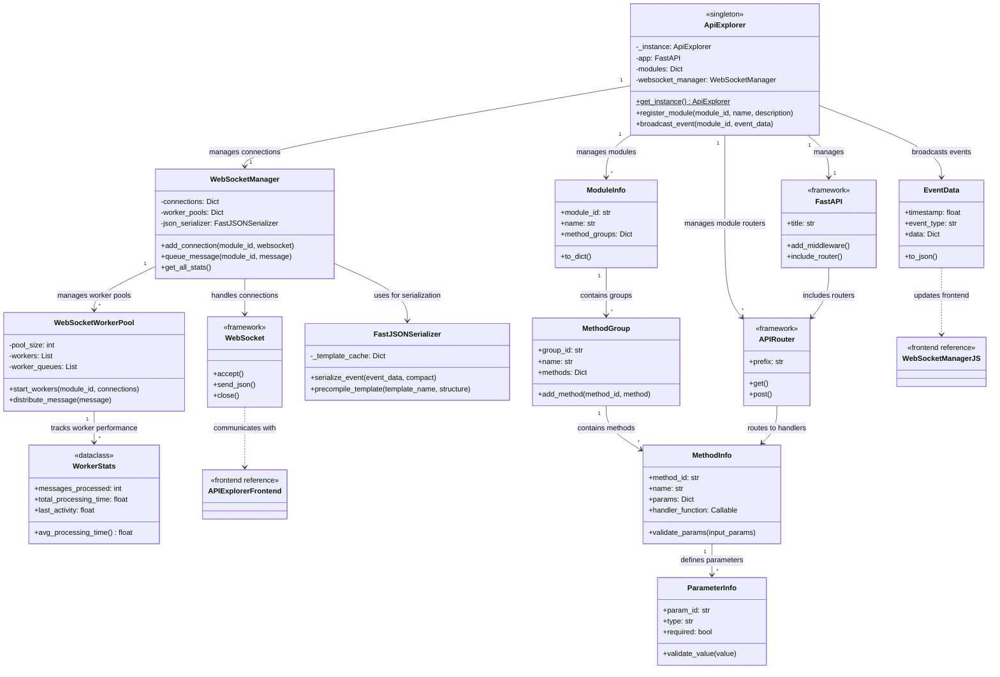

```mermaid
classDiagram
    direction TB
    
    %% Core Backend Classes
    class ApiExplorer {
        <<singleton>>
        -_instance: ApiExplorer
        -app: FastAPI
        -modules: Dict
        -websocket_manager: WebSocketManager
        +get_instance()$ ApiExplorer
        +register_module(module_id, name, description)
        +broadcast_event(module_id, event_data)
    }
    
    class WebSocketManager {
        -connections: Dict
        -worker_pools: Dict
        -json_serializer: FastJSONSerializer
        +add_connection(module_id, websocket)
        +queue_message(module_id, message)
        +get_all_stats()
    }
    
    class WebSocketWorkerPool {
        -pool_size: int
        -workers: List
        -worker_queues: List
        +start_workers(module_id, connections)
        +distribute_message(message)
    }
    
    class WebSocket {
        <<framework>>
        +accept()
        +send_json()
        +close()
    }

    class WorkerStats {
        <<dataclass>>
        +messages_processed: int
        +total_processing_time: float
        +last_activity: float
        +avg_processing_time() float
    }
    
    class FastJSONSerializer {
        -_template_cache: Dict
        +serialize_event(event_data, compact)
        +precompile_template(template_name, structure)
    }

    class APIExplorerFrontend {
        <<frontend reference>>
    }
    
    %% Data Structures
    class ModuleInfo {
        +module_id: str
        +name: str
        +method_groups: Dict
        +to_dict()
    }
    
    class MethodGroup {
        +group_id: str
        +name: str
        +methods: Dict
        +add_method(method_id, method)
    }
    
    class MethodInfo {
        +method_id: str
        +name: str
        +params: Dict
        +handler_function: Callable
        +validate_params(input_params)
    }
    
    class ParameterInfo {
        +param_id: str
        +type: str
        +required: bool
        +validate_value(value)
    }
    
    class EventData {
        +timestamp: float
        +event_type: str
        +data: Dict
        +to_json()
    }
    
    %% Framework Components
    class FastAPI {
        <<framework>>
        +title: str
        +add_middleware()
        +include_router()
    }
    
    class APIRouter {
        <<framework>>
        +prefix: str
        +get()
        +post()
    }
    
    %% Frontend Reference Classes
    class WebSocketManagerJS {
        <<frontend reference>>
    }
    
    %% Relationships
    ApiExplorer "1" --> "1" FastAPI : manages
    ApiExplorer "1" --> "1" WebSocketManager : manages connections
    ApiExplorer "1" --> "*" ModuleInfo : manages modules
    ApiExplorer "1" --> "*" APIRouter : manages module routers
    
    WebSocketManager "1" --> "*" WebSocketWorkerPool : manages worker pools
    WebSocketManager --> FastJSONSerializer : uses for serialization
    WebSocketManager --> WebSocket : handles connections
    
    WebSocketWorkerPool "1" --> "*" WorkerStats : tracks worker performance

    ModuleInfo "1" --> "*" MethodGroup : contains groups
    MethodGroup "1" --> "*" MethodInfo : contains methods
    MethodInfo "1" --> "*" ParameterInfo : defines parameters
    
    FastAPI --> APIRouter : includes routers
    APIRouter --> MethodInfo : routes to handlers
    
    ApiExplorer --> EventData : broadcasts events
    EventData ..> WebSocketManagerJS : updates frontend
    WebSocket ..> APIExplorerFrontend : communicates with
```