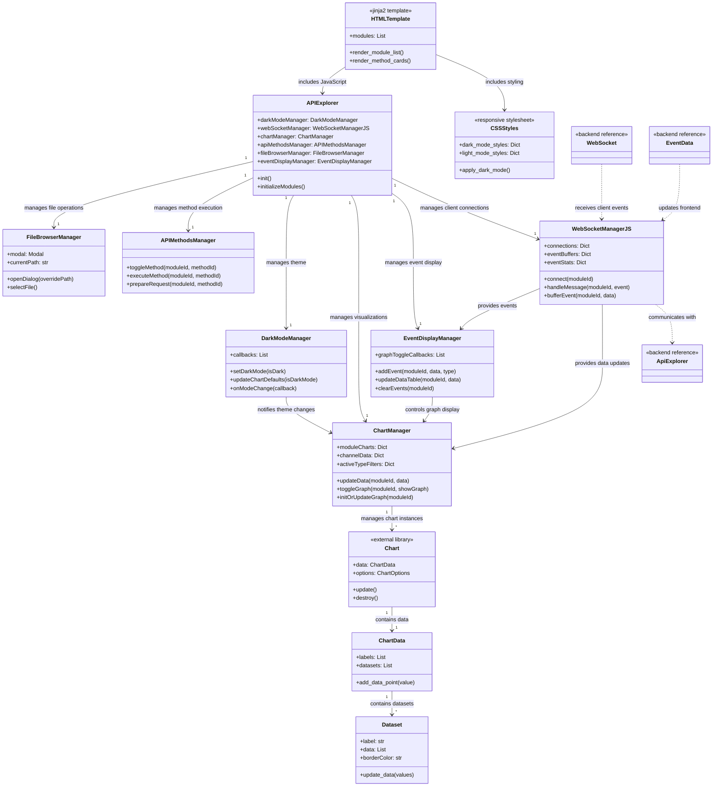

```mermaid
classDiagram
    direction TB
    
    %% Main Frontend Coordinator
    class APIExplorer {
        +darkModeManager: DarkModeManager
        +webSocketManager: WebSocketManagerJS
        +chartManager: ChartManager
        +apiMethodsManager: APIMethodsManager
        +fileBrowserManager: FileBrowserManager
        +eventDisplayManager: EventDisplayManager
        +init()
        +initializeModules()
    }
    
    %% Core Managers
    class DarkModeManager {
        +callbacks: List
        +setDarkMode(isDark)
        +updateChartDefaults(isDarkMode)
        +onModeChange(callback)
    }
    
    class WebSocketManagerJS {
        +connections: Dict
        +eventBuffers: Dict
        +eventStats: Dict
        +connect(moduleId)
        +handleMessage(moduleId, event)
        +bufferEvent(moduleId, data)
    }
    
    class ChartManager {
        +moduleCharts: Dict
        +channelData: Dict
        +activeTypeFilters: Dict
        +updateData(moduleId, data)
        +toggleGraph(moduleId, showGraph)
        +initOrUpdateGraph(moduleId)
    }
    
    class APIMethodsManager {
        +toggleMethod(moduleId, methodId)
        +executeMethod(moduleId, methodId)
        +prepareRequest(moduleId, methodId)
    }
    
    class FileBrowserManager {
        +modal: Modal
        +currentPath: str
        +openDialog(overridePath)
        +selectFile()
    }
    
    class EventDisplayManager {
        +graphToggleCallbacks: List
        +addEvent(moduleId, data, type)
        +updateDataTable(moduleId, data)
        +clearEvents(moduleId)
    }
    
    %% Chart Components
    class Chart {
        <<external library>>
        +data: ChartData
        +options: ChartOptions
        +update()
        +destroy()
    }
    
    class ChartData {
        +labels: List
        +datasets: List
        +add_data_point(value)
    }
    
    class Dataset {
        +label: str
        +data: List
        +borderColor: str
        +update_data(values)
    }
    
    %% Template and Styling
    class HTMLTemplate {
        <<jinja2 template>>
        +modules: List
        +render_module_list()
        +render_method_cards()
    }
    
    class CSSStyles {
        <<responsive stylesheet>>
        +dark_mode_styles: Dict
        +light_mode_styles: Dict
        +apply_dark_mode()
    }
    
    %% Backend Reference Classes
    class ApiExplorer {
        <<backend reference>>
    }
    
    class WebSocket {
        <<backend reference>>
    }
    
    class EventData {
        <<backend reference>>
    }
    
    %% Relationships
    APIExplorer "1" --> "1" WebSocketManagerJS : manages client connections
    APIExplorer "1" --> "1" EventDisplayManager : manages event display
    APIExplorer "1" --> "1" ChartManager : manages visualizations
    APIExplorer "1" --> "1" DarkModeManager : manages theme
    APIExplorer "1" --> "1" APIMethodsManager : manages method execution
    APIExplorer "1" --> "1" FileBrowserManager : manages file operations
    
    WebSocketManagerJS ..> ApiExplorer : communicates with
    WebSocketManagerJS --> ChartManager : provides data updates
    WebSocketManagerJS --> EventDisplayManager : provides events
    EventDisplayManager --> ChartManager : controls graph display
    DarkModeManager --> ChartManager : notifies theme changes
    
    ChartManager "1" --> "*" Chart : manages chart instances
    Chart "1" --> "1" ChartData : contains data
    ChartData "1" --> "*" Dataset : contains datasets
    
    HTMLTemplate --> CSSStyles : includes styling
    HTMLTemplate --> APIExplorer : includes JavaScript
    
    WebSocket ..> WebSocketManagerJS : receives client events
    EventData ..> WebSocketManagerJS : updates frontend
```