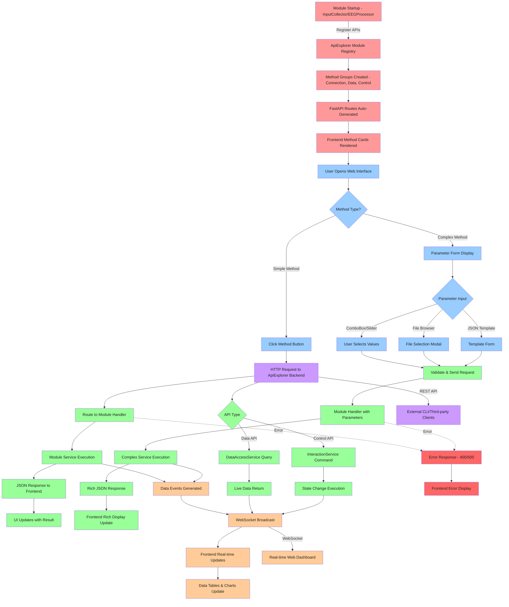

```mermaid
flowchart TD
    %% Module Registration
    A[Module Startup - InputCollector/EEGProcessor] -->|Register APIs| B[ApiExplorer Module Registry]
    
    %% Method Registration
    B --> C[Method Groups Created - Connection, Data, Control]
    C --> D[FastAPI Routes Auto-Generated]
    D --> E[Frontend Method Cards Rendered]
    
    %% User Interaction Branch
    E --> F[User Opens Web Interface]
    F --> G{Method Type?}
    
    %% Simple Method Flow
    G -->|Simple Method| H[Click Method Button]
    H --> I[HTTP Request to ApiExplorer Backend]
    I --> J[Route to Module Handler]
    J --> K[Module Service Execution]
    K --> L[JSON Response to Frontend]
    L --> M[UI Updates with Result]
    
    %% Complex Method Flow
    G -->|Complex Method| N[Parameter Form Display]
    N --> O{Parameter Input}
    O -->|ComboBox/Slider| P[User Selects Values]
    O -->|File Browser| Q[File Selection Modal]
    O -->|JSON Template| R[Template Form]
    
    P --> S[Validate & Send Request]
    Q --> S
    R --> S
    S --> T[Module Handler with Parameters]
    T --> U[Complex Service Execution]
    U --> V[Rich JSON Response]
    V --> W[Frontend Rich Display Update]
    
    %% Real-time Data Flow
    K --> X[Data Events Generated]
    U --> X
    X --> Y[WebSocket Broadcast]
    Y --> Z[Frontend Real-time Updates]
    Z --> AA[Data Tables & Charts Update]
    
    %% API Distribution
    I --> BB{API Type}
    BB -->|Data API| CC[DataAccessService Query]
    BB -->|Control API| DD[InteractionService Command]
    
    CC --> EE[Live Data Return]
    DD --> FF[State Change Execution]
    
    EE --> Y
    FF --> Y
    
    %% External API Access
    I -->|REST API| GG[External CLI/Third-party Clients]
    Y -->|WebSocket| HH[Real-time Web Dashboard]
    
    %% Error Handling
    J -.->|Error| II[Error Response - 400/500]
    T -.->|Error| II
    II --> JJ[Frontend Error Display]
    
    %% Styling
    classDef registration fill:#ff9999,color:#222
    classDef ui fill:#99ccff,color:#222
    classDef execution fill:#99ff99,color:#222
    classDef realtime fill:#ffcc99,color:#222
    classDef api fill:#cc99ff,color:#222
    classDef error fill:#ff6666,color:#222
    
    class A,B,C,D,E registration
    class F,G,H,N,O,P,Q,R ui
    class I,J,K,L,M,S,T,U,V,W,BB,CC,DD,EE,FF execution
    class X,Y,Z,AA,HH realtime
    class GG,I api
    class II,JJ error
```