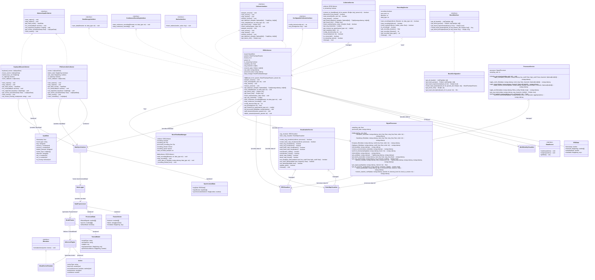

```mermaid
  classDiagram
    %% Interfaces for extensibility and reusability
    class IDataSource {
        <<interface>>
        +startAcquisition(): void
        +stopAcquisition(): void
        +getData(): any
    }

    class CollectorInterface {
        <<interface>>
        +prepare_session(): void
        +start_stream(): void
        +stop_stream(): void
        +release_session(): void
        +get_data(num_samples: Optional[int]): Tuple[Any, List[int]]
        +save_data(filename: str, data_type: str): void
        +get_board_info(): Dict[str, Any]
        +insert_marker(marker_value: int): void
    }

    class AbstractInputCollector {
        <<interface>>
        +start_capture(): void
        +stop_capture(): void
        +get_input_event(): InputData
        +on_event(callback: function): void
        +set_supported_keys(keys: List[str]): void
        +get_events_since(timestamp: float): List[InputData]
        +clear_events(): void
    }

    class IEmulator {
        <<interface>>
        +simulateAction(action: Action): void
    }

    %% Data Types
    class EEGData {
        +timestamp: number
        +channels: Map[string, number[]]
        +samplingRate: number
        +metadata: Map[string, any>
    }

    class InputData {
        +timestamp: float
        +event_type: string
        +key: string|null
        +mouse_x: number|null
        +mouse_y: number|null
        +button_pressed: string|null
        +active_keys: List[string]
        +direction: string|null
        +rel_x: number|null
        +rel_y: number|null
        +is_moving: boolean|null
    }

    class SynchronizedData {
        +eegData: EEGData[]
        +inputEvents: InputData[]
        +synchronizationMarkers: Map[number, number]
    }

    class ProcessedData {
        +filteredSignals: number[][]
        +epochs: number[][][]
        +artifactMask: boolean[]
    }

    class FeatureVector {
        +features: number[][]
        +labels: string[]|number[]
        +metadata: Map[string, any]
    }

    class TrainedModel {
        +modelType: string
        +architecture: string
        +weights: any
        +hyperparameters: Map[string, any]
        +performanceMetrics: Map[string, number]
    }

    class Action {
        +actionType: string
        +keyCode: number|null
        +mouseMovement: [number, number]|null
        +buttonAction: string|null
        +confidence: number
    }

    %% Input Collector Implementation
    class KeyboardMouseCollector {
        -keyboard_events: List[InputData]
        -mouse_events: List[InputData]
        -tracked_keys_set: Set[string]
        -is_capturing: boolean
        -event_callbacks: List[function]
        +start_capture(): void
        +stop_capture(): void
        +get_input_event(): InputData
        +on_event(callback: function): void
        +set_supported_keys(keys: List[string]): void
        +get_events_since(timestamp: float): List[InputData]
        +clear_events(): void
        +set_mouse_tracking_mode(mode: string): void
    }

    class PS4ControllerCollector {
        -events: List[InputData]
        -button_state: Map[string, boolean]
        -axis_state: Map[string, number]
        -is_capturing: boolean
        -event_callbacks: List[function]
        +start_capture(): void
        +stop_capture(): void
        +get_input_event(): InputData
        +on_event(callback: function): void
        +set_supported_keys(keys: List[string]): void
        +get_events_since(timestamp: float): List[InputData]
        +clear_events(): void
        +scan_controllers(): List[object]
    }

    %% Main Modules
    class CollectorInterface {
        <<interface>>
        +prepare_session(): void
        +start_stream(): void
        +stop_stream(): void
        +release_session(): void
        +get_data(num_samples: Optional[int]): Tuple[Any, List[int]]
        +get_device_info(): Dict[str, Any]
    }
    
    class DataStorageInterface {
        <<interface>>
        +save_data(filename: str, data_type: str): void
    }
    
    class ContinuousRecordingInterface {
        <<interface>>
        +start_continuous_recording(filename: str, data_type: str): void
        +stop_continuous_recording(): void
    }
    
    class MarkerInterface {
        <<interface>>
        +insert_marker(marker_value: Any): void
    }
    
    class ConfigurableCollectorInterface {
        <<interface>>
        +config_device(config: str): str
        +set_preset(preset: Any): bool
    }
    
    class BoardInterface {
        <<interface>>
        +get_all_boards(): List[Tuple[str, int]]
        +get_board_groups(): Dict[str, List[Tuple[str, int]]]
        +get_board_requirements(board_id: Any): Dict[str, bool]
        +create_board_params(board_id: Any, params_dict: Dict[str, Any]): Any
        +get_board_description(board_id: Any, preset: Any): Dict[str, Any]
    }

    class EEGCollector {
        -board: BoardShim
        -params: BrainFlowInputParams
        -board_id: int
        -preset: int
        -is_streaming: boolean
        -sampling_rate: float
        -eeg_channels: List[int] 
        -channel_types: Dict[str, List[int]]
        -raw_data: numpy.ndarray
        -processed_data: numpy.ndarray
        -data_manager: BrainFlowDataManager
        +__init__(board_id: int, params: BrainFlowInputParams, preset: int)
        +prepare_session(): void
        +start_stream(buffer_size: int): void
        +stop_stream(): void
        +release_session(): void
        +get_data(num_samples: Optional[int]): Tuple[numpy.ndarray, List[int]]
        +save_data(filename: str, data_type: str): void
        +get_device_info(): Dict[str, Any]
        +get_board_info(): Dict[str, Any]
        +insert_marker(marker_value: float): void
        +get_eeg_channels(): List[int]
        +start_continuous_recording(filename: str, data_type: str): void
        +stop_continuous_recording(): void
        +config_device(config: str): str
        +set_preset(preset: int): bool
        +get_channel_by_type(channel_type: str): List[int]
        +set_processed_data(data: numpy.ndarray): void
        +add_streamer(streamer_params: str): void
        +delete_streamer(streamer_params: str): void
    }
    
    class BrainFlowDataManager {
        -collector: EEGCollector
        -recording: boolean
        -recording_file: File
        -processed_recording_file: File
        -recording_thread: Thread
        -recording_queue: Queue
        -total_recorded_samples: int
        +__init__(collector: EEGCollector)
        +start_recording(filename: str, data_type: str): void
        +stop_recording(): void
        -_write_data_to_file(data: numpy.ndarray, data_type: str): void
        -_recording_thread_func(): void
    }
    
    class BoardConfiguration {
        +get_all_boards(): List[Tuple[str, int]]
        +get_board_groups(): Dict[str, List[Tuple[str, int]]]
        +get_board_requirements(board_id: int): Dict[str, bool]
        +create_input_params(board_id: int, params_dict: Dict[str, str]): BrainFlowInputParams
        +get_preset_info(): Dict[int, str]
        +get_board_description(board_id: int, preset: int): Dict
    }

    class CollectorService {
        -collector: EEGCollector
        -is_streaming: boolean
        +connect_to_board(board_id: int, params: Dict[str, Any], preset: int): boolean
        +disconnect_from_board(): boolean
        +start_stream(buffer_size: int): boolean
        +stop_stream(): boolean
        +get_board_data(num_samples: Optional[int]): Tuple[numpy.ndarray, List[int]]
        +get_board_info(): Dict[str, Any]
        +insert_marker(marker_value: Union[int, float]): boolean
        +get_eeg_channels(): List[int]
        +get_channel_by_type(channel_type: str): List[int]
        +get_sampling_rate(): int
        +config_device(config: str): str
        +set_preset(preset: int): boolean
        +is_connected(): boolean
        +is_streaming_active(): boolean
        +cleanup(): void
    }

    class SignalProcessor {
        -sampling_rate: float
        -processed_data: numpy.ndarray
        +__init__(sampling_rate: float)
        +bandpass_filter(data: numpy.ndarray, start_freq: float, stop_freq: float, order: int): numpy.ndarray
        +bandstop_filter(data: numpy.ndarray, start_freq: float, stop_freq: float, order: int): numpy.ndarray
        +lowpass_filter(data: numpy.ndarray, cutoff_freq: float, order: int): numpy.ndarray
        +highpass_filter(data: numpy.ndarray, cutoff_freq: float, order: int): numpy.ndarray
        +denoise(data: numpy.ndarray): numpy.ndarray
        +remove_environmental_noise(data: numpy.ndarray): numpy.ndarray
        +perform_downsampling(data: numpy.ndarray, factor: int): numpy.ndarray
        +detrend(data: numpy.ndarray): numpy.ndarray
        +get_psd(data: numpy.ndarray): Tuple[numpy.ndarray, numpy.ndarray]
        +get_band_power(data: numpy.ndarray, start_freq: float, stop_freq: float): numpy.ndarray
        +get_eeg_metrics(data: numpy.ndarray, eeg_channels: List[int]): Dict[str, float]
        +perform_ica(data: numpy.ndarray, num_components: int): Tuple[numpy.ndarray, numpy.ndarray, numpy.ndarray, numpy.ndarray]
        +get_signal_quality(data: numpy.ndarray, channel: int): float
        +get_all_channels_quality(data: numpy.ndarray, channels: List[int]): Dict[int, float]
        +detect_peaks(data: numpy.ndarray, lag: int, threshold: float, influence: float): numpy.ndarray
        +restore_wavelet_coeffs(data: numpy.ndarray, wavelet: int, decomp_level: int, level_to_restore: int): numpy.ndarray
    }
    
    class ProcessorService {
        -processor: SignalProcessor
        -sampling_rate: int
        +initialize_processor(sampling_rate: int): void
        +apply_bandpass_filter(data: numpy.ndarray, low_cutoff: float, high_cutoff: float, channels: Optional[List[int]]): numpy.ndarray
        +apply_notch_filter(data: numpy.ndarray, notch_freq: float, channels: Optional[List[int]]): numpy.ndarray
        +apply_detrend(data: numpy.ndarray, channels: Optional[List[int]]): numpy.ndarray
        +apply_wavelet_denoising(data: numpy.ndarray, wavelet: WaveletTypes, channels: Optional[List[int]]): numpy.ndarray
        +apply_all_filters(data: numpy.ndarray, filters_config: Dict[str, Any]): numpy.ndarray
        +get_eeg_metrics(data: numpy.ndarray, eeg_channels: List[int]): Dict[str, Any]
        +perform_ica(data: numpy.ndarray, num_components: int): Tuple
        +perform_downsampling(data: numpy.ndarray, factor: int, operation: AggOperations): numpy.ndarray
    }
    
    class RecordingService {
        -recording: boolean
        -start_time: int
        -filename: str
        -data_type: str
        +start_recording(collector, filename: str, data_type: str): boolean
        +stop_recording(collector): boolean
        +insert_marker(collector, marker_value: float): boolean
        +is_recording(): boolean
        +get_recording_duration(): float
        +get_recording_filename(): str
        +get_recording_data_type(): str
        +cleanup(): void
    }

    class VisualizationService {
        -eeg_visualizer: EEGVisualizer
        -brain_map_visualizer: BrainMapVisualizer
        +create_eeg_visualizer(collector, processor): boolean
        +create_brain_map_visualizer(collector, processor): boolean
        +start_eeg_visualization(): boolean
        +stop_eeg_visualization(): boolean
        +start_brain_map_visualization(): boolean
        +stop_brain_map_visualization(): boolean
        +visualization_visible(): boolean
        +visualization_closed(): boolean
        +brain_map_visible(): boolean
        +brain_map_closed(): boolean
        +set_bandpass_filter(enabled: bool, low_cutoff: float, high_cutoff: float): boolean
        +set_notch_filter(enabled: bool, frequency: float): boolean
        +set_detrend(enabled: bool): boolean
        +update_plots(): boolean
        +cleanup(): void
    }

    %% Relationships
    CollectorInterface <|.. EEGCollector
    DataStorageInterface <|.. EEGCollector
    ContinuousRecordingInterface <|.. EEGCollector
    MarkerInterface <|.. EEGCollector
    ConfigurableCollectorInterface <|.. EEGCollector
    BoardInterface <|.. BoardConfiguration
    
    CollectorService "1" o-- "1" EEGCollector : "manages"
    ProcessorService "1" o-- "1" SignalProcessor : "manages"
    VisualizationService "1" o-- "1" EEGVisualizer : "manages"
    VisualizationService "1" o-- "1" BrainMapVisualizer : "manages"
    RecordingService "1" ..> "1" EEGCollector : "uses"
    EEGCollector "1" o-- "1" BrainFlowDataManager : "has"

    %% Relationships
    CollectorInterface <|.. EEGCollector
    AbstractInputCollector <|.. KeyboardMouseCollector
    AbstractInputCollector <|.. PS4ControllerCollector
    IEmulator <|.. VirtualDeviceEmulator

    EEGCollector "1" --> "1" DataSynchronizer : "provides EEGData"
    KeyboardMouseCollector "1" --> "1" DataSynchronizer : "provides InputData"
    PS4ControllerCollector "1" --> "1" DataSynchronizer : "provides InputData"

    DataSynchronizer "1" --> "1" DataLogger : "stores SynchronizedData"

    DataLogger "1" --> "1" DataPreprocessor : "provides raw data"

    DataPreprocessor "1" --> "1" ModelTrainer : "generates FeatureVector"

    ModelTrainer "1" --> "1" InferenceEngine : "delivers TrainedModel"

    InferenceEngine "1" --> "1" VirtualDeviceEmulator : "generates Action"

    EEGCollector "1" --> "1" SignalProcessor : "provides data for"
    EEGCollector "1" --> "1" EEGVisualizer : "provides data to"
    EEGCollector "1" --> "1" BrainMapVisualizer : "provides data to"
    EEGCollector "1" --> "1" MultiModalityVisualizer : "provides data to"
    SignalProcessor "1" --> "1" EEGVisualizer : "processes data for"
    SignalProcessor "1" --> "1" BrainMapVisualizer : "processes data for"
    
    EEGCollector --|> IDataSource
    EEGCollector -- EEGData : "produces"
    KeyboardMouseCollector -- InputData : "produces"
    PS4ControllerCollector -- InputData : "produces"
    DataSynchronizer -- SynchronizedData : "produces"
    DataPreprocessor -- ProcessedData : "produces"
    DataPreprocessor -- FeatureVector : "produces"
    ModelTrainer -- TrainedModel : "produces"
    InferenceEngine -- Action : "produces"
```
