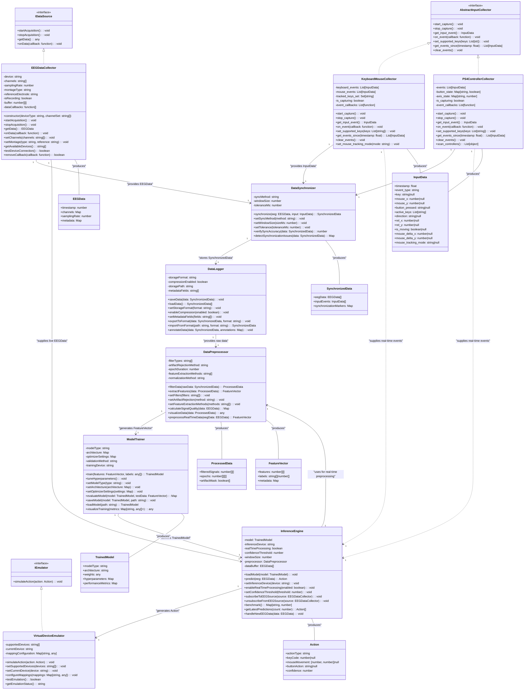

```mermaid
  classDiagram
    %% Interfaces for extensibility and reusability
    class IDataSource {
        <<interface>>
        +startAcquisition(): void
        +stopAcquisition(): void
        +getData(): any
        +onData(callback: function): void
    }

    class AbstractInputCollector {
        <<interface>>
        +start_capture(): void
        +stop_capture(): void
        +get_input_event(): InputData
        +on_event(callback: function): void
        +set_supported_keys(keys: List[str]): void
        +get_events_since(timestamp: float): List[InputData]
        +clear_events(): void
    }

    class IEmulator {
        <<interface>>
        +simulateAction(action: Action): void
    }

    %% Data Types
    class EEGData {
        +timestamp: number
        +channels: Map<string, number[]>
        +samplingRate: number
        +metadata: Map<string, any>
    }

    class InputData {
        +timestamp: float
        +event_type: string
        +key: string|null
        +mouse_x: number|null
        +mouse_y: number|null
        +button_pressed: string|null
        +active_keys: List[string]
        +direction: string|null
        +rel_x: number|null
        +rel_y: number|null
        +is_moving: boolean|null
        +mouse_delta_x: number|null
        +mouse_delta_y: number|null
        +mouse_tracking_mode: string|null
    }

    class SynchronizedData {
        +eegData: EEGData[]
        +inputEvents: InputData[]
        +synchronizationMarkers: Map<number, number>
    }

    class ProcessedData {
        +filteredSignals: number[][]
        +epochs: number[][][]
        +artifactMask: boolean[]
    }

    class FeatureVector {
        +features: number[][]
        +labels: string[]|number[]
        +metadata: Map<string, any>
    }

    class TrainedModel {
        +modelType: string
        +architecture: string
        +weights: any
        +hyperparameters: Map<string, any>
        +performanceMetrics: Map<string, number>
    }

    class Action {
        +actionType: string
        +keyCode: number|null
        +mouseMovement: [number, number]|null
        +buttonAction: string|null
        +confidence: number
    }

    %% Input Collector Implementation
    class KeyboardMouseCollector {
        -keyboard_events: List[InputData]
        -mouse_events: List[InputData]
        -tracked_keys_set: Set[string]
        -is_capturing: boolean
        -event_callbacks: List[function]
        +start_capture(): void
        +stop_capture(): void
        +get_input_event(): InputData
        +on_event(callback: function): void
        +set_supported_keys(keys: List[string]): void
        +get_events_since(timestamp: float): List[InputData]
        +clear_events(): void
        +set_mouse_tracking_mode(mode: string): void
    }

    class PS4ControllerCollector {
        -events: List[InputData]
        -button_state: Map[string, boolean]
        -axis_state: Map[string, number]
        -is_capturing: boolean
        -event_callbacks: List[function]
        +start_capture(): void
        +stop_capture(): void
        +get_input_event(): InputData
        +on_event(callback: function): void
        +set_supported_keys(keys: List[string]): void
        +get_events_since(timestamp: float): List[InputData]
        +clear_events(): void
        +scan_controllers(): List[object]
    }

    %% Main Modules
    class EEGDataCollector {
        -device: string
        -channels: string[]
        -samplingRate: number
        -montageType: string
        -referenceElectrode: string
        -isRecording: boolean
        -buffer: number[][]
        -dataCallbacks: function[]
        +constructor(deviceType: string, channelSet: string[])
        +startAcquisition(): void
        +stopAcquisition(): void
        +getData(): EEGData
        +onData(callback: function): void
        +setChannels(channels: string[]): void
        +setMontage(type: string, reference: string): void
        +getAvailableDevices(): string[]
        +testDeviceConnection(): boolean
        +removeCallback(callback: function): boolean
    }

    class DataSynchronizer {
        -syncMethod: string
        -windowSize: number
        -toleranceMs: number
        +synchronize(eeg: EEGData, input: InputData): SynchronizedData
        +setSyncMethod(method: string): void
        +setWindowSize(sizeMs: number): void
        +setTolerance(toleranceMs: number): void
        +verifySyncAccuracy(data: SynchronizedData): number
        +detectSynchronizationIssues(data: SynchronizedData): Map<string, any>
    }

    class DataLogger {
        -storageFormat: string
        -compressionEnabled: boolean
        -storagePath: string
        -metadataFields: string[]
        +saveData(data: SynchronizedData): void
        +loadData(): SynchronizedData[]
        +setStorageFormat(format: string): void
        +enableCompression(enabled: boolean): void
        +setMetadataFields(fields: string[]): void
        +exportToFormat(data: SynchronizedData, format: string): void
        +importFromFormat(path: string, format: string): SynchronizedData
        +annotateData(data: SynchronizedData, annotations: Map<string, any>): void
    }

    class DataPreprocessor {
        -filterTypes: string[]
        -artifactRejectionMethod: string
        -epochDuration: number
        -featureExtractionMethods: string[]
        -normalizationMethod: string
        +filterData(rawData: SynchronizedData): ProcessedData
        +extractFeatures(data: ProcessedData): FeatureVector
        +setFilters(filters: string[]): void
        +setArtifactRejection(method: string): void
        +setFeatureExtractionMethods(methods: string[]): void
        +calculateSignalQuality(data: EEGData): Map<string, number>
        +visualizeData(data: ProcessedData): any
        +preprocessRealTimeData(eegData: EEGData): FeatureVector
    }

    class ModelTrainer {
        -modelType: string
        -architecture: Map<string, any>
        -optimizerSettings: Map<string, any>
        -validationMethod: string
        -trainingDevice: string
        +train(features: FeatureVector, labels: any[]): TrainedModel
        +tuneHyperparameters(): void
        +setModelType(type: string): void
        +setArchitecture(architecture: Map<string, any>): void
        +setOptimizerSettings(settings: Map<string, any>): void
        +evaluateModel(model: TrainedModel, testData: FeatureVector): Map<string, number>
        +saveModel(model: TrainedModel, path: string): void
        +loadModel(path: string): TrainedModel
        +visualizeTraining(metrics: Map[string, any[]>): any
    }

    class InferenceEngine {
        -model: TrainedModel
        -inferenceDevice: string
        -realTimeProcessing: boolean
        -confidenceThreshold: number
        -windowSize: number
        -preprocessor: DataPreprocessor
        -dataBuffer: EEGData[]
        +loadModel(model: TrainedModel): void
        +predict(eeg: EEGData): Action
        +setInferenceDevice(device: string): void
        +enableRealTimeProcessing(enabled: boolean): void
        +setConfidenceThreshold(threshold: number): void
        +subscribeToEEGSource(source: EEGDataCollector): void
        +unsubscribeFromEEGSource(source: EEGDataCollector): void
        +benchmark(): Map[string, number]
        +getLatestPredictions(count: number): Action[]
        +handleNewEEGData(data: EEGData): void
    }

    class VirtualDeviceEmulator {
        -supportedDevices: string[]
        -currentDevice: string
        -mappingConfiguration: Map[string, any]
        +simulateAction(action: Action): void
        +setSupportedDevices(devices: string[]): void
        +setCurrentDevice(device: string): void
        +configureMappings(mappings: Map[string, any]): void
        +testEmulation(): boolean
        +getEmulationStatus(): string
    }

    %% Relationships
    IDataSource <|.. EEGDataCollector
    AbstractInputCollector <|.. KeyboardMouseCollector
    AbstractInputCollector <|.. PS4ControllerCollector
    IEmulator <|.. VirtualDeviceEmulator

    EEGDataCollector "1" --> "1" DataSynchronizer : "provides EEGData"
    KeyboardMouseCollector "1" --> "1" DataSynchronizer : "provides InputData"
    PS4ControllerCollector "1" --> "1" DataSynchronizer : "provides InputData"

    DataSynchronizer "1" --> "1" DataLogger : "stores SynchronizedData"

    DataLogger "1" --> "1" DataPreprocessor : "provides raw data"

    DataPreprocessor "1" --> "1" ModelTrainer : "generates FeatureVector"

    ModelTrainer "1" --> "1" InferenceEngine : "delivers TrainedModel"

    %% Direct line for real-time inference
    EEGDataCollector "1" --> "1" InferenceEngine : "supplies live EEGData"
    KeyboardMouseCollector "1" ..> "1" InferenceEngine : "supplies real-time events"
    PS4ControllerCollector "1" ..> "1" InferenceEngine : "supplies real-time events"
    InferenceEngine "1" --> "1" DataPreprocessor : "uses for real-time preprocessing"
    InferenceEngine "1" --> "1" VirtualDeviceEmulator : "generates Action"

    EEGDataCollector -- EEGData : "produces"
    KeyboardMouseCollector -- InputData : "produces"
    PS4ControllerCollector -- InputData : "produces"
    DataSynchronizer -- SynchronizedData : "produces"
    DataPreprocessor -- ProcessedData : "produces"
    DataPreprocessor -- FeatureVector : "produces"
    ModelTrainer -- TrainedModel : "produces"
    InferenceEngine -- Action : "produces"
```
