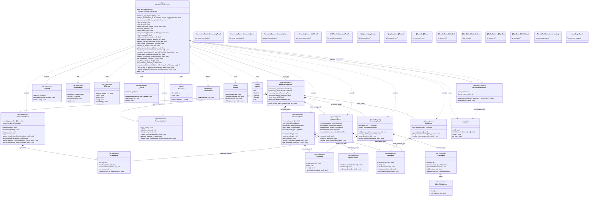

```mermaid
classDiagram
    %% ================================================================================
    %% ADAPTERS MODULE - CROSS-FRAMEWORK INTEGRATION SYSTEM
    %% ================================================================================

    %% ================================================================================
    %% CORE ADAPTER CLASS
    %% ================================================================================

    class QtInteractionAdapter {
        <<adapter>>
        -main_app: Optional[Any]
        -_executor: ThreadPoolExecutor

        +__init__(main_app: Optional[Any]) void
        +connect_board(board_id: int, params: Dict[str, Any], preset: int) bool
        +disconnect_board(force_ui_update: bool) bool
        +start_stream() bool
        +stop_stream() bool
        +apply_filters(filter_config: Dict[str, Any]) bool
        +calculate_metrics() bool
        +show_brain_map() bool
        +start_recording(filename: str, data_type: str) bool
        +stop_recording() bool
        +add_marker(marker_value: int) bool
        +add_streamer(streamer_params: str) bool
        +remove_streamer(streamer_params: str) bool
        +send_board_config(config_cmd: str) bool
        +convert_to_mne(duration: int) bool
        +plot_mne_visualization(plot_type: str) bool
        +compute_ica(components: int, channel: int) bool
        +compute_wavelet(wavelet_type: int, level: int, channel: int) bool
        +show_status_message(message: str) bool
        +update_visualization_button(enabled: bool) bool
        +get_connection_settings() Dict[str, Any]
        +get_filter_settings() Dict[str, Any]
        +get_recording_settings() Dict[str, Any]
        -_execute_safely(func: Callable[..., T], *args: Any, **kwargs: Any) T
        -_set_combo_by_data(combo: Any, data_value: Any) void
        -_update_all_panels_connection_state(connected: bool) void
        +__del__() void
    }

    %% ================================================================================
    %% GUI PANEL INTERFACES (TARGET COMPONENTS)
    %% ================================================================================

    class ConnectionPanel {
        <<gui component>>
        +board_type_combo: QComboBox
        +preset_combo: QComboBox
        +connect_board() void
        +disconnect_board() void
        +start_stream() void
        +stop_stream() void
        +update_visualization_button(enabled: bool) void
        +get_connection_settings() Dict[str, Any]
        -_update_params_from_dict(params: Dict[str, Any]) void
        -_update_connection_state(connected: bool) void
    }

    class ProcessingPanel {
        <<gui component>>
        +apply_filters() void
        +calculate_metrics() void
        +show_brain_map() void
        +enable_processing(enabled: bool) void
        +get_filter_settings() Dict[str, Any]
        -_update_filter_controls(filter_config: Dict[str, Any]) void
    }

    class RecordingPanel {
        <<gui component>>
        +record_file_edit: QLineEdit
        +raw_radio: QRadioButton
        +processed_radio: QRadioButton
        +both_radio: QRadioButton
        +marker_value_spin: QSpinBox
        +start_recording() void
        +stop_recording() void
        +add_marker() void
        +enable_recording(enabled: bool) void
        +get_recording_settings() Dict[str, Any]
    }

    class StreamingPanel {
        <<gui component>>
        +streamers_list: QListWidget
        +config_cmd_edit: QLineEdit
        +add_streamer(streamer_params: str) void
        +delete_selected_streamer() void
        +send_board_config() void
        +enable_streaming(enabled: bool) void
    }

    class MNEPanel {
        <<gui component>>
        +mne_duration_spin: QSpinBox
        +convert_to_mne() void
        +plot_mne_visualization(plot_type: str) void
        +enable_processing(enabled: bool) void
    }

    class AdvancedPanel {
        <<gui component>>
        +ica_components_spin: QSpinBox
        +ica_channel_combo: QComboBox
        +wavelet_type_combo: QComboBox
        +wavelet_level_spin: QSpinBox
        +wavelet_channel_combo: QComboBox
        +compute_ica() void
        +compute_wavelet() void
        +enable_processing(enabled: bool) void
    }

    class EEGProcessorApp {
        <<main application>>
        +connection_panel: ConnectionPanel
        +processing_panel: ProcessingPanel
        +recording_panel: RecordingPanel
        +streaming_panel: StreamingPanel
        +mne_panel: MNEPanel
        +advanced_panel: AdvancedPanel
        +show_status_message(message: str) void
    }

    %% ================================================================================
    %% QT5 FRAMEWORK COMPONENTS
    %% ================================================================================

    class QObject {
        <<qt5 framework>>
        +parent() QObject
        +setParent(parent: QObject) void
        +deleteLater() void
    }

    class QApplication {
        <<qt5 framework>>
        +instance()$ QApplication
        +thread() QThread
        +processEvents() void
        +quit() void
    }

    class QThread {
        <<qt5 framework>>
        +currentThread()$ QThread
        +start() void
        +quit() void
        +wait() bool
        +isRunning() bool
    }

    class QTimer {
        <<qt5 framework>>
        +singleShot(msec: int, slot: Callable)$ void
        +start(msec: int) void
        +stop() void
        +timeout: pyqtSignal
    }

    class QComboBox {
        <<qt5 framework>>
        +count() int
        +itemData(index: int) Any
        +setCurrentIndex(index: int) void
        +currentIndex() int
        +addItem(text: str, userData: Any) void
    }

    class QLineEdit {
        <<qt5 framework>>
        +setText(text: str) void
        +text() str
        +clear() void
        +setEnabled(enabled: bool) void
    }

    class QRadioButton {
        <<qt5 framework>>
        +setChecked(checked: bool) void
        +isChecked() bool
        +setEnabled(enabled: bool) void
    }

    class QSpinBox {
        <<qt5 framework>>
        +setValue(value: int) void
        +value() int
        +setMinimum(min: int) void
        +setMaximum(max: int) void
        +setEnabled(enabled: bool) void
    }

    class QListWidget {
        <<qt5 framework>>
        +count() int
        +item(row: int) QListWidgetItem
        +setCurrentRow(row: int) void
        +addItem(text: str) void
        +takeItem(row: int) QListWidgetItem
    }

    class QListWidgetItem {
        <<qt5 framework>>
        +text() str
        +setText(text: str) void
    }

    %% ================================================================================
    %% THREADING COMPONENTS
    %% ================================================================================

    class ThreadPoolExecutor {
        <<concurrent.futures>>
        +max_workers: int
        +thread_name_prefix: str
        +submit(func: Callable, *args: Any, **kwargs: Any) Future
        +shutdown(wait: bool) void
    }

    class threading {
        <<stdlib>>
        +Event: Class
        +Lock: Class
        +current_thread() Thread
    }

    class Event {
        <<threading>>
        +set() void
        +wait(timeout: Optional[float]) bool
        +clear() void
        +is_set() bool
    }

    class TimeoutError {
        <<exception>>
        +__init__(message: str) void
    }

    %% ================================================================================
    %% STANDARD LIBRARY COMPONENTS
    %% ================================================================================

    class logging {
        <<stdlib>>
        +info(message: str) void
        +warning(message: str) void
        +error(message: str) void
        +debug(message: str) void
    }

    class typing {
        <<stdlib>>
        +Any
        +Callable
        +Optional
        +TypeVar
        +Dict
    }

    %% ================================================================================
    %% RELATIONSHIPS
    %% ================================================================================

    %% Inheritance
    QtInteractionAdapter --|> QObject : extends

    %% Composition and Aggregation
    QtInteractionAdapter "1" *-- "1" ThreadPoolExecutor : _executor
    QtInteractionAdapter "1" o-- "1" EEGProcessorApp : main_app

    EEGProcessorApp "1" *-- "1" ConnectionPanel : connection_panel
    EEGProcessorApp "1" *-- "1" ProcessingPanel : processing_panel
    EEGProcessorApp "1" *-- "1" RecordingPanel : recording_panel
    EEGProcessorApp "1" *-- "1" StreamingPanel : streaming_panel
    EEGProcessorApp "1" *-- "1" MNEPanel : mne_panel
    EEGProcessorApp "1" *-- "1" AdvancedPanel : advanced_panel

    ConnectionPanel "1" *-- "2..*" QComboBox : ui_controls
    RecordingPanel "1" *-- "1" QLineEdit : record_file_edit
    RecordingPanel "1" *-- "3" QRadioButton : data_type_radios
    RecordingPanel "1" *-- "1" QSpinBox : marker_value_spin
    StreamingPanel "1" *-- "1" QListWidget : streamers_list
    StreamingPanel "1" *-- "1" QLineEdit : config_cmd_edit
    MNEPanel "1" *-- "1" QSpinBox : mne_duration_spin
    AdvancedPanel "1" *-- "2" QSpinBox : parameter_spins
    AdvancedPanel "1" *-- "3" QComboBox : selection_combos

    QListWidget "1" *-- "*" QListWidgetItem : items

    %% Dependencies and Usage
    QtInteractionAdapter ..> QApplication : uses
    QtInteractionAdapter ..> QThread : uses
    QtInteractionAdapter ..> QTimer : uses
    QtInteractionAdapter ..> threading : uses
    QtInteractionAdapter ..> Event : uses
    QtInteractionAdapter ..> TimeoutError : throws
    QtInteractionAdapter ..> logging : uses
    QtInteractionAdapter ..> typing : uses

    %% API Target Relationships
    QtInteractionAdapter ..> ConnectionPanel : controls
    QtInteractionAdapter ..> ProcessingPanel : controls
    QtInteractionAdapter ..> RecordingPanel : controls
    QtInteractionAdapter ..> StreamingPanel : controls
    QtInteractionAdapter ..> MNEPanel : controls
    QtInteractionAdapter ..> AdvancedPanel : controls

    %% Thread Safety Dependencies
    QtInteractionAdapter ..> ThreadPoolExecutor : executes in
    ThreadPoolExecutor ..> Event : synchronizes with

    %% ================================================================================
    %% LOGICAL GROUPINGS
    %% ================================================================================

    %% Connection Operations Group
    ConnectionPanel -.- ProcessingPanel : "gui panel coordination"
    ProcessingPanel -.- RecordingPanel : "gui panel coordination"
    RecordingPanel -.- StreamingPanel : "gui panel coordination"
    StreamingPanel -.- MNEPanel : "gui panel coordination"
    MNEPanel -.- AdvancedPanel : "gui panel coordination"

    %% Qt Framework Group
    QObject -.- QApplication : "qt framework core"
    QApplication -.- QThread : "qt framework core"
    QThread -.- QTimer : "qt framework core"

    %% UI Controls Group
    QComboBox -.- QLineEdit : "qt ui controls"
    QLineEdit -.- QRadioButton : "qt ui controls"
    QRadioButton -.- QSpinBox : "qt ui controls"
    QSpinBox -.- QListWidget : "qt ui controls"

    %% Threading Group
    ThreadPoolExecutor -.- threading : "concurrency support"
    threading -.- Event : "concurrency support"
```
