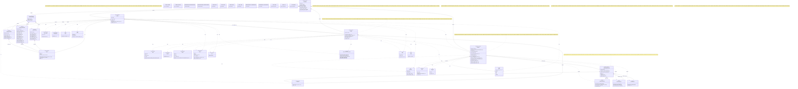

```mermaid
classDiagram
    %% ================================================================================
    %% CLI MODULE - COMMAND-LINE INTERFACE SYSTEM
    %% ================================================================================
    
    %% ================================================================================
    %% CORE CLI COMPONENTS
    %% ================================================================================
    
    class CLIApp {
        <<typer application>>
        +app: Typer
        
        +run_cli() void
        +version() void
        +info() void
        +signal_handler(sig: int, frame: Any) void
        +shutdown_cli() void
    }
    
    class CLIShell {
        <<interactive shell>>
        +console: Console
        
        +run_interactive_shell() void
        +run_typer_command(args: List[str]) void
        +show_welcome_message() void
        +show_help_message() void
        +show_status() void
        +run_shell() void
    }
    
    class CLIConfig {
        <<configuration module>>
        +headless_mode: bool
        +headless_app: Optional[HeadlessEEGProcessor]
        +gui_mode: bool
        +cli_running: threading.Event
        +_main_thread_id: int
        
        +set_gui_mode(enabled: bool) void
        +get_gui_mode() bool
        +is_main_thread() bool
        +set_cli_running(running: bool) void
        +is_cli_running() bool
        +wait_for_cli_exit(timeout: Optional[float]) bool
        +init_headless_mode() HeadlessEEGProcessor
        +get_data_service() Any
        +get_interaction_service() Any
        +get_collector_service() Any
        +initialize_headless_mode() bool
        +cleanup_headless_mode() void
    }
    
    class HeadlessEEGProcessor {
        <<headless application>>
        +console: Console
        +data_service: DataAccessService
        +interaction_service: InteractionService
        +collector_service: CollectorService
        
        +__init__() void
        +shutdown() void
        -_setup_services() void
        -_initialize_apis() void
    }
    
    class CLIPackage {
        <<module package>>
        +app: Typer
        +run_shell: Callable
        +headless_mode: bool
        +set_gui_mode: Callable
        +get_gui_mode: Callable
        +init_headless_mode: Callable
        +get_data_service: Callable
        +get_interaction_service: Callable
        +get_collector_service: Callable
    }
    
    %% ================================================================================
    %% COMMAND MODULES (IMPORTED FROM COMMANDS PACKAGE)
    %% ================================================================================
    
    class CommandsPackage {
        <<command modules>>
        +data_app: Typer
        +monitor_app: Typer
        +control_app: Typer
    }
    
    class DataCommands {
        <<typer app>>
        +data_app: Typer
        
        +get_current_data() void
        +get_eeg_data() void
        +get_channel_data() void
        +get_metadata() void
        +get_sampling_rate() void
        +get_channel_names() void
        +get_board_info() void
        +get_signal_quality() void
    }
    
    class InteractionCommands {
        <<typer app>>
        +control_app: Typer
        
        +connect_to_board() void
        +disconnect_from_board() void
        +start_stream() void
        +stop_stream() void
        +start_recording() void
        +stop_recording() void
        +apply_filters() void
        +start_visualization() void
        +stop_visualization() void
        +perform_ica() void
        +convert_to_mne() void
        +compute_wavelet() void
        +apply_downsampling() void
        +get_system_status() void
        +list_available_boards() void
    }
    
    class MonitorCommands {
        <<typer app>>
        +monitor_app: Typer
        
        +monitor_stream() void
        +monitor_status() void
        +monitor_channels() void
        +monitor_signal_quality() void
        +monitor_recording() void
    }
    
    %% ================================================================================
    %% TYPER FRAMEWORK COMPONENTS
    %% ================================================================================
    
    class Typer {
        <<typer framework>>
        +name: str
        +help: str
        +commands: Dict[str, Command]
        
        +add_typer(typer_instance: Typer, name: str) void
        +command(name: str) Callable
        +__call__() Any
    }
    
    class typer_module {
        <<typer framework>>
        +Typer: Class
        +run(app: Typer) void
    }
    
    %% ================================================================================
    %% RICH CONSOLE FRAMEWORK
    %% ================================================================================
    
    class Console {
        <<rich framework>>
        +print(message: str, style: str) void
        +clear() void
    }
    
    class Panel {
        <<rich framework>>
        +content: str
        +title: str
        +border_style: str
        +box: Box
        
        +fit(content: str, title: str, border_style: str, box: Box)$ Panel
    }
    
    class Prompt {
        <<rich framework>>
        +ask(question: str)$ str
    }
    
    class Syntax {
        <<rich framework>>
        +code: str
        +lexer: str
        +theme: str
        +line_numbers: bool
        
        +__init__(code: str, lexer: str, theme: str, line_numbers: bool) void
    }
    
    class Table {
        <<rich framework>>
        +title: str
        +box: Box
        +columns: List[Column]
        +rows: List[Row]
        
        +add_column(header: str, style: str) void
        +add_row(*values: str) void
    }
    
    class box {
        <<rich framework>>
        +ROUNDED$: Box
    }
    
    %% ================================================================================
    %% SERVICES AND API INTEGRATION
    %% ================================================================================
    
    class DataAccessService {
        <<service>>
        +get_instance()$ DataAccessService
        +get_current_data() Tuple[np.ndarray, List[int]]
        +get_metadata() Dict[str, Any]
        +is_streaming() bool
    }
    
    class InteractionService {
        <<service>>
        +get_instance()$ InteractionService
        +get_system_status() Dict[str, Any]
        +get_recording_status() Dict[str, Any]
    }
    
    class CollectorService {
        <<service>>
        +get_instance()$ CollectorService
        +cleanup() void
    }
    
    class EEGProcessorInteractionAPI {
        <<static api>>
        +get_system_status()$ Dict[str, Any]
        +connect_to_board()$ Dict[str, Any]
        +disconnect_from_board()$ Dict[str, Any]
        +start_stream()$ Dict[str, Any]
        +stop_stream()$ Dict[str, Any]
    }
    
    class APIIntegration {
        <<api integration>>
        +shutdown() void
    }
    
    %% ================================================================================
    %% SYSTEM COMPONENTS
    %% ================================================================================
    
    class atexit {
        <<stdlib>>
        +register(func: Callable) void
    }
    
    class signal {
        <<stdlib>>
        +signal(sig: int, handler: Callable) void
        +SIGINT$: int
        +SIGTERM$: int
    }
    
    class sys {
        <<stdlib>>
        +argv: List[str]
        +exit(code: int) void
        +stdin: TextIO
    }
    
    class threading {
        <<stdlib>>
        +Event: Class
        +Thread: Class
        +main_thread() Thread
        +current_thread() Thread
    }
    
    class Event {
        <<threading>>
        +set() void
        +clear() void
        +wait(timeout: Optional[float]) bool
        +is_set() bool
    }
    
    class Thread {
        <<threading>>
        +ident: int
        +is_alive() bool
    }
    
    class shlex {
        <<stdlib>>
        +split(s: str) List[str]
    }
    
    class typing {
        <<stdlib>>
        +TYPE_CHECKING: bool
        +Optional
        +List
        +Dict
        +Any
        +Callable
    }
    
    %% ================================================================================
    %% RELATIONSHIPS
    %% ================================================================================
    
    %% Package Composition
    CLIPackage "1" *-- "1" CLIApp : contains
    CLIPackage "1" *-- "1" CLIShell : contains
    CLIPackage "1" *-- "1" CLIConfig : contains
    CLIPackage "1" *-- "1" CommandsPackage : contains
    
    CommandsPackage "1" *-- "1" DataCommands : contains
    CommandsPackage "1" *-- "1" InteractionCommands : contains
    CommandsPackage "1" *-- "1" MonitorCommands : contains
    
    %% Core Component Relationships
    CLIApp "1" *-- "1" Typer : app
    CLIApp "1" o-- "1" CLIShell : uses
    CLIApp ..> CLIConfig : uses
    
    CLIShell "1" *-- "1" Console : console
    CLIShell ..> CLIApp : runs commands via
    CLIShell ..> CLIConfig : uses
    
    CLIConfig "1" *-- "1" Event : cli_running
    CLIConfig "1" o-- "0..1" HeadlessEEGProcessor : headless_app
    
    HeadlessEEGProcessor "1" *-- "1" Console : console
    HeadlessEEGProcessor "1" *-- "1" DataAccessService : data_service
    HeadlessEEGProcessor "1" *-- "1" InteractionService : interaction_service
    HeadlessEEGProcessor "1" *-- "1" CollectorService : collector_service
    
    %% Command Module Integration
    CLIApp ..> DataCommands : registers
    CLIApp ..> InteractionCommands : registers
    CLIApp ..> MonitorCommands : registers
    
    DataCommands "1" *-- "1" Typer : data_app
    InteractionCommands "1" *-- "1" Typer : control_app
    MonitorCommands "1" *-- "1" Typer : monitor_app
    
    %% Framework Dependencies
    CLIApp ..> typer_module : uses
    CLIApp ..> Console : uses
    CLIApp ..> Table : uses
    CLIApp ..> box : uses
    
    CLIShell ..> Panel : uses
    CLIShell ..> Prompt : uses
    CLIShell ..> Syntax : uses
    CLIShell ..> Table : uses
    CLIShell ..> box : uses
    
    %% Service Dependencies
    CLIConfig ..> DataAccessService : provides
    CLIConfig ..> InteractionService : provides
    CLIConfig ..> CollectorService : provides
    
    CLIShell ..> EEGProcessorInteractionAPI : uses
    CLIApp ..> EEGProcessorInteractionAPI : uses
    CLIApp ..> APIIntegration : uses
    
    %% System Dependencies
    CLIApp ..> atexit : uses
    CLIApp ..> signal : uses
    CLIApp ..> sys : uses
    CLIApp ..> threading : uses
    
    CLIShell ..> shlex : uses
    CLIShell ..> sys : uses
    
    CLIConfig ..> threading : uses
    CLIConfig ..> Thread : uses
    CLIConfig ..> Event : uses
    
    %% Standard Library Dependencies
    CLIApp ..> typing : uses
    CLIShell ..> typing : uses
    CLIConfig ..> typing : uses
    
    %% ================================================================================
    %% LOGICAL GROUPINGS
    %% ================================================================================
    
    %% Core CLI Components
    CLIApp -.- CLIShell : "core cli components"
    CLIShell -.- CLIConfig : "core cli components"
    
    %% Command Modules
    DataCommands -.- InteractionCommands : "command modules"
    InteractionCommands -.- MonitorCommands : "command modules"
    
    %% Rich Framework
    Console -.- Panel : "rich framework"
    Panel -.- Prompt : "rich framework"
    Prompt -.- Syntax : "rich framework"
    Syntax -.- Table : "rich framework"
    
    %% Services
    DataAccessService -.- InteractionService : "core services"
    InteractionService -.- CollectorService : "core services"
    
    %% System Components
    atexit -.- signal : "system components"
    signal -.- sys : "system components"
    sys -.- threading : "system components"
    
    %% ================================================================================
    %% NOTES
    %% ================================================================================
    
    note for CLIApp "Main CLI Application:\n• Typer-based CLI application with command structure\n• Signal handler registration for graceful shutdown (SIGINT, SIGTERM)\n• Atexit handler for cleanup operations\n• Thread-safe operation with main thread detection\n• Version and info commands with rich table output\n• Integration with CLI shell for interactive operation\n• Proper resource cleanup and API shutdown coordination\n• Support for both standalone and GUI-integrated operation modes"
    
    note for CLIShell "Interactive CLI Shell:\n• Rich-powered interactive shell with professional appearance\n• Command parsing using shlex for proper argument handling\n• Built-in commands (exit, quit, help, status, clear)\n• Welcome message with mode-specific information (GUI/headless)\n• Help system with syntax highlighting\n• Real-time status display with connection, streaming, and recording info\n• Exception handling preventing shell crashes\n• SystemExit catching to maintain shell operation\n• Keyboard interrupt handling with user guidance"
    
    note for CLIConfig "Configuration and State Management:\n• Global state management for headless and GUI modes\n• Thread-safe configuration with Event-based synchronization\n• Main thread detection for signal handler registration\n• Service factory functions with error handling\n• CLI lifecycle management (running/stopped states)\n• Timeout-based waiting for CLI exit\n• Resource cleanup coordination\n• Backward compatibility support"
    
    note for HeadlessEEGProcessor "Headless Application Mode:\n• Complete EEG processor initialization without GUI\n• Service lifecycle management (DataAccess, Interaction, Collector)\n• Proper initialization order ensuring dependency satisfaction\n• Rich console integration for status reporting\n• Resource cleanup with exception handling\n• API initialization coordination\n• Memory management and service cleanup"
    
    note "CLI Architecture Features:\n• Dual operation modes: standalone headless and GUI-integrated\n• Modular command structure with clear separation (data, control, monitor)\n• Professional terminal interface with Rich framework integration\n• Thread-safe operation with proper signal handling\n• Service dependency injection with factory pattern\n• Resource lifecycle management with cleanup coordination\n• Interactive shell with built-in help and status commands\n• Cross-platform compatibility with proper error handling"
    
    note "Integration Capabilities:\n• Seamless GUI integration preserving both CLI and GUI functionality\n• Service sharing between CLI and GUI components\n• Real-time status synchronization across interfaces\n• API integration enabling external control and automation\n• Command-line argument processing for scriptable operation\n• Interactive shell for exploratory and development use\n• Resource sharing optimization reducing memory footprint"
    
    note "User Experience Design:\n• Professional terminal appearance with Rich framework styling\n• Intuitive command structure following standard CLI conventions\n• Help system with syntax highlighting\n• Real-time feedback with color-coded status indicators\n• Graceful error handling with user-friendly messages\n• Interactive prompts with command history and completion\n• Clear separation between interactive and batch operation modes\n• Consistent behavior across Windows and Unix platforms"
    
    note "Command Integration:\n• 25+ commands organized into logical groups (data, control, monitor)\n• Typer framework providing modern CLI with auto-completion\n• Rich formatting for professional terminal output\n• Multi-format support (JSON, tables, interactive displays)\n• Real-time monitoring with configurable refresh rates\n• Cross-platform keyboard input handling\n• Parameter validation with user-friendly error messages\n• Coverage of all EEG processor functionality"
```