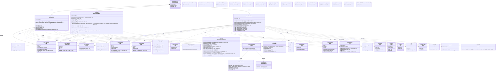

```mermaid
classDiagram
    %% ================================================================================
    %% CLI COMMANDS MODULE - COMMAND-LINE INTERFACE SYSTEM
    %% ================================================================================

    %% ================================================================================
    %% COMMAND MODULES
    %% ================================================================================

    class DataCommands {
        <<typer app>>
        +data_app: Typer

        +get_current_data(max_samples: Optional[int], format: str, all_data: bool, vertical: bool) void
        +get_eeg_data(max_samples: Optional[int], format: str, all_data: bool, vertical: bool) void
        +get_channel_data(channel_index: int, max_samples: Optional[int], format: str, all_data: bool) void
        +get_metadata() void
        +get_sampling_rate() void
        +get_channel_names() void
        +get_board_info() void
        +get_signal_quality(channel_index: Optional[int], all_channels: bool) void
    }

    class InteractionCommands {
        <<typer app>>
        +control_app: Typer

        +connect_to_board(board_id: int, preset: int, params: Optional[str]) void
        +disconnect_from_board() void
        +start_stream(buffer_size: int) void
        +stop_stream() void
        +start_recording(filename: str, data_type: str) void
        +stop_recording() void
        +apply_filters(bandpass_low: float, bandpass_high: float, notch_freq: int, enable_bandpass: bool, enable_notch: bool, enable_detrend: bool, apply_to_viz: bool) void
        +start_visualization(viz_type: str) void
        +stop_visualization(viz_type: str) void
        +perform_ica(num_components: int, channels: Optional[str]) void
        +convert_to_mne(duration: int, use_filters: bool) void
        +compute_wavelet(wavelet_type: int, level: int, channel: int, extension: int, denoising: bool) void
        +apply_downsampling(factor: int, method: str, apply: bool) void
        +get_system_status() void
        +list_available_boards() void
    }

    class MonitorCommands {
        <<typer app>>
        +monitor_app: Typer

        +monitor_stream(duration: Optional[int], refresh_rate: float) void
        +monitor_status(duration: Optional[int], refresh_rate: float) void
        +monitor_channels(channels: Optional[str], duration: Optional[int], refresh_rate: float) void
        +monitor_signal_quality(duration: Optional[int], refresh_rate: float) void
        +monitor_recording(refresh_rate: float) void
        -_setup_key_listener(stop_event: threading.Event) void
        -_create_stream_display() Panel | Layout
        -_create_status_display() Panel | Layout
        -_create_channels_display() Panel | Layout
        -_create_quality_display() Panel | Layout
        -_create_recording_display() Panel
    }

    class CommandsPackage {
        <<module package>>
        +data_app: Typer
        +monitor_app: Typer
        +control_app: Typer
    }

    %% ================================================================================
    %% TYPER FRAMEWORK COMPONENTS
    %% ================================================================================

    class Typer {
        <<typer framework>>
        +name: str
        +help: str
        +commands: Dict[str, Command]

        +command(name: str) Callable
        +add_typer(typer_instance: Typer, name: str) void
        +__call__() Any
    }

    class typer_Argument {
        <<typer framework>>
        +default: Any
        +help: str

        +__init__(*args: Any, help: str) void
    }

    class typer_Option {
        <<typer framework>>
        +default: Any
        +flag_name: str
        +help: str

        +__init__(default: Any, flag_name: str, help: str) void
    }

    %% ================================================================================
    %% RICH CONSOLE COMPONENTS
    %% ================================================================================

    class Console {
        <<rich framework>>
        +print(message: str, style: str) void
        +print(*args: Any, **kwargs: Any) void
    }

    class Table {
        <<rich framework>>
        +title: str
        +box: Box
        +columns: List[Column]
        +rows: List[Row]

        +add_column(header: str, style: str, justify: str) void
        +add_row(*values: str) void
    }

    class Panel {
        <<rich framework>>
        +content: str
        +title: str
        +border_style: str

        +__init__(content: str, title: str, border_style: str) void
    }

    class Layout {
        <<rich framework>>
        +name: str
        +ratio: float
        +size: int

        +split_column(*layouts: Layout) void
        +split_row(*layouts: Layout) void
        +update(content: Any) void
    }

    class Live {
        <<rich framework>>
        +renderable: Any
        +refresh_per_second: float

        +__init__(renderable: Any, refresh_per_second: float) void
        +update(renderable: Any) void
        +__enter__() Live
        +__exit__(exc_type: Any, exc_val: Any, exc_tb: Any) void
    }

    class box {
        <<rich framework>>
        +ROUNDED$: Box
        +SIMPLE$: Box
    }

    %% ================================================================================
    %% CLI CONFIGURATION AND SERVICES
    %% ================================================================================

    class cli_config {
        <<configuration module>>
        +get_data_service()$ DataAccessService
        +get_interaction_service()$ InteractionService
    }

    class DataAccessService {
        <<external service>>
        +get_current_data() Tuple[np.ndarray, List[int]]
        +get_eeg_data(max_samples: Optional[int]) Tuple[np.ndarray, List[int]]
        +get_metadata() Dict[str, Any]
        +get_channel_names() List[str]
        +is_streaming() bool
    }

    class InteractionService {
        <<external service>>
        +get_system_status() Dict[str, Any]
        +get_recording_status() Dict[str, Any]
    }

    %% ================================================================================
    %% API INTEGRATION COMPONENTS
    %% ================================================================================

    class EEGDataAPI {
        <<static api>>
        +get_channel_data(channel_index: int)$ Tuple[np.ndarray, List[int]]
        +get_metadata()$ Dict[str, Any]
        +get_sampling_rate()$ int
        +get_channel_names()$ List[str]
        +get_board_info()$ Dict[str, Any]
        +get_all_channels_quality()$ Dict[int, float]
    }

    class EEGProcessorInteractionAPI {
        <<static api>>
        +connect_to_board(board_id: int, params: Dict[str, Any], preset: int)$ Dict[str, Any]
        +disconnect_from_board()$ Dict[str, Any]
        +start_stream(buffer_size: int)$ Dict[str, Any]
        +stop_stream()$ Dict[str, Any]
        +start_recording(filename: str, data_type: str)$ Dict[str, Any]
        +stop_recording()$ Dict[str, Any]
        +apply_filters(filter_config: Dict[str, Any])$ Dict[str, Any]
        +start_visualization(viz_type: str)$ Dict[str, Any]
        +stop_visualization(viz_type: str)$ Dict[str, Any]
        +perform_ica(num_components: int, channels: Optional[List[int]])$ Dict[str, Any]
        +convert_to_mne(duration: int, use_filters: bool)$ Dict[str, Any]
        +compute_wavelet(wavelet_type: int, level: int, channel: int, extension: int, denoising: bool)$ Dict[str, Any]
        +apply_downsampling(factor: int, method: int, apply: bool)$ Dict[str, Any]
        +get_system_status()$ Dict[str, Any]
    }

    %% ================================================================================
    %% BRAINFLOW COMPONENTS
    %% ================================================================================

    class BoardIds {
        <<brainflow enum>>
        +SYNTHETIC_BOARD$: BoardIds
        +CYTON_BOARD$: BoardIds
        +GANGLION_BOARD$: BoardIds
        +UNICORN_BOARD$: BoardIds
        +BRAINBIT_BOARD$: BoardIds
        +MUSE_2_BOARD$: BoardIds
        +PLAYBACK_FILE_BOARD$: BoardIds
        +STREAMING_BOARD$: BoardIds
        +value: int
    }

    class BoardShim {
        <<brainflow framework>>
        +get_board_descr(board_id: int)$ Dict[str, Any]
    }

    %% ================================================================================
    %% SYSTEM COMPONENTS
    %% ================================================================================

    class threading {
        <<stdlib>>
        +Event: Class
        +Thread: Class
        +current_thread() Thread
    }

    class Event {
        <<threading>>
        +set() void
        +is_set() bool
        +wait(timeout: float) bool
        +clear() void
    }

    class Thread {
        <<threading>>
        +daemon: bool
        +target: Callable
        +start() void
        +join() void
    }

    class time {
        <<stdlib>>
        +time() float
        +sleep(seconds: float) void
        +strftime(format: str) str
    }

    class sys {
        <<stdlib>>
        +platform: str
        +stdin: TextIO
    }

    class json {
        <<stdlib>>
        +dumps(obj: Any, indent: int) str
        +loads(s: str) Any
        +JSONDecodeError: Exception
    }

    class typing {
        <<stdlib>>
        +Optional
        +List
        +Dict
        +Any
        +Tuple
    }

    %% ================================================================================
    %% PLATFORM-SPECIFIC COMPONENTS
    %% ================================================================================

    class msvcrt {
        <<windows stdlib>>
        +kbhit() bool
        +getch() bytes
    }

    class tty {
        <<unix stdlib>>
        +setcbreak(fd: int) void
    }

    class termios {
        <<unix stdlib>>
        +tcgetattr(fd: int) List[Any]
        +tcsetattr(fd: int, when: int, attrs: List[Any]) void
        +TCSADRAIN$: int
    }

    class select {
        <<unix stdlib>>
        +select(rlist: List[Any], wlist: List[Any], xlist: List[Any], timeout: float) Tuple[List[Any], List[Any], List[Any]]
    }

    %% ================================================================================
    %% EXTERNAL DEPENDENCIES
    %% ================================================================================

    class numpy {
        <<external library>>
        +ndarray: Class
        +array(data: Any) ndarray
    }

    %% ================================================================================
    %% RELATIONSHIPS
    %% ================================================================================

    %% Package Composition
    CommandsPackage "1" *-- "1" DataCommands : contains
    CommandsPackage "1" *-- "1" InteractionCommands : contains
    CommandsPackage "1" *-- "1" MonitorCommands : contains

    %% Framework Relationships
    DataCommands "1" *-- "1" Typer : data_app
    InteractionCommands "1" *-- "1" Typer : control_app
    MonitorCommands "1" *-- "1" Typer : monitor_app

    %% Dependencies - Framework Usage
    DataCommands ..> typer_Argument : uses
    DataCommands ..> typer_Option : uses
    DataCommands ..> Console : uses
    DataCommands ..> Table : uses
    DataCommands ..> Panel : uses
    DataCommands ..> box : uses

    InteractionCommands ..> typer_Argument : uses
    InteractionCommands ..> typer_Option : uses
    InteractionCommands ..> Console : uses
    InteractionCommands ..> Table : uses
    InteractionCommands ..> BoardIds : uses
    InteractionCommands ..> BoardShim : uses

    MonitorCommands ..> typer_Option : uses
    MonitorCommands ..> Console : uses
    MonitorCommands ..> Table : uses
    MonitorCommands ..> Panel : uses
    MonitorCommands ..> Layout : uses
    MonitorCommands ..> Live : uses
    MonitorCommands ..> box : uses
    MonitorCommands ..> threading : uses
    MonitorCommands ..> Event : uses
    MonitorCommands ..> Thread : uses

    %% Service Dependencies
    DataCommands ..> cli_config : uses
    DataCommands ..> EEGDataAPI : uses
    MonitorCommands ..> cli_config : uses
    MonitorCommands ..> EEGDataAPI : uses
    InteractionCommands ..> EEGProcessorInteractionAPI : uses

    cli_config ..> DataAccessService : provides
    cli_config ..> InteractionService : provides

    %% Standard Library Dependencies
    DataCommands ..> json : uses
    DataCommands ..> typing : uses
    InteractionCommands ..> json : uses
    InteractionCommands ..> typing : uses
    MonitorCommands ..> sys : uses
    MonitorCommands ..> time : uses
    MonitorCommands ..> typing : uses

    %% Platform-Specific Dependencies
    MonitorCommands ..> msvcrt : uses (Windows)
    MonitorCommands ..> tty : uses (Unix)
    MonitorCommands ..> termios : uses (Unix)
    MonitorCommands ..> select : uses (Unix)

    %% External Dependencies
    DataCommands ..> numpy : uses
    MonitorCommands ..> numpy : uses

    %% ================================================================================
    %% LOGICAL GROUPINGS
    %% ================================================================================

    %% Command Categories
    DataCommands -.- InteractionCommands : "cli command apps"
    InteractionCommands -.- MonitorCommands : "cli command apps"

    %% Rich Framework Components
    Console -.- Table : "rich display components"
    Table -.- Panel : "rich display components"
    Panel -.- Layout : "rich display components"
    Layout -.- Live : "rich display components"

    %% Typer Framework Components
    Typer -.- typer_Argument : "typer framework"
    typer_Argument -.- typer_Option : "typer framework"

    %% Threading Components
    threading -.- Event : "concurrency support"
    Event -.- Thread : "concurrency support"

    %% Platform-Specific Components
    msvcrt -.- tty : "platform keyboard input"
    tty -.- termios : "unix terminal control"
    termios -.- select : "unix terminal control"

    %% API Components
    EEGDataAPI -.- EEGProcessorInteractionAPI : "api integration"
```
