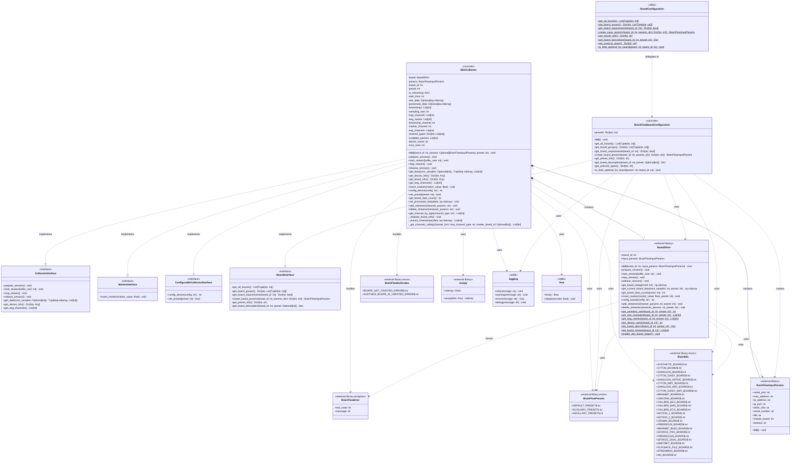

```mermaid
classDiagram
    %% ================================================================================
    %% COLLECTORS MODULE - EEG DATA COLLECTION SYSTEM
    %% ================================================================================
    
    %% Core Collector Implementation
    class EEGCollector {
        <<concrete>>
        -board: BoardShim
        -params: BrainFlowInputParams
        -board_id: int
        -preset: int
        -is_streaming: bool
        -start_time: int
        -raw_data: Optional[np.ndarray]
        -processed_data: Optional[np.ndarray]
        -timestamps: List[int]
        -sampling_rate: int
        -eeg_channels: List[int]
        -eeg_names: List[str]
        -timestamp_channel: int
        -marker_channel: int
        -exg_channels: List[int]
        -channel_types: Dict[str, List[int]]
        -available_presets: List[int]
        -device_name: str
        -num_rows: int
        
        +__init__(board_id: int, params: Optional[BrainFlowInputParams], preset: int) void
        +prepare_session() void
        +start_stream(buffer_size: int) void
        +stop_stream() void
        +release_session() void
        +get_data(num_samples: Optional[int]) Tuple[np.ndarray, List[int]]
        +get_device_info() Dict[str, Any]
        +get_board_info() Dict[str, Any]
        +get_eeg_channels() List[int]
        +insert_marker(marker_value: float) void
        +config_device(config: str) str
        +set_preset(preset: int) bool
        +get_board_data_count() int
        +set_processed_data(data: np.ndarray) void
        +add_streamer(streamer_params: str) void
        +delete_streamer(streamer_params: str) void
        +get_channel_by_type(channel_type: str) List[int]
        -_initialize_board_info() void
        -_extract_timestamps(data: np.ndarray) List[int]
        -_get_channels_safely(channel_func: Any, channel_type: str, master_board_id: Optional[int]) List[int]
    }
    
    %% Board Configuration Management
    class BrainFlowBoardConfiguration {
        <<concrete>>
        +presets: Dict[str, int]
        
        +__init__() void
        +get_all_boards() List[Tuple[str, int]]
        +get_board_groups() Dict[str, List[Tuple[str, int]]]
        +get_board_requirements(board_id: int) Dict[str, bool]
        +create_board_params(board_id: int, params_dict: Dict[str, str]) BrainFlowInputParams
        +get_preset_info() Dict[int, str]
        +get_board_description(board_id: int, preset: Optional[int]) Dict
        +get_protocol_types() Dict[int, str]
        +is_field_optional_for_board(param: str, board_id: int) bool
    }
    
    %% Static Configuration Wrapper
    class BoardConfiguration {
        <<utility>>
        +get_all_boards()$ List[Tuple[str, int]]
        +get_board_groups()$ Dict[str, List[Tuple[str, int]]]
        +get_board_requirements(board_id: int)$ Dict[str, bool]
        +create_input_params(board_id: int, params_dict: Dict[str, str])$ BrainFlowInputParams
        +get_preset_info()$ Dict[int, str]
        +get_board_description(board_id: int, preset: int)$ Dict
        +get_protocol_types()$ Dict[int, str]
        +is_field_optional_for_board(param: str, board_id: int)$ bool
    }
    
    %% ================================================================================
    %% INTERFACE DEFINITIONS
    %% ================================================================================
    
    class CollectorInterface {
        <<interface>>
        +prepare_session() void
        +start_stream(buffer_size: int) void
        +stop_stream() void
        +release_session() void
        +get_data(num_samples: Optional[int]) Tuple[np.ndarray, List[int]]
        +get_device_info() Dict[str, Any]
        +get_eeg_channels() List[int]
    }
    
    class MarkerInterface {
        <<interface>>
        +insert_marker(marker_value: float) void
    }
    
    class ConfigurableCollectorInterface {
        <<interface>>
        +config_device(config: str) str
        +set_preset(preset: int) bool
    }
    
    class BoardInterface {
        <<interface>>
        +get_all_boards() List[Tuple[str, int]]
        +get_board_groups() Dict[str, List[Tuple[str, int]]]
        +get_board_requirements(board_id: int) Dict[str, bool]
        +create_board_params(board_id: int, params_dict: Dict[str, str]) BrainFlowInputParams
        +get_preset_info() Dict[int, str]
        +get_board_description(board_id: int, preset: Optional[int]) Dict
    }
    
    %% ================================================================================
    %% BRAINFLOW LIBRARY COMPONENTS
    %% ================================================================================
    
    class BoardShim {
        <<external library>>
        +board_id: int
        +input_params: BrainFlowInputParams
        
        +__init__(board_id: int, input_params: BrainFlowInputParams) void
        +prepare_session() void
        +start_stream(buffer_size: int) void
        +stop_stream() void
        +release_session() void
        +get_board_data(preset: int) np.ndarray
        +get_current_board_data(num_samples: int, preset: int) np.ndarray
        +get_board_data_count(preset: int) int
        +insert_marker(marker_value: float, preset: int) void
        +config_board(config: str) str
        +add_streamer(streamer_params: str, preset: int) void
        +delete_streamer(streamer_params: str, preset: int) void
        +get_sampling_rate(board_id: int, preset: int)$ int
        +get_eeg_channels(board_id: int, preset: int)$ List[int]
        +get_eeg_names(board_id: int, preset: int)$ List[str]
        +get_device_name(board_id: int)$ str
        +get_board_descr(board_id: int, preset: int)$ Dict
        +get_board_presets(board_id: int)$ List[int]
        +enable_dev_board_logger()$ void
    }
    
    class BrainFlowInputParams {
        <<external library>>
        +serial_port: str
        +mac_address: str
        +ip_address: str
        +ip_port: int
        +other_info: str
        +serial_number: str
        +file: str
        +master_board: int
        +timeout: int
        
        +__init__() void
    }
    
    class BoardIds {
        <<external library enum>>
        +SYNTHETIC_BOARD$ int
        +CYTON_BOARD$ int
        +GANGLION_BOARD$ int
        +CYTON_DAISY_BOARD$ int
        +GANGLION_NATIVE_BOARD$ int
        +CYTON_WIFI_BOARD$ int
        +GANGLION_WIFI_BOARD$ int
        +CYTON_DAISY_WIFI_BOARD$ int
        +BRAINBIT_BOARD$ int
        +UNICORN_BOARD$ int
        +CALLIBRI_EEG_BOARD$ int
        +CALLIBRI_EMG_BOARD$ int
        +CALLIBRI_ECG_BOARD$ int
        +NOTION_1_BOARD$ int
        +NOTION_2_BOARD$ int
        +CROWN_BOARD$ int
        +FREEEEG32_BOARD$ int
        +BRAINBIT_BLED_BOARD$ int
        +GFORCE_PRO_BOARD$ int
        +FREEEEG128_BOARD$ int
        +GFORCE_DUAL_BOARD$ int
        +EMOTIBIT_BOARD$ int
        +PLAYBACK_FILE_BOARD$ int
        +STREAMING_BOARD$ int
        +NO_BOARD$ int
    }
    
    class BrainFlowPresets {
        <<external library enum>>
        +DEFAULT_PRESET$ int
        +AUXILIARY_PRESET$ int
        +ANCILLARY_PRESET$ int
    }
    
    class BrainFlowError {
        <<external library exception>>
        +exit_code: int
        +message: str
    }
    
    class BrainFlowExitCodes {
        <<external library enum>>
        +BOARD_NOT_CREATED_ERROR$ int
        +ANOTHER_BOARD_IS_CREATED_ERROR$ int
    }
    
    %% ================================================================================
    %% STANDARD LIBRARY COMPONENTS
    %% ================================================================================
    
    class numpy {
        <<external library>>
        +ndarray: Class
        +array(data: Any) ndarray
    }
    
    class logging {
        <<stdlib>>
        +info(message: str) void
        +warning(message: str) void
        +error(message: str) void
        +debug(message: str) void
    }
    
    class time {
        <<stdlib>>
        +time() float
        +sleep(seconds: float) void
    }
    
    %% ================================================================================
    %% RELATIONSHIPS
    %% ================================================================================
    
    %% Interface Implementation
    EEGCollector ..|> CollectorInterface : implements
    EEGCollector ..|> MarkerInterface : implements
    EEGCollector ..|> ConfigurableCollectorInterface : implements
    BrainFlowBoardConfiguration ..|> BoardInterface : implements
    
    %% Composition and Aggregation
    EEGCollector "1" *-- "1" BoardShim : contains
    EEGCollector "1" *-- "1" BrainFlowInputParams : contains
    BoardShim ..> BrainFlowInputParams : uses
    
    %% Dependencies
    EEGCollector ..> BoardIds : uses
    EEGCollector ..> BrainFlowPresets : uses
    EEGCollector ..> BrainFlowError : handles
    EEGCollector ..> BrainFlowExitCodes : handles
    EEGCollector ..> numpy : uses
    EEGCollector ..> logging : uses
    EEGCollector ..> time : uses
    
    BrainFlowBoardConfiguration ..> BoardShim : uses
    BrainFlowBoardConfiguration ..> BoardIds : uses
    BrainFlowBoardConfiguration ..> BrainFlowPresets : uses
    BrainFlowBoardConfiguration ..> BrainFlowInputParams : creates
    BrainFlowBoardConfiguration ..> logging : uses
    
    %% Static Delegation
    BoardConfiguration ..> BrainFlowBoardConfiguration : delegates to
    
    %% BrainFlow Internal Relationships
    BoardShim ..> BoardIds : uses
    BoardShim ..> BrainFlowPresets : uses
    BoardShim ..> BrainFlowError : throws
```