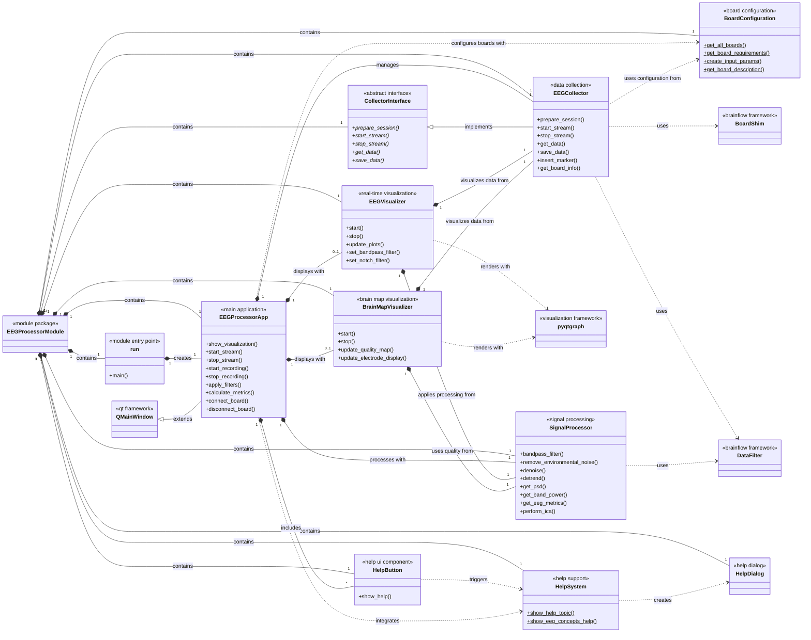

```mermaid
classDiagram
    direction LR
    
    %% Main Application Entry Point
    class run {
        <<module entry point>>
        +main()
    }
    
    class EEGProcessorApp {
        <<main application>>
        +show_visualization()
        +start_stream()
        +stop_stream()
        +start_recording()
        +stop_recording()
        +apply_filters()
        +calculate_metrics()
        +connect_board()
        +disconnect_board()
    }
    
    %% Core Components
    class EEGCollector {
        <<data collection>>
        +prepare_session()
        +start_stream()
        +stop_stream()
        +get_data()
        +save_data()
        +insert_marker()
        +get_board_info()
    }
    
    class SignalProcessor {
        <<signal processing>>
        +bandpass_filter()
        +remove_environmental_noise()
        +denoise()
        +detrend()
        +get_psd()
        +get_band_power()
        +get_eeg_metrics()
        +perform_ica()
    }
    
    class EEGVisualizer {
        <<real-time visualization>>
        +start()
        +stop()
        +update_plots()
        +set_bandpass_filter()
        +set_notch_filter()
    }
    
    class BrainMapVisualizer {
        <<brain map visualization>>
        +start()
        +stop()
        +update_quality_map()
        +update_electrode_display()
    }
    
    %% Configuration and Support
    class BoardConfiguration {
        <<board configuration>>
        +get_all_boards()$
        +get_board_requirements()$
        +create_input_params()$
        +get_board_description()$
    }
    
    class HelpSystem {
        <<help support>>
        +show_help_topic()$
        +show_eeg_concepts_help()$
    }
    
    class HelpButton {
        <<help ui component>>
        +show_help()
    }
    
    class HelpDialog {
        <<help dialog>>
    }
    
    %% Interface
    class CollectorInterface {
        <<abstract interface>>
        +prepare_session()*
        +start_stream()*
        +stop_stream()*
        +get_data()*
        +save_data()*
    }
    
    %% External Framework Components
    class QMainWindow {
        <<qt framework>>
    }
    
    class BoardShim {
        <<brainflow framework>>
    }
    
    class DataFilter {
        <<brainflow framework>>
    }
    
    class pyqtgraph {
        <<visualization framework>>
    }
    
    %% Package Reference
    class EEGProcessorModule {
        <<module package>>
    }
    
    %% Package Composition
    EEGProcessorModule "1" *-- "1" run : contains
    EEGProcessorModule "1" *-- "1" EEGProcessorApp : contains
    EEGProcessorModule "1" *-- "1" EEGCollector : contains
    EEGProcessorModule "1" *-- "1" SignalProcessor : contains
    EEGProcessorModule "1" *-- "1" EEGVisualizer : contains
    EEGProcessorModule "1" *-- "1" BrainMapVisualizer : contains
    EEGProcessorModule "1" *-- "1" BoardConfiguration : contains
    EEGProcessorModule "1" *-- "1" HelpSystem : contains
    EEGProcessorModule "1" *-- "1" HelpButton : contains
    EEGProcessorModule "1" *-- "1" HelpDialog : contains
    EEGProcessorModule "1" *-- "1" CollectorInterface : contains
    
    %% Entry Point Relationship
    run "1" *-- "1" EEGProcessorApp : creates
    
    %% Main Application Architecture
    QMainWindow <|-- EEGProcessorApp : extends
    
    EEGProcessorApp "1" *-- "1" EEGCollector : manages
    EEGProcessorApp "1" *-- "1" SignalProcessor : processes with
    EEGProcessorApp "1" *-- "0..1" EEGVisualizer : displays with
    EEGProcessorApp "1" *-- "0..1" BrainMapVisualizer : displays with
    EEGProcessorApp "1" *-- "*" HelpButton : includes
    
    %% Interface Implementation
    CollectorInterface <|-- EEGCollector : implements
    
    %% Component Relationships
    EEGVisualizer "1" *-- "1" EEGCollector : visualizes data from
    EEGVisualizer "1" *-- "1" SignalProcessor : applies processing from
    
    BrainMapVisualizer "1" *-- "1" EEGCollector : visualizes data from
    BrainMapVisualizer "1" *-- "1" SignalProcessor : uses quality from
    
    %% Configuration Usage
    EEGProcessorApp ..> BoardConfiguration : configures boards with
    EEGCollector ..> BoardConfiguration : uses configuration from
    
    %% Help System Integration
    HelpButton ..> HelpSystem : triggers
    HelpSystem ..> HelpDialog : creates
    EEGProcessorApp ..> HelpSystem : integrates
    
    %% Framework Dependencies
    EEGCollector ..> BoardShim : uses
    EEGCollector ..> DataFilter : uses
    SignalProcessor ..> DataFilter : uses
    EEGVisualizer ..> pyqtgraph : renders with
    BrainMapVisualizer ..> pyqtgraph : renders with
```