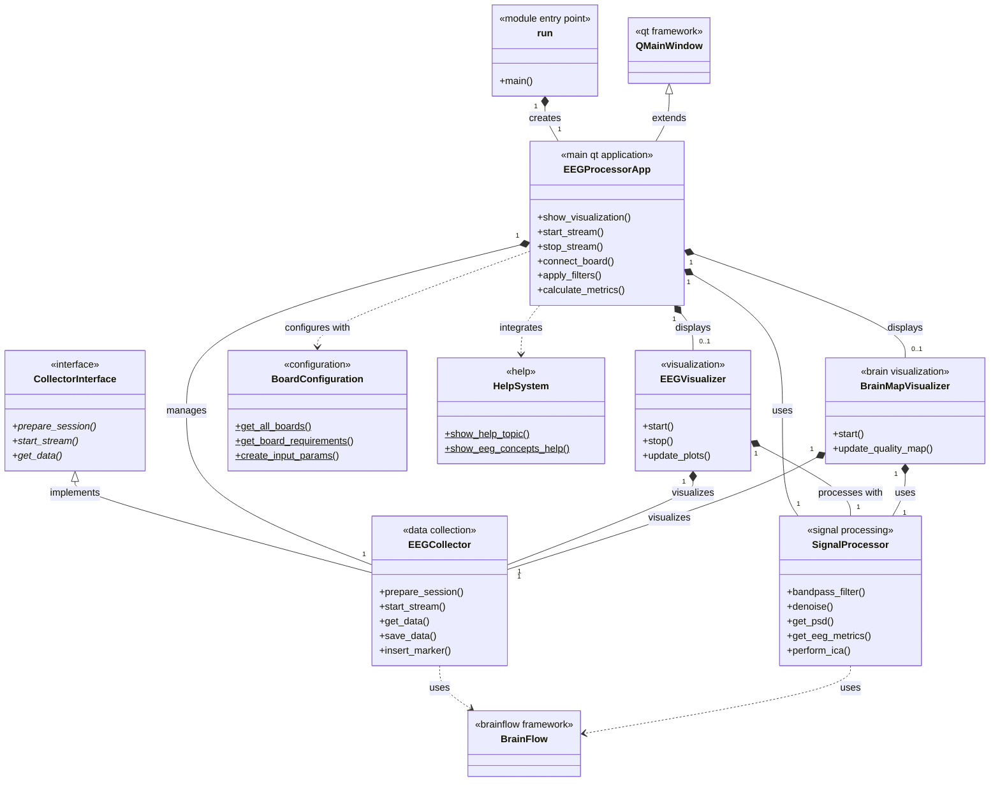

```mermaid
classDiagram
    direction TB
    
    %% Main Application
    class run {
        <<module entry point>>
        +main()
    }
    
    class EEGProcessorApp {
        <<main qt application>>
        +show_visualization()
        +start_stream()
        +stop_stream()
        +connect_board()
        +apply_filters()
        +calculate_metrics()
    }
    
    %% Core Components
    class EEGCollector {
        <<data collection>>
        +prepare_session()
        +start_stream()
        +get_data()
        +save_data()
        +insert_marker()
    }
    
    class SignalProcessor {
        <<signal processing>>
        +bandpass_filter()
        +denoise()
        +get_psd()
        +get_eeg_metrics()
        +perform_ica()
    }
    
    class EEGVisualizer {
        <<visualization>>
        +start()
        +stop()
        +update_plots()
    }
    
    class BrainMapVisualizer {
        <<brain visualization>>
        +start()
        +update_quality_map()
    }
    
    %% Configuration
    class BoardConfiguration {
        <<configuration>>
        +get_all_boards()$
        +get_board_requirements()$
        +create_input_params()$
    }
    
    %% Help System
    class HelpSystem {
        <<help>>
        +show_help_topic()$
        +show_eeg_concepts_help()$
    }
    
    %% Interface
    class CollectorInterface {
        <<interface>>
        +prepare_session()*
        +start_stream()*
        +get_data()*
    }
    
    %% External Frameworks
    class QMainWindow {
        <<qt framework>>
    }
    
    class BrainFlow {
        <<brainflow framework>>
    }
    
    %% Entry Point
    run "1" *-- "1" EEGProcessorApp : creates
    
    %% Main Architecture
    QMainWindow <|-- EEGProcessorApp : extends
    CollectorInterface <|-- EEGCollector : implements
    
    EEGProcessorApp "1" *-- "1" EEGCollector : manages
    EEGProcessorApp "1" *-- "1" SignalProcessor : uses
    EEGProcessorApp "1" *-- "0..1" EEGVisualizer : displays
    EEGProcessorApp "1" *-- "0..1" BrainMapVisualizer : displays
    
    %% Component Relationships
    EEGVisualizer "1" *-- "1" EEGCollector : visualizes
    EEGVisualizer "1" *-- "1" SignalProcessor : processes with
    BrainMapVisualizer "1" *-- "1" EEGCollector : visualizes
    BrainMapVisualizer "1" *-- "1" SignalProcessor : uses
    
    %% Configuration
    EEGProcessorApp ..> BoardConfiguration : configures with
    EEGProcessorApp ..> HelpSystem : integrates
    EEGCollector ..> BrainFlow : uses
    SignalProcessor ..> BrainFlow : uses
```