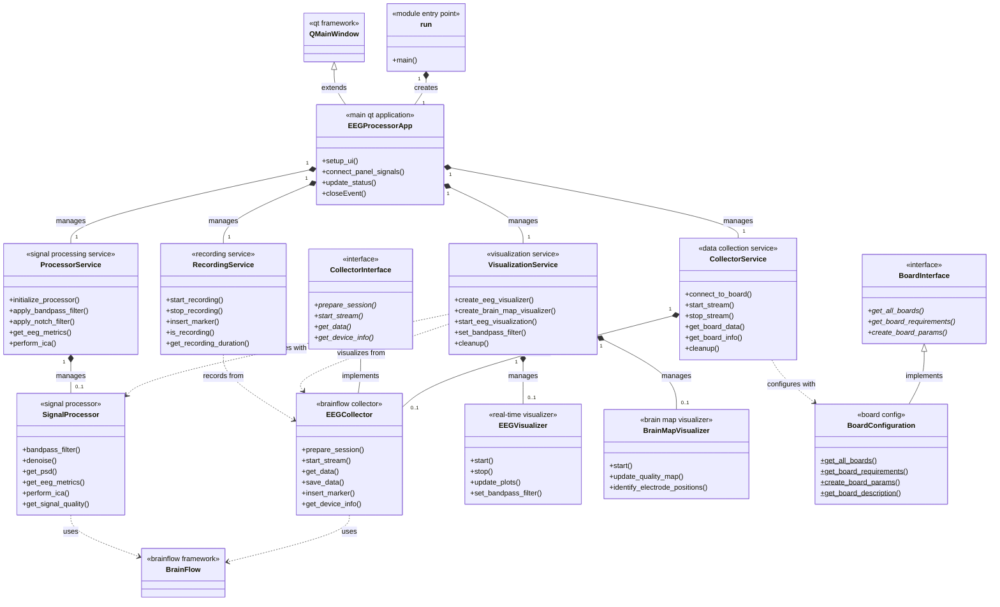

```mermaid
classDiagram
    direction TB
    
    %% Main Application Entry Point
    class run {
        <<module entry point>>
        +main()
    }
    
    class EEGProcessorApp {
        <<main qt application>>
        +setup_ui()
        +connect_panel_signals()
        +update_status()
        +closeEvent()
    }
    
    %% Core Services Layer
    class CollectorService {
        <<data collection service>>
        +connect_to_board()
        +start_stream()
        +stop_stream()
        +get_board_data()
        +get_board_info()
        +cleanup()
    }
    
    class ProcessorService {
        <<signal processing service>>
        +initialize_processor()
        +apply_bandpass_filter()
        +apply_notch_filter()
        +get_eeg_metrics()
        +perform_ica()
    }
    
    class VisualizationService {
        <<visualization service>>
        +create_eeg_visualizer()
        +create_brain_map_visualizer()
        +start_eeg_visualization()
        +set_bandpass_filter()
        +cleanup()
    }
    
    class RecordingService {
        <<recording service>>
        +start_recording()
        +stop_recording()
        +insert_marker()
        +is_recording()
        +get_recording_duration()
    }
    
    %% Core Components
    class EEGCollector {
        <<brainflow collector>>
        +prepare_session()
        +start_stream()
        +get_data()
        +save_data()
        +insert_marker()
        +get_device_info()
    }
    
    class SignalProcessor {
        <<signal processor>>
        +bandpass_filter()
        +denoise()
        +get_psd()
        +get_eeg_metrics()
        +perform_ica()
        +get_signal_quality()
    }
    
    class EEGVisualizer {
        <<real-time visualizer>>
        +start()
        +stop()
        +update_plots()
        +set_bandpass_filter()
    }
    
    class BrainMapVisualizer {
        <<brain map visualizer>>
        +start()
        +update_quality_map()
        +identify_electrode_positions()
    }
    
    %% Configuration Components
    class BoardConfiguration {
        <<board config>>
        +get_all_boards()$
        +get_board_requirements()$
        +create_board_params()$
        +get_board_description()$
    }
    
    %% Interfaces
    class CollectorInterface {
        <<interface>>
        +prepare_session()*
        +start_stream()*
        +get_data()*
        +get_device_info()*
    }
    
    class BoardInterface {
        <<interface>>
        +get_all_boards()*
        +get_board_requirements()*
        +create_board_params()*
    }
    
    %% External Framework
    class QMainWindow {
        <<qt framework>>
    }
    
    class BrainFlow {
        <<brainflow framework>>
    }
    
    %% Entry Point
    run "1" *-- "1" EEGProcessorApp : creates
    
    %% Main Architecture
    QMainWindow <|-- EEGProcessorApp : extends
    
    %% Service Dependencies
    EEGProcessorApp "1" *-- "1" CollectorService : manages
    EEGProcessorApp "1" *-- "1" ProcessorService : manages
    EEGProcessorApp "1" *-- "1" VisualizationService : manages
    EEGProcessorApp "1" *-- "1" RecordingService : manages
    
    %% Service to Component Delegation
    CollectorService "1" *-- "0..1" EEGCollector : manages
    
    VisualizationService "1" *-- "0..1" EEGVisualizer : manages
    VisualizationService "1" *-- "0..1" BrainMapVisualizer : manages
    
    %% Interface Implementation
    CollectorInterface <|-- EEGCollector : implements
    BoardInterface <|-- BoardConfiguration : implements
    
    %% Service Interactions
    CollectorService ..> BoardConfiguration : configures with
    VisualizationService ..> EEGCollector : visualizes from
    RecordingService ..> EEGCollector : records from
    VisualizationService ..> SignalProcessor : processes with

    ProcessorService "1" *-- "0..1" SignalProcessor : manages
    
    %% Framework Dependencies
    EEGCollector ..> BrainFlow : uses
    SignalProcessor ..> BrainFlow : uses
```