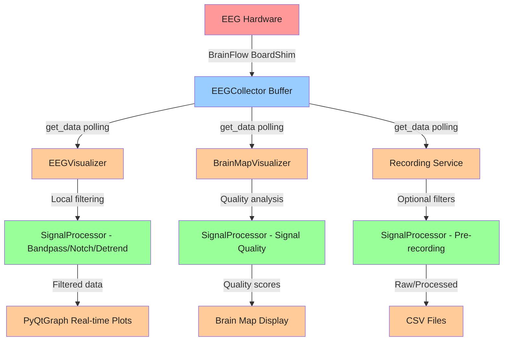

```mermaid
flowchart TD
    %% Hardware to Collection
    A[EEG Hardware] -->|BrainFlow BoardShim| B[EEGCollector Buffer]
    
    %% Direct Polling from Visualizers
    B -->|get_data polling| C[EEGVisualizer]
    B -->|get_data polling| D[BrainMapVisualizer] 
    B -->|get_data polling| E[Recording Service]
    
    %% Individual Processing
    C -->|Local filtering| F[SignalProcessor - Bandpass/Notch/Detrend]
    D -->|Quality analysis| G[SignalProcessor - Signal Quality]
    E -->|Optional filters| H[SignalProcessor - Pre-recording]
    
    %% Output
    F -->|Filtered data| I[PyQtGraph Real-time Plots]
    G -->|Quality scores| J[Brain Map Display]
    H -->|Raw/Processed| K[CSV Files]
    
    %% Styling
    classDef hardware fill:#ff9999,color:#222
    classDef collection fill:#99ccff,color:#222
    classDef processing fill:#99ff99,color:#222
    classDef output fill:#ffcc99,color:#222
    
    class A hardware
    class B collection
    class F,G,H processing
    class C,D,E,I,J,K output
```