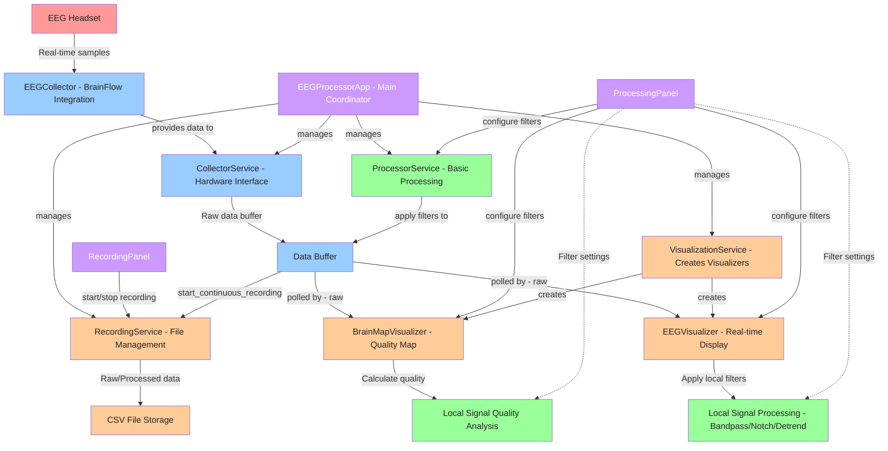

```mermaid
flowchart TD
    %% Hardware Layer
    A[EEG Headset] -->|Real-time samples| B[EEGCollector - BrainFlow Integration]
    
    %% Service Layer
    B -->|provides data to| C[CollectorService - Hardware Interface]
    C -->|Raw data buffer| D[Data Buffer]
    
    %% Visualization Branch - Direct Access
    D -->|polled by - raw| E[EEGVisualizer - Real-time Display]
    D -->|polled by - raw| F[BrainMapVisualizer - Quality Map]
    
    %% Local Processing in Visualizers
    E -->|Apply local filters| G[Local Signal Processing - Bandpass/Notch/Detrend]
    F -->|Calculate quality| H[Local Signal Quality Analysis]
    
    %% Recording Branch - Direct Access
    I -->|Raw/Processed data| J[CSV File Storage]
    
    %% Processing Service - Metrics Calculation
    K[ProcessorService - Basic Processing] -->|apply filters to| D
    
    %% UI Control Layer
    M[EEGProcessorApp - Main Coordinator] -->|manages| C
    M -->|manages| N[VisualizationService - Creates Visualizers]
    M -->|manages| I[RecordingService - File Management]
    M -->|manages| K
    
    %% UI Panel Controls
    N -->|creates| E
    
    O[ProcessingPanel] -->|configure filters| E
    O -->|configure filters| F
    N -->|creates| F
    O -->|configure filters| K
    P[RecordingPanel] -->|start/stop recording| I

    D -->|start_continuous_recording| I
    
    %% Filter Configuration Flow
    O -.->|Filter settings| G
    O -.->|Filter settings| H
    
    %% Styling
    classDef hardware fill:#ff9999,color:#222
    classDef services fill:#99ccff,color:#222
    classDef processing fill:#99ff99,color:#222
    classDef visualization fill:#ffcc99,color:#222
    classDef control fill:#cc99ff,color:#fff
    
    class A hardware
    class B,C,D services
    class G,H,K processing
    class E,F,I,J,N visualization
    class M,O,P control
```