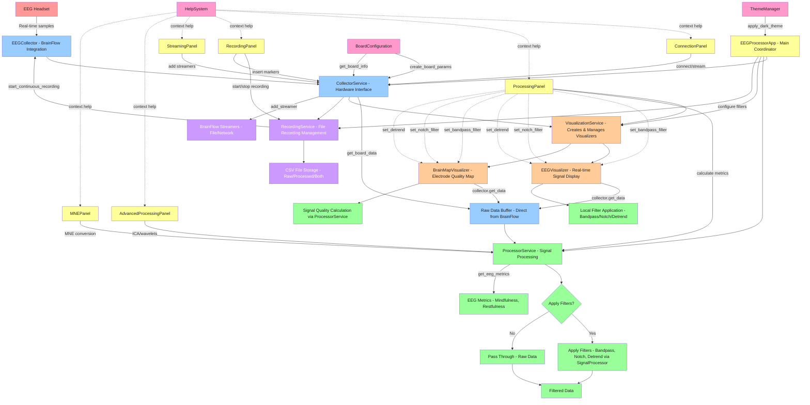

```mermaid
flowchart TD
    %% Hardware Layer
    A[EEG Headset] -->|Real-time samples| B[EEGCollector - BrainFlow Integration]
    
    %% Collection Service Layer
    B --> C[CollectorService - Hardware Interface]
    C -->|get_board_data| D[Raw Data Buffer - Direct from BrainFlow]
    
    %% Processing Service Layer
    D --> E[ProcessorService - Signal Processing]
    E --> F{Apply Filters?}
    F -->|Yes| G[Apply Filters - Bandpass, Notch, Detrend via SignalProcessor]
    F -->|No| H[Pass Through - Raw Data]
    G --> I[Filtered Data]
    H --> I
    
    %% Visualization Service Distribution
    C --> J[VisualizationService - Creates & Manages Visualizers]
    J --> K[EEGVisualizer - Real-time Signal Display]
    J --> L[BrainMapVisualizer - Electrode Quality Map]
    
    %% Direct Data Access from Visualizers
    K -->|collector.get_data| D
    L -->|collector.get_data| D
    
    %% Local Processing in Visualizers
    K --> M[Local Filter Application - Bandpass/Notch/Detrend]
    L --> N[Signal Quality Calculation via ProcessorService]
    
    %% Recording Service
    C --> O[RecordingService - File Recording Management]
    O -->|start_continuous_recording| B
    O --> P[CSV File Storage - Raw/Processed/Both]
    
    %% Service-based Architecture
    Q[EEGProcessorApp - Main Coordinator] --> C
    Q --> E
    Q --> J
    Q --> O
    
    %% UI Panel Controls
    R[ConnectionPanel] -->|connect/stream| C
    S[ProcessingPanel] -->|configure filters| J
    S -->|calculate metrics| E
    T[RecordingPanel] -->|start/stop recording| O
    T -->|insert markers| C
    U[StreamingPanel] -->|add streamers| C
    V[AdvancedProcessingPanel] -->|ICA/wavelets| E
    W[MNEPanel] -->|MNE conversion| E
    
    %% Filter Application Paths
    S -.->|set_bandpass_filter| K
    S -.->|set_notch_filter| K
    S -.->|set_detrend| K
    S -.->|set_bandpass_filter| L
    S -.->|set_notch_filter| L
    S -.->|set_detrend| L
    
    %% Data Flow for Metrics
    E -->|get_eeg_metrics| X[EEG Metrics - Mindfulness, Restfulness]
    
    %% Streaming Support
    C -->|add_streamer| Y[BrainFlow Streamers - File/Network]
    
    %% Board Configuration
    Z[BoardConfiguration] -->|create_board_params| C
    Z -->|get_board_info| C
    
    %% Theme Management
    AA[ThemeManager] -->|apply_dark_theme| Q
    
    %% Help System
    BB[HelpSystem] -.->|context help| R
    BB -.->|context help| S
    BB -.->|context help| T
    BB -.->|context help| U
    BB -.->|context help| V
    BB -.->|context help| W
    
    %% Styling
    classDef hardware fill:#ff9999,color:#222
    classDef collection fill:#99ccff,color:#222
    classDef processing fill:#99ff99,color:#222
    classDef visualization fill:#ffcc99,color:#222
    classDef services fill:#cc99ff,color:#fff
    classDef ui fill:#ffff99,color:#222
    classDef config fill:#ff99cc,color:#222
    
    class A hardware
    class B,C,D collection
    class E,F,G,H,I,M,N,X processing
    class J,K,L visualization
    class O,P,Y services
    class Q,R,S,T,U,V,W ui
    class Z,AA,BB config
```