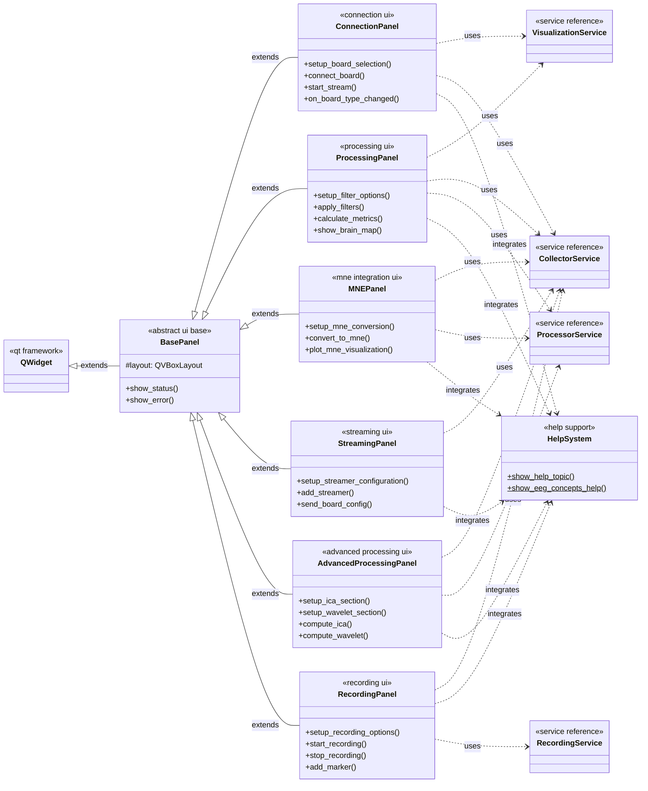

```mermaid
classDiagram
    direction LR
    
    %% Base UI Components
    class BasePanel {
        <<abstract ui base>>
        #layout: QVBoxLayout
        +show_status()
        +show_error()
    }
    
    class HelpSystem {
        <<help support>>
        +show_help_topic()$
        +show_eeg_concepts_help()$
    }
    
    %% Concrete UI Panels
    class ConnectionPanel {
        <<connection ui>>
        +setup_board_selection()
        +connect_board()
        +start_stream()
        +on_board_type_changed()
    }
    
    class ProcessingPanel {
        <<processing ui>>
        +setup_filter_options()
        +apply_filters()
        +calculate_metrics()
        +show_brain_map()
    }
    
    class MNEPanel {
        <<mne integration ui>>
        +setup_mne_conversion()
        +convert_to_mne()
        +plot_mne_visualization()
    }
    
    class StreamingPanel {
        <<streaming ui>>
        +setup_streamer_configuration()
        +add_streamer()
        +send_board_config()
    }
    
    class AdvancedProcessingPanel {
        <<advanced processing ui>>
        +setup_ica_section()
        +setup_wavelet_section()
        +compute_ica()
        +compute_wavelet()
    }

    class RecordingPanel {
        <<recording ui>>
        +setup_recording_options()
        +start_recording()
        +stop_recording()
        +add_marker()
    }
    
    %% Services (references from main diagram)
    class CollectorService {
        <<service reference>>
    }
    
    class ProcessorService {
        <<service reference>>
    }
    
    class VisualizationService {
        <<service reference>>
    }
    
    class RecordingService {
        <<service reference>>
    }
    
    %% External Qt Framework
    class QWidget {
        <<qt framework>>
    }
    
    %% Inheritance Hierarchy
    QWidget <|-- BasePanel : extends
    BasePanel <|-- ConnectionPanel : extends
    BasePanel <|-- ProcessingPanel : extends
    BasePanel <|-- MNEPanel : extends
    BasePanel <|-- StreamingPanel : extends
    BasePanel <|-- AdvancedProcessingPanel : extends
    BasePanel <|-- RecordingPanel : extends
    
    %% Panel to Service Dependencies
    ConnectionPanel ..> VisualizationService : uses
    ConnectionPanel ..> CollectorService : uses
    
    ProcessingPanel ..> VisualizationService : uses
    ProcessingPanel ..> CollectorService : uses
    ProcessingPanel ..> ProcessorService : uses
    
    MNEPanel ..> CollectorService : uses
    MNEPanel ..> ProcessorService : uses
    
    AdvancedProcessingPanel ..> CollectorService : uses
    AdvancedProcessingPanel ..> ProcessorService : uses
    
    RecordingPanel ..> CollectorService : uses

    StreamingPanel ..> CollectorService : uses
    
    %% Utility Dependencies
    ConnectionPanel ..> HelpSystem : integrates
    ProcessingPanel ..> HelpSystem : integrates
    MNEPanel ..> HelpSystem : integrates
    StreamingPanel ..> HelpSystem : integrates
    AdvancedProcessingPanel ..> HelpSystem : integrates
    RecordingPanel ..> HelpSystem : integrates

    RecordingPanel ..> RecordingService : uses
```