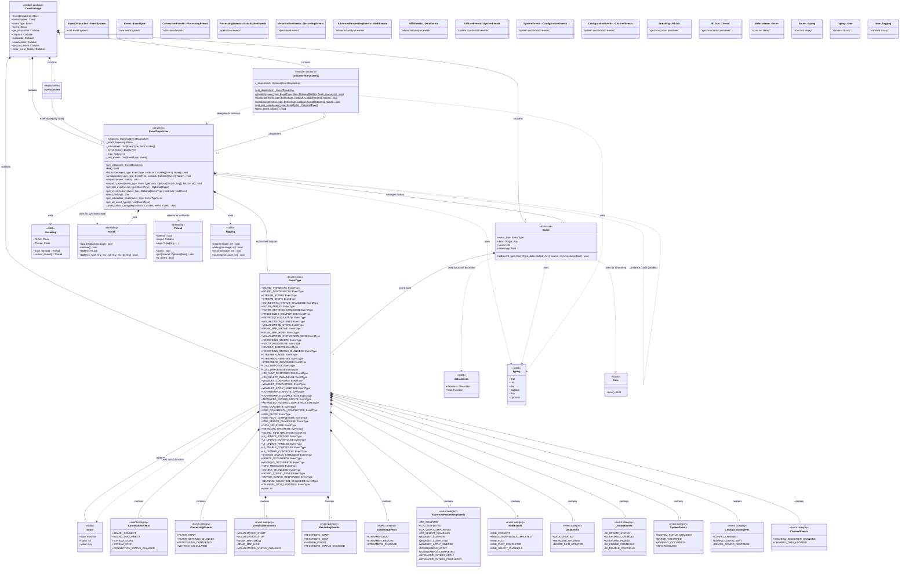

```mermaid
classDiagram
    %% ================================================================================
    %% CORE MODULE - EVENT SYSTEM ARCHITECTURE
    %% ================================================================================
    
    %% ================================================================================
    %% CORE EVENT SYSTEM COMPONENTS
    %% ================================================================================
    
    class EventDispatcher {
        <<singleton>>
        -_instance$: Optional[EventDispatcher]
        -_lock$: threading.RLock
        -_subscribers: Dict[EventType, Set[Callable]]
        -_event_history: List[Event]
        -_max_history: int
        -_last_events: Dict[EventType, Event]
        
        +get_instance()$ EventDispatcher
        +__init__() void
        +subscribe(event_type: EventType, callback: Callable[[Event], None]) void
        +unsubscribe(event_type: EventType, callback: Callable[[Event], None]) void
        +dispatch(event: Event) void
        +dispatch_event(event_type: EventType, data: Optional[Dict[str, Any]], source: str) void
        +get_last_event(event_type: EventType) Optional[Event]
        +get_event_history(event_type: Optional[EventType], limit: int) List[Event]
        +clear_history() void
        +get_subscriber_count(event_type: EventType) int
        +get_all_event_types() List[EventType]
        -_safe_callback_wrapper(callback: Callable, event: Event) void
    }
    
    class EventSystem {
        <<legacy alias>>
    }
    
    class Event {
        <<dataclass>>
        +event_type: EventType
        +data: Dict[str, Any]
        +source: str
        +timestamp: float
        
        +__init__(event_type: EventType, data: Dict[str, Any], source: str, timestamp: float) void
    }
    
    class EventType {
        <<enumeration>>
        +BOARD_CONNECT$: EventType
        +BOARD_DISCONNECT$: EventType
        +STREAM_START$: EventType
        +STREAM_STOP$: EventType
        +CONNECTION_STATUS_CHANGED$: EventType
        +FILTER_APPLY$: EventType
        +FILTER_SETTINGS_CHANGED$: EventType
        +PROCESSING_COMPLETED$: EventType
        +METRICS_CALCULATED$: EventType
        +VISUALIZATION_START$: EventType
        +VISUALIZATION_STOP$: EventType
        +BRAIN_MAP_SHOW$: EventType
        +BRAIN_MAP_HIDE$: EventType
        +VISUALIZATION_STATUS_CHANGED$: EventType
        +RECORDING_START$: EventType
        +RECORDING_STOP$: EventType
        +MARKER_INSERT$: EventType
        +RECORDING_STATUS_CHANGED$: EventType
        +STREAMER_ADD$: EventType
        +STREAMER_REMOVE$: EventType
        +STREAMERS_CHANGED$: EventType
        +ICA_COMPUTE$: EventType
        +ICA_COMPLETED$: EventType
        +ICA_VIEW_COMPONENTS$: EventType
        +ICA_SELECT_CHANNELS$: EventType
        +WAVELET_COMPUTE$: EventType
        +WAVELET_COMPLETED$: EventType
        +WAVELET_APPLY_INVERSE$: EventType
        +DOWNSAMPLE_APPLY$: EventType
        +DOWNSAMPLE_COMPLETED$: EventType
        +ADVANCED_FILTERS_APPLY$: EventType
        +ADVANCED_FILTERS_COMPLETED$: EventType
        +MNE_CONVERT$: EventType
        +MNE_CONVERSION_COMPLETED$: EventType
        +MNE_PLOT$: EventType
        +MNE_PLOT_COMPLETED$: EventType
        +MNE_SELECT_CHANNELS$: EventType
        +DATA_UPDATED$: EventType
        +METADATA_UPDATED$: EventType
        +BOARD_INFO_UPDATED$: EventType
        +UI_UPDATE_STATUS$: EventType
        +UI_UPDATE_CONTROLS$: EventType
        +UI_UPDATE_PANELS$: EventType
        +UI_ENABLE_CONTROLS$: EventType
        +UI_DISABLE_CONTROLS$: EventType
        +SYSTEM_STATUS_CHANGED$: EventType
        +ERROR_OCCURRED$: EventType
        +WARNING_OCCURRED$: EventType
        +INFO_MESSAGE$: EventType
        +CONFIG_CHANGED$: EventType
        +BOARD_CONFIG_SENT$: EventType
        +DEVICE_CONFIG_RESPONSE$: EventType
        +CHANNEL_SELECTION_CHANGED$: EventType
        +CHANNEL_DATA_UPDATED$: EventType
        +value: int
    }
    
    class CorePackage {
        <<module package>>
        +EventDispatcher: Class
        +EventSystem: Class
        +EventType: Enum
        +Event: Class
        +get_dispatcher: Callable
        +dispatch: Callable
        +subscribe: Callable
        +unsubscribe: Callable
        +get_last_event: Callable
        +clear_event_history: Callable
    }
    
    %% ================================================================================
    %% GLOBAL CONVENIENCE FUNCTIONS
    %% ================================================================================
    
    class GlobalEventFunctions {
        <<module functions>>
        +_dispatcher$: Optional[EventDispatcher]
        +get_dispatcher()$ EventDispatcher
        +dispatch(event_type: EventType, data: Optional[Dict[str, Any]], source: str)$ void
        +subscribe(event_type: EventType, callback: Callable[[Event], None])$ void
        +unsubscribe(event_type: EventType, callback: Callable[[Event], None])$ void
        +get_last_event(event_type: EventType)$ Optional[Event]
        +clear_event_history()$ void
    }
    
    %% ================================================================================
    %% EVENT CATEGORY GROUPINGS
    %% ================================================================================
    
    class ConnectionEvents {
        <<event category>>
        +BOARD_CONNECT
        +BOARD_DISCONNECT
        +STREAM_START
        +STREAM_STOP
        +CONNECTION_STATUS_CHANGED
    }
    
    class ProcessingEvents {
        <<event category>>
        +FILTER_APPLY
        +FILTER_SETTINGS_CHANGED
        +PROCESSING_COMPLETED
        +METRICS_CALCULATED
    }
    
    class VisualizationEvents {
        <<event category>>
        +VISUALIZATION_START
        +VISUALIZATION_STOP
        +BRAIN_MAP_SHOW
        +BRAIN_MAP_HIDE
        +VISUALIZATION_STATUS_CHANGED
    }
    
    class RecordingEvents {
        <<event category>>
        +RECORDING_START
        +RECORDING_STOP
        +MARKER_INSERT
        +RECORDING_STATUS_CHANGED
    }
    
    class StreamingEvents {
        <<event category>>
        +STREAMER_ADD
        +STREAMER_REMOVE
        +STREAMERS_CHANGED
    }
    
    class AdvancedProcessingEvents {
        <<event category>>
        +ICA_COMPUTE
        +ICA_COMPLETED
        +ICA_VIEW_COMPONENTS
        +ICA_SELECT_CHANNELS
        +WAVELET_COMPUTE
        +WAVELET_COMPLETED
        +WAVELET_APPLY_INVERSE
        +DOWNSAMPLE_APPLY
        +DOWNSAMPLE_COMPLETED
        +ADVANCED_FILTERS_APPLY
        +ADVANCED_FILTERS_COMPLETED
    }
    
    class MNEEvents {
        <<event category>>
        +MNE_CONVERT
        +MNE_CONVERSION_COMPLETED
        +MNE_PLOT
        +MNE_PLOT_COMPLETED
        +MNE_SELECT_CHANNELS
    }
    
    class DataEvents {
        <<event category>>
        +DATA_UPDATED
        +METADATA_UPDATED
        +BOARD_INFO_UPDATED
    }
    
    class UIStateEvents {
        <<event category>>
        +UI_UPDATE_STATUS
        +UI_UPDATE_CONTROLS
        +UI_UPDATE_PANELS
        +UI_ENABLE_CONTROLS
        +UI_DISABLE_CONTROLS
    }
    
    class SystemEvents {
        <<event category>>
        +SYSTEM_STATUS_CHANGED
        +ERROR_OCCURRED
        +WARNING_OCCURRED
        +INFO_MESSAGE
    }
    
    class ConfigurationEvents {
        <<event category>>
        +CONFIG_CHANGED
        +BOARD_CONFIG_SENT
        +DEVICE_CONFIG_RESPONSE
    }
    
    class ChannelEvents {
        <<event category>>
        +CHANNEL_SELECTION_CHANGED
        +CHANNEL_DATA_UPDATED
    }
    
    %% ================================================================================
    %% THREADING AND SYNCHRONIZATION
    %% ================================================================================
    
    class threading {
        <<stdlib>>
        +RLock: Class
        +Thread: Class
        +main_thread() Thread
        +current_thread() Thread
    }
    
    class RLock {
        <<threading>>
        +acquire(blocking: bool) bool
        +release() void
        +__enter__() RLock
        +__exit__(exc_type: Any, exc_val: Any, exc_tb: Any) void
    }
    
    class Thread {
        <<threading>>
        +daemon: bool
        +target: Callable
        +args: Tuple[Any, ...]
        +start() void
        +join(timeout: Optional[float]) void
        +is_alive() bool
    }
    
    %% ================================================================================
    %% DATA STRUCTURES AND TYPING
    %% ================================================================================
    
    class dataclasses {
        <<stdlib>>
        +dataclass: Decorator
        +field: Function
    }
    
    class Enum {
        <<stdlib>>
        +auto: Function
        +name: str
        +value: Any
    }
    
    class typing {
        <<stdlib>>
        +Dict
        +List
        +Set
        +Callable
        +Any
        +Optional
    }
    
    class time {
        <<stdlib>>
        +time() float
    }
    
    class logging {
        <<stdlib>>
        +info(message: str) void
        +debug(message: str) void
        +error(message: str) void
        +warning(message: str) void
    }
    
    %% ================================================================================
    %% RELATIONSHIPS
    %% ================================================================================
    
    %% Package Composition
    CorePackage "1" *-- "1" EventDispatcher : contains
    CorePackage "1" *-- "1" EventSystem : contains
    CorePackage "1" *-- "1" Event : contains
    CorePackage "1" *-- "1" EventType : contains
    CorePackage "1" *-- "1" GlobalEventFunctions : contains
    
    %% Core Component Relationships
    EventDispatcher "1" *-- "*" Event : manages history
    EventDispatcher "1" *-- "1" EventType : subscribes to types
    EventDispatcher ..> RLock : uses for synchronization
    EventDispatcher ..> Thread : creates for callbacks
    
    Event "1" *-- "1" EventType : event_type
    Event ..> time : uses for timestamp
    Event ..> dataclasses : uses dataclass decorator
    
    EventType --|> Enum : extends
    EventType ..> Enum : uses auto() function
    
    EventSystem --|> EventDispatcher : extends (legacy alias)
    
    %% Global Functions Relationships
    GlobalEventFunctions ..> EventDispatcher : delegates to instance
    GlobalEventFunctions "1" o-- "0..1" EventDispatcher : _dispatcher
    
    %% Event Category Relationships (Logical Groupings)
    EventType "1" *-- "1" ConnectionEvents : contains
    EventType "1" *-- "1" ProcessingEvents : contains
    EventType "1" *-- "1" VisualizationEvents : contains
    EventType "1" *-- "1" RecordingEvents : contains
    EventType "1" *-- "1" StreamingEvents : contains
    EventType "1" *-- "1" AdvancedProcessingEvents : contains
    EventType "1" *-- "1" MNEEvents : contains
    EventType "1" *-- "1" DataEvents : contains
    EventType "1" *-- "1" UIStateEvents : contains
    EventType "1" *-- "1" SystemEvents : contains
    EventType "1" *-- "1" ConfigurationEvents : contains
    EventType "1" *-- "1" ChannelEvents : contains
    
    %% Threading Dependencies
    EventDispatcher ..> threading : uses
    EventDispatcher "1" *-- "1" RLock : _lock
    
    %% Standard Library Dependencies
    EventDispatcher ..> logging : uses
    EventDispatcher ..> typing : uses
    Event ..> typing : uses
    GlobalEventFunctions ..> typing : uses
    
    %% Singleton Pattern
    EventDispatcher ..> EventDispatcher : _instance (class variable)
    
    %% ================================================================================
    %% LOGICAL GROUPINGS
    %% ================================================================================
    
    %% Core Event Components
    EventDispatcher -.- EventSystem : "core event system"
    Event -.- EventType : "core event system"
    
    %% Event Categories (Connection and Processing)
    ConnectionEvents -.- ProcessingEvents : "operational events"
    ProcessingEvents -.- VisualizationEvents : "operational events"
    VisualizationEvents -.- RecordingEvents : "operational events"
    
    %% Event Categories (Advanced Features)
    AdvancedProcessingEvents -.- MNEEvents : "advanced analysis events"
    MNEEvents -.- DataEvents : "advanced analysis events"
    
    %% Event Categories (System and UI)
    UIStateEvents -.- SystemEvents : "system coordination events"
    SystemEvents -.- ConfigurationEvents : "system coordination events"
    ConfigurationEvents -.- ChannelEvents : "system coordination events"
    
    %% Threading Components
    threading -.- RLock : "synchronization primitives"
    RLock -.- Thread : "synchronization primitives"
    
    %% Standard Library Components
    dataclasses -.- Enum : "standard library"
    Enum -.- typing : "standard library"
    typing -.- time : "standard library"
    time -.- logging : "standard library"
```