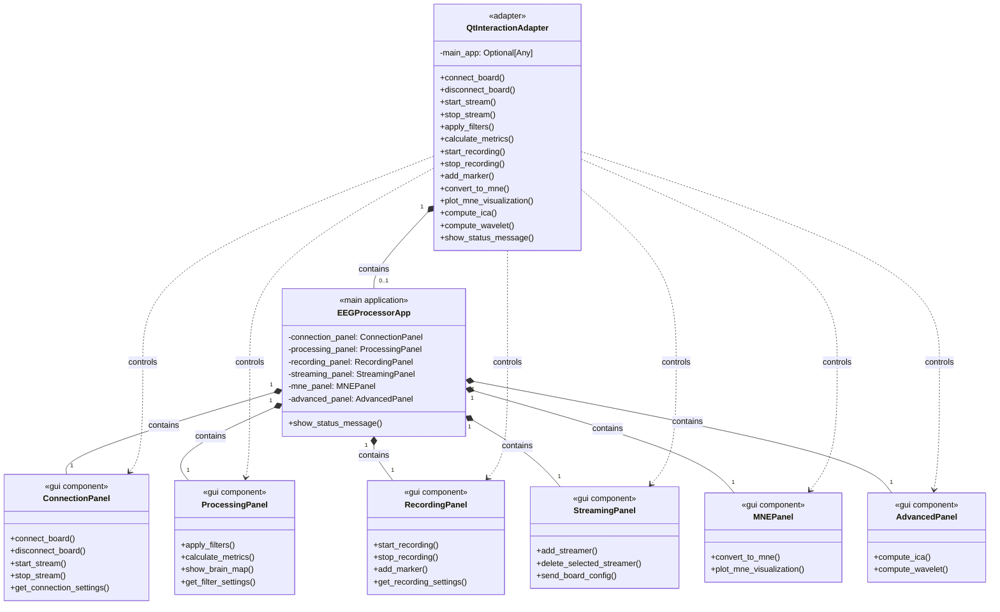

```mermaid
classDiagram
    direction TB
    
    %% Core Adapter Class
    class QtInteractionAdapter {
        <<adapter>>
        -main_app: Optional[Any]
        +connect_board()
        +disconnect_board()
        +start_stream()
        +stop_stream()
        +apply_filters()
        +calculate_metrics()
        +start_recording()
        +stop_recording()
        +add_marker()
        +convert_to_mne()
        +plot_mne_visualization()
        +compute_ica()
        +compute_wavelet()
        +show_status_message()
    }
    
    %% GUI Panel Interfaces (Target Components)
    class ConnectionPanel {
        <<gui component>>
        +connect_board()
        +disconnect_board()
        +start_stream()
        +stop_stream()
        +get_connection_settings()
    }
    
    class ProcessingPanel {
        <<gui component>>
        +apply_filters()
        +calculate_metrics()
        +show_brain_map()
        +get_filter_settings()
    }
    
    class RecordingPanel {
        <<gui component>>
        +start_recording()
        +stop_recording()
        +add_marker()
        +get_recording_settings()
    }
    
    class StreamingPanel {
        <<gui component>>
        +add_streamer()
        +delete_selected_streamer()
        +send_board_config()
    }
    
    class MNEPanel {
        <<gui component>>
        +convert_to_mne()
        +plot_mne_visualization()
    }
    
    class AdvancedPanel {
        <<gui component>>
        +compute_ica()
        +compute_wavelet()
    }
    
    class EEGProcessorApp {
        <<main application>>
        -connection_panel: ConnectionPanel
        -processing_panel: ProcessingPanel
        -recording_panel: RecordingPanel
        -streaming_panel: StreamingPanel
        -mne_panel: MNEPanel
        -advanced_panel: AdvancedPanel
        +show_status_message()
    }
    
    %% Core Composition
    QtInteractionAdapter "1" *-- "0..1" EEGProcessorApp : contains
    
    EEGProcessorApp "1" *-- "1" ConnectionPanel : contains
    EEGProcessorApp "1" *-- "1" ProcessingPanel : contains
    EEGProcessorApp "1" *-- "1" RecordingPanel : contains
    EEGProcessorApp "1" *-- "1" StreamingPanel : contains
    EEGProcessorApp "1" *-- "1" MNEPanel : contains
    EEGProcessorApp "1" *-- "1" AdvancedPanel : contains
    
    %% API Control Relationships
    QtInteractionAdapter ..> ConnectionPanel : controls
    QtInteractionAdapter ..> ProcessingPanel : controls
    QtInteractionAdapter ..> RecordingPanel : controls
    QtInteractionAdapter ..> StreamingPanel : controls
    QtInteractionAdapter ..> MNEPanel : controls
    QtInteractionAdapter ..> AdvancedPanel : controls
```