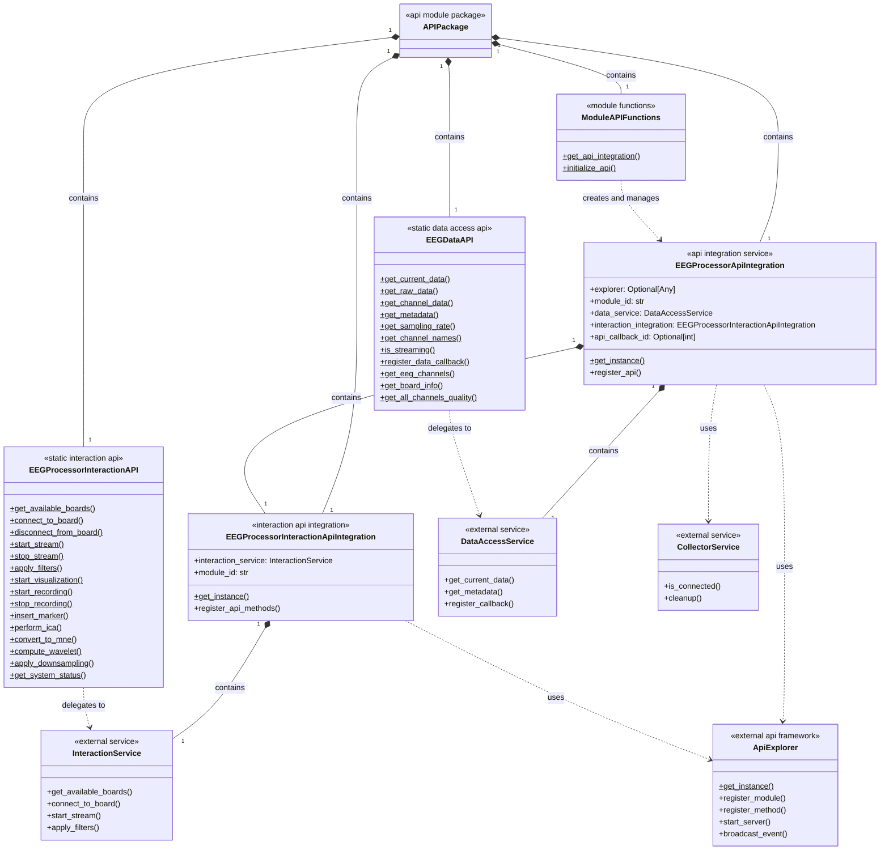

```mermaid
classDiagram
    direction TB
    
    %% Core API Classes
    class EEGDataAPI {
        <<static data access api>>
        +get_current_data()$
        +get_raw_data()$
        +get_channel_data()$
        +get_metadata()$
        +get_sampling_rate()$
        +get_channel_names()$
        +is_streaming()$
        +register_data_callback()$
        +get_eeg_channels()$
        +get_board_info()$
        +get_all_channels_quality()$
    }
    
    class EEGProcessorInteractionAPI {
        <<static interaction api>>
        +get_available_boards()$
        +connect_to_board()$
        +disconnect_from_board()$
        +start_stream()$
        +stop_stream()$
        +apply_filters()$
        +start_visualization()$
        +start_recording()$
        +stop_recording()$
        +insert_marker()$
        +perform_ica()$
        +convert_to_mne()$
        +compute_wavelet()$
        +apply_downsampling()$
        +get_system_status()$
    }
    
    %% API Integration Services
    class EEGProcessorApiIntegration {
        <<api integration service>>
        +explorer: Optional[Any]
        +module_id: str
        +data_service: DataAccessService
        +interaction_integration: EEGProcessorInteractionApiIntegration
        +api_callback_id: Optional[int]
        +get_instance()$
        +register_api()
    }
    
    class EEGProcessorInteractionApiIntegration {
        <<interaction api integration>>
        +interaction_service: InteractionService
        +module_id: str
        +get_instance()$
        +register_api_methods()
    }
    
    %% Module API Functions
    class ModuleAPIFunctions {
        <<module functions>>
        +get_api_integration()$
        +initialize_api()$
    }
    
    %% Core Services (References)
    class DataAccessService {
        <<external service>>
        +get_current_data()
        +get_metadata()
        +register_callback()
    }
    
    class InteractionService {
        <<external service>>
        +get_available_boards()
        +connect_to_board()
        +start_stream()
        +apply_filters()
    }
    
    class CollectorService {
        <<external service>>
        +is_connected()
        +cleanup()
    }
    
    %% External Framework
    class ApiExplorer {
        <<external api framework>>
        +get_instance()$
        +register_module()
        +register_method()
        +start_server()
        +broadcast_event()
    }
    
    %% Package Reference
    class APIPackage {
        <<api module package>>
    }
    
    %% Package Composition
    APIPackage "1" *-- "1" EEGDataAPI : contains
    APIPackage "1" *-- "1" EEGProcessorInteractionAPI : contains
    APIPackage "1" *-- "1" EEGProcessorApiIntegration : contains
    APIPackage "1" *-- "1" EEGProcessorInteractionApiIntegration : contains
    APIPackage "1" *-- "1" ModuleAPIFunctions : contains
    
    %% Core Integration Composition
    EEGProcessorApiIntegration "1" *-- "1" DataAccessService : contains
    EEGProcessorApiIntegration "1" *-- "1" EEGProcessorInteractionApiIntegration : contains
    EEGProcessorInteractionApiIntegration "1" *-- "1" InteractionService : contains
    
    %% API Delegation Pattern
    EEGDataAPI ..> DataAccessService : delegates to
    EEGProcessorInteractionAPI ..> InteractionService : delegates to
    
    %% Integration Service Usage
    EEGProcessorApiIntegration ..> CollectorService : uses
    EEGProcessorApiIntegration ..> ApiExplorer : uses
    EEGProcessorInteractionApiIntegration ..> ApiExplorer : uses
    
    %% Module Functions Management
    ModuleAPIFunctions ..> EEGProcessorApiIntegration : creates and manages
```