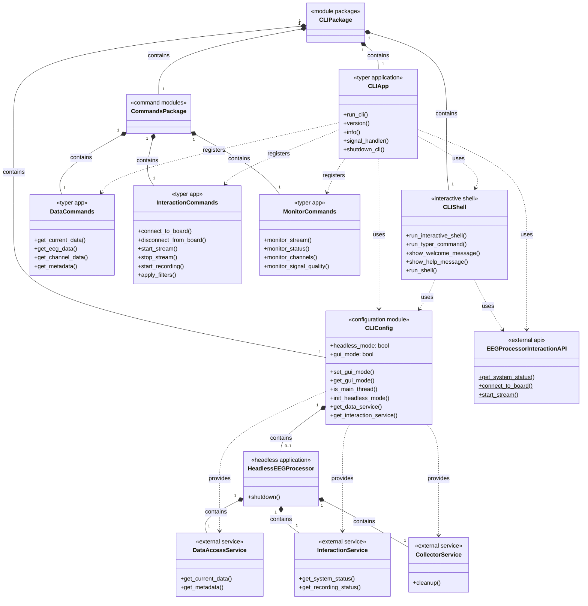

```mermaid
classDiagram
    direction TB
    
    %% Core CLI Components
    class CLIApp {
        <<typer application>>
        +run_cli()
        +version()
        +info()
        +signal_handler()
        +shutdown_cli()
    }
    
    class CLIShell {
        <<interactive shell>>
        +run_interactive_shell()
        +run_typer_command()
        +show_welcome_message()
        +show_help_message()
        +run_shell()
    }
    
    class CLIConfig {
        <<configuration module>>
        +headless_mode: bool
        +gui_mode: bool
        +set_gui_mode()
        +get_gui_mode()
        +is_main_thread()
        +init_headless_mode()
        +get_data_service()
        +get_interaction_service()
    }
    
    class HeadlessEEGProcessor {
        <<headless application>>
        +shutdown()
    }
    
    %% Command Modules (References)
    class CommandsPackage {
        <<command modules>>
    }
    
    class DataCommands {
        <<typer app>>
        +get_current_data()
        +get_eeg_data()
        +get_channel_data()
        +get_metadata()
    }
    
    class InteractionCommands {
        <<typer app>>
        +connect_to_board()
        +disconnect_from_board()
        +start_stream()
        +stop_stream()
        +start_recording()
        +apply_filters()
    }
    
    class MonitorCommands {
        <<typer app>>
        +monitor_stream()
        +monitor_status()
        +monitor_channels()
        +monitor_signal_quality()
    }
    
    %% Services (External References)
    class DataAccessService {
        <<external service>>
        +get_current_data()
        +get_metadata()
    }
    
    class InteractionService {
        <<external service>>
        +get_system_status()
        +get_recording_status()
    }
    
    class CollectorService {
        <<external service>>
        +cleanup()
    }
    
    class EEGProcessorInteractionAPI {
        <<external api>>
        +get_system_status()$
        +connect_to_board()$
        +start_stream()$
    }
    
    %% Package References
    class CLIPackage {
        <<module package>>
    }
    
    %% Package Composition
    CLIPackage "1" *-- "1" CLIApp : contains
    CLIPackage "1" *-- "1" CLIShell : contains
    CLIPackage "1" *-- "1" CLIConfig : contains
    CLIPackage "1" *-- "1" CommandsPackage : contains
    
    CommandsPackage "1" *-- "1" DataCommands : contains
    CommandsPackage "1" *-- "1" InteractionCommands : contains
    CommandsPackage "1" *-- "1" MonitorCommands : contains
    
    %% Core Component Relationships
    CLIConfig "1" *-- "0..1" HeadlessEEGProcessor : contains
    
    HeadlessEEGProcessor "1" *-- "1" DataAccessService : contains
    HeadlessEEGProcessor "1" *-- "1" InteractionService : contains
    HeadlessEEGProcessor "1" *-- "1" CollectorService : contains
    
    %% Command Integration
    CLIApp ..> DataCommands : registers
    CLIApp ..> InteractionCommands : registers
    CLIApp ..> MonitorCommands : registers
    
    %% API Integration
    CLIShell ..> EEGProcessorInteractionAPI : uses
    CLIApp ..> EEGProcessorInteractionAPI : uses
    
    %% Service Provision
    CLIConfig ..> DataAccessService : provides
    CLIConfig ..> InteractionService : provides
    CLIConfig ..> CollectorService : provides
    
    %% Inter-component Communication
    CLIApp ..> CLIShell : uses
    CLIApp ..> CLIConfig : uses
    CLIShell ..> CLIConfig : uses
```