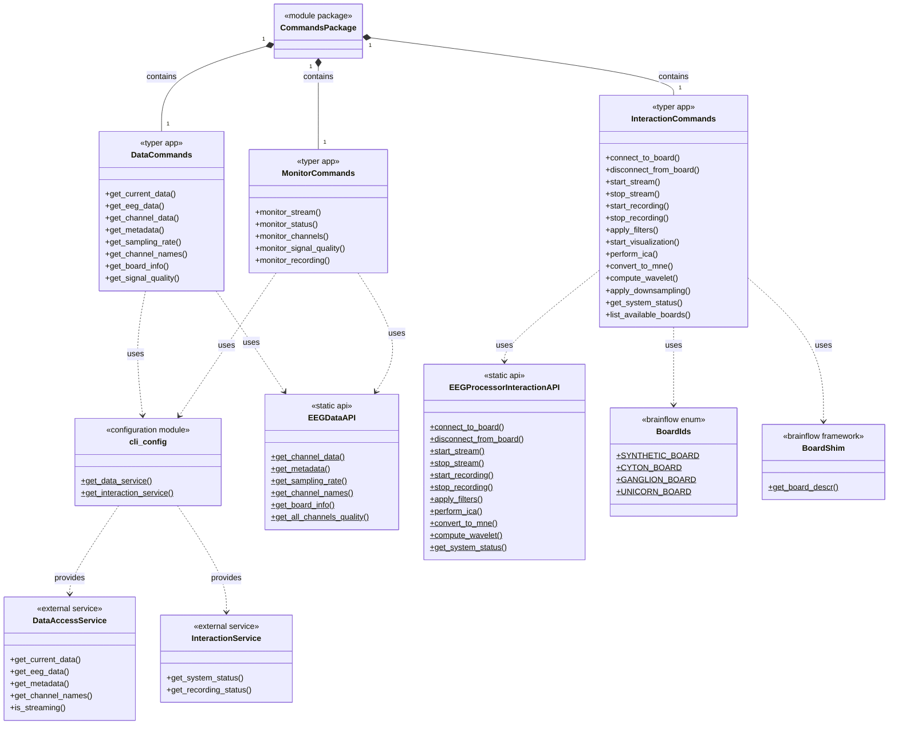

```mermaid
classDiagram
    direction TB
    
    %% Command Modules
    class DataCommands {
        <<typer app>>
        +get_current_data()
        +get_eeg_data()
        +get_channel_data()
        +get_metadata()
        +get_sampling_rate()
        +get_channel_names()
        +get_board_info()
        +get_signal_quality()
    }
    
    class InteractionCommands {
        <<typer app>>
        +connect_to_board()
        +disconnect_from_board()
        +start_stream()
        +stop_stream()
        +start_recording()
        +stop_recording()
        +apply_filters()
        +start_visualization()
        +perform_ica()
        +convert_to_mne()
        +compute_wavelet()
        +apply_downsampling()
        +get_system_status()
        +list_available_boards()
    }
    
    class MonitorCommands {
        <<typer app>>
        +monitor_stream()
        +monitor_status()
        +monitor_channels()
        +monitor_signal_quality()
        +monitor_recording()
    }
    
    %% Package Reference
    class CommandsPackage {
        <<module package>>
    }
    
    %% Configuration and Services
    class cli_config {
        <<configuration module>>
        +get_data_service()$
        +get_interaction_service()$
    }
    
    class DataAccessService {
        <<external service>>
        +get_current_data()
        +get_eeg_data()
        +get_metadata()
        +get_channel_names()
        +is_streaming()
    }
    
    class InteractionService {
        <<external service>>
        +get_system_status()
        +get_recording_status()
    }
    
    %% API Integration
    class EEGDataAPI {
        <<static api>>
        +get_channel_data()$
        +get_metadata()$
        +get_sampling_rate()$
        +get_channel_names()$
        +get_board_info()$
        +get_all_channels_quality()$
    }
    
    class EEGProcessorInteractionAPI {
        <<static api>>
        +connect_to_board()$
        +disconnect_from_board()$
        +start_stream()$
        +stop_stream()$
        +start_recording()$
        +stop_recording()$
        +apply_filters()$
        +perform_ica()$
        +convert_to_mne()$
        +compute_wavelet()$
        +get_system_status()$
    }
    
    %% BrainFlow Components
    class BoardIds {
        <<brainflow enum>>
        +SYNTHETIC_BOARD$
        +CYTON_BOARD$
        +GANGLION_BOARD$
        +UNICORN_BOARD$
    }
    
    class BoardShim {
        <<brainflow framework>>
        +get_board_descr()$
    }
    
    %% Package Composition
    CommandsPackage "1" *-- "1" DataCommands : contains
    CommandsPackage "1" *-- "1" InteractionCommands : contains
    CommandsPackage "1" *-- "1" MonitorCommands : contains
    
    %% Service Dependencies
    DataCommands ..> cli_config : uses
    DataCommands ..> EEGDataAPI : uses
    MonitorCommands ..> cli_config : uses
    MonitorCommands ..> EEGDataAPI : uses
    InteractionCommands ..> EEGProcessorInteractionAPI : uses
    
    %% Configuration Service Provision
    cli_config ..> DataAccessService : provides
    cli_config ..> InteractionService : provides
    
    %% BrainFlow Dependencies
    InteractionCommands ..> BoardIds : uses
    InteractionCommands ..> BoardShim : uses
```