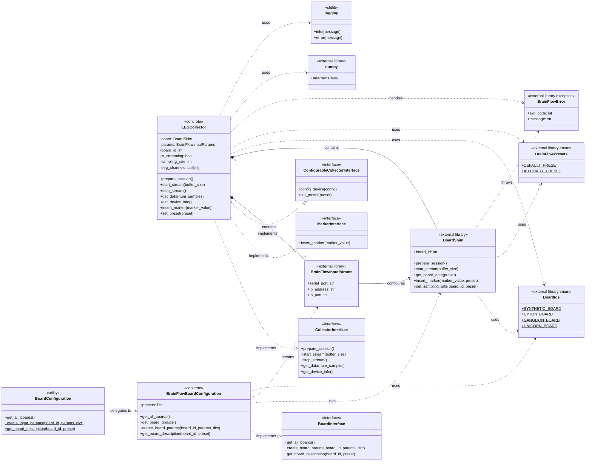

```mermaid
classDiagram
    direction LR
    
    %% Core Collector Implementation
    class EEGCollector {
        <<concrete>>
        -board: BoardShim
        -params: BrainFlowInputParams
        -board_id: int
        -is_streaming: bool
        -sampling_rate: int
        -eeg_channels: List[int]
        +prepare_session()
        +start_stream(buffer_size)
        +stop_stream()
        +get_data(num_samples)
        +get_device_info()
        +insert_marker(marker_value)
        +set_preset(preset)
    }
    
    %% Interface Definitions
    class CollectorInterface {
        <<interface>>
        +prepare_session()
        +start_stream(buffer_size)
        +stop_stream()
        +get_data(num_samples)
        +get_device_info()
    }
    
    class MarkerInterface {
        <<interface>>
        +insert_marker(marker_value)
    }
    
    class ConfigurableCollectorInterface {
        <<interface>>
        +config_device(config)
        +set_preset(preset)
    }
    
    %% BrainFlow Library Components
    class BrainFlowInputParams {
        <<external library>>
        +serial_port: str
        +ip_address: str
        +ip_port: int
    }
    
    class BoardShim {
        <<external library>>
        +board_id: int
        +prepare_session()
        +start_stream(buffer_size)
        +get_board_data(preset)
        +insert_marker(marker_value, preset)
        +get_sampling_rate(board_id, preset)$
    }
    
    class BoardIds {
        <<external library enum>>
        +SYNTHETIC_BOARD$
        +CYTON_BOARD$
        +GANGLION_BOARD$
        +UNICORN_BOARD$
    }
    
    class BrainFlowPresets {
        <<external library enum>>
        +DEFAULT_PRESET$
        +AUXILIARY_PRESET$
    }
    
    class BrainFlowError {
        <<external library exception>>
        +exit_code: int
        +message: str
    }
    
    %% Board Configuration Management
    class BoardConfiguration {
        <<utility>>
        +get_all_boards()$
        +create_input_params(board_id, params_dict)$
        +get_board_description(board_id, preset)$
    }
    
    class BrainFlowBoardConfiguration {
        <<concrete>>
        +presets: Dict
        +get_all_boards()
        +get_board_groups()
        +create_board_params(board_id, params_dict)
        +get_board_description(board_id, preset)
    }
    
    class BoardInterface {
        <<interface>>
        +get_all_boards()
        +create_board_params(board_id, params_dict)
        +get_board_description(board_id, preset)
    }
    
    %% Standard Library Components
    class numpy {
        <<external library>>
        +ndarray: Class
    }
    
    class logging {
        <<stdlib>>
        +info(message)
        +error(message)
    }
    
    %% ========== RELATIONSHIPS FOR VERTICAL LAYOUT ==========
    
    %% COLUMN 1: Interface implementations (creates left vertical column)
    EEGCollector ..|> CollectorInterface : implements
    EEGCollector ..|> MarkerInterface : implements
    EEGCollector ..|> ConfigurableCollectorInterface : implements
    
    %% COLUMN 2: Core composition (creates middle vertical column)
    EEGCollector "1" *-- "1" BrainFlowInputParams : contains
    EEGCollector "1" *-- "1" BoardShim : contains
    
    %% COLUMN 2 continued: BrainFlow vertical chain
    BrainFlowInputParams --> BoardShim : configures
    BoardShim ..> BoardIds : uses
    BoardShim ..> BrainFlowPresets : uses
    BoardShim ..> BrainFlowError : throws
    
    %% COLUMN 3: Configuration vertical chain (creates right vertical column)
    BoardConfiguration ..> BrainFlowBoardConfiguration : delegates to
    BrainFlowBoardConfiguration ..|> BoardInterface : implements
    BrainFlowBoardConfiguration ..> BoardShim : uses
    BrainFlowBoardConfiguration ..> BrainFlowInputParams : creates
    BrainFlowBoardConfiguration ..> BoardIds : uses
    
    %% Bottom connections (horizontal, but at bottom)
    EEGCollector ..> BoardIds : uses
    EEGCollector ..> BrainFlowPresets : uses
    EEGCollector ..> BrainFlowError : handles
    EEGCollector ..> numpy : uses
    EEGCollector ..> logging : uses
```