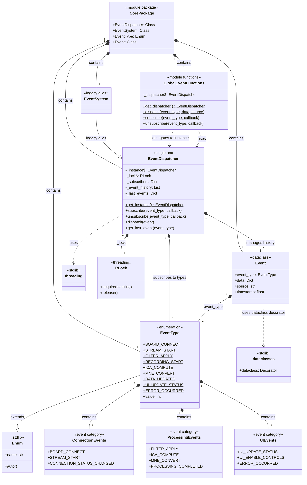

```mermaid
classDiagram
    direction TB
    
    %% Core Event System Components
    class EventDispatcher {
        <<singleton>>
        -_instance$: EventDispatcher
        -_lock$: RLock
        -_subscribers: Dict
        -_event_history: List
        -_last_events: Dict
        +get_instance()$ EventDispatcher
        +subscribe(event_type, callback)
        +unsubscribe(event_type, callback)
        +dispatch(event)
        +get_last_event(event_type)
    }
    
    class Event {
        <<dataclass>>
        +event_type: EventType
        +data: Dict
        +source: str
        +timestamp: float
    }
    
    class EventType {
        <<enumeration>>
        +BOARD_CONNECT$
        +STREAM_START$
        +FILTER_APPLY$
        +RECORDING_START$
        +ICA_COMPUTE$
        +MNE_CONVERT$
        +DATA_UPDATED$
        +UI_UPDATE_STATUS$
        +ERROR_OCCURRED$
        +value: int
    }
    
    class EventSystem {
        <<legacy alias>>
    }
    
    class CorePackage {
        <<module package>>
        +EventDispatcher: Class
        +EventSystem: Class
        +EventType: Enum
        +Event: Class
    }
    
    %% Global Convenience Functions
    class GlobalEventFunctions {
        <<module functions>>
        -_dispatcher$: EventDispatcher
        +get_dispatcher()$ EventDispatcher
        +dispatch(event_type, data, source)$
        +subscribe(event_type, callback)$
        +unsubscribe(event_type, callback)$
    }
    
    %% Event Categories (Simplified)
    class ConnectionEvents {
        <<event category>>
        +BOARD_CONNECT
        +STREAM_START
        +CONNECTION_STATUS_CHANGED
    }
    
    class ProcessingEvents {
        <<event category>>
        +FILTER_APPLY
        +ICA_COMPUTE
        +MNE_CONVERT
        +PROCESSING_COMPLETED
    }
    
    class UIEvents {
        <<event category>>
        +UI_UPDATE_STATUS
        +UI_ENABLE_CONTROLS
        +ERROR_OCCURRED
    }
    
    %% Threading Components
    class threading {
        <<stdlib>>
    }
    
    class RLock {
        <<threading>>
        +acquire(blocking)
        +release()
    }
    
    class Enum {
        <<stdlib>>
        +auto()
        +name: str
    }
    
    class dataclasses {
        <<stdlib>>
        +dataclass: Decorator
    }
    
    %% Package Composition
    CorePackage "1" *-- "1" EventDispatcher : contains
    CorePackage "1" *-- "1" EventSystem : contains
    CorePackage "1" *-- "1" Event : contains
    CorePackage "1" *-- "1" EventType : contains
    CorePackage "1" *-- "1" GlobalEventFunctions : contains
    
    %% Core Relationships
    EventDispatcher "1" *-- "*" Event : manages history
    EventDispatcher "1" *-- "1" EventType : subscribes to types
    EventDispatcher "1" *-- "1" RLock : _lock
    EventDispatcher ..> threading : uses
    
    Event "1" *-- "1" EventType : event_type
    Event ..> dataclasses : uses dataclass decorator
    EventType --|> Enum : extends
    EventSystem --|> EventDispatcher : legacy alias
    
    GlobalEventFunctions ..> EventDispatcher : delegates to instance
    GlobalEventFunctions ..> EventDispatcher : uses
    
    %% Event Categories
    EventType "1" *-- "1" ConnectionEvents : contains
    EventType "1" *-- "1" ProcessingEvents : contains
    EventType "1" *-- "1" UIEvents : contains
```