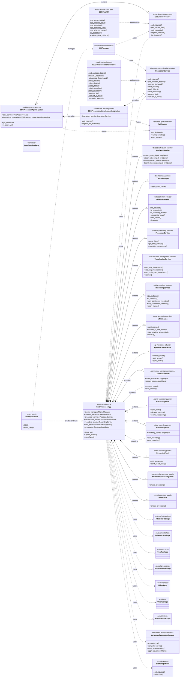

```mermaid
classDiagram
    direction LR
    
    %% Core Application
    class EEGProcessorApp {
        <<main application>>
        +theme_manager: ThemeManager
        +collector_service: CollectorService
        +processor_service: ProcessorService
        +visualization_service: VisualizationService
        +recording_service: RecordingService
        +mne_service: Optional[MNEService]
        +qt_adapter: QtInteractionAdapter
        +setup_ui()
        +update_status()
        +closeEvent()
    }
    
    class AppEventHandler {
        <<thread-safe event handler>>
        +stream_start_signal: pyqtSignal
        +stream_stop_signal: pyqtSignal
        +board_connect_signal: pyqtSignal
        +board_disconnect_signal: pyqtSignal
    }
    
    %% APIs
    class EEGDataAPI {
        <<static data access api>>
        +get_current_data()$
        +get_channel_data()$
        +get_metadata()$
        +get_sampling_rate()$
        +get_channel_names()$
        +is_streaming()$
        +register_data_callback()$
    }
    
    class EEGProcessorInteractionAPI {
        <<static interaction api>>
        +get_available_boards()$
        +connect_to_board()$
        +disconnect_from_board()$
        +start_stream()$
        +stop_stream()$
        +apply_filters()$
        +start_recording()$
        +stop_recording()$
        +perform_ica()$
        +convert_to_mne()$
        +compute_wavelet()$
    }
    
    class EEGProcessorApiIntegration {
        <<api integration service>>
        +data_service: DataAccessService
        +interaction_integration: EEGProcessorInteractionApiIntegration
        +get_instance()$
        +register_api()
    }
    
    class EEGProcessorInteractionApiIntegration {
        <<interaction api integration>>
        +interaction_service: InteractionService
        +get_instance()$
        +register_api_methods()
    }
    
    %% Core Services
    class CollectorService {
        <<data collection service>>
        +get_instance()$
        +is_connected()
        +is_streaming_active()
        +connect_to_board()
        +start_stream()
        +cleanup()
    }
    
    class DataAccessService {
        <<centralized data access>>
        +get_instance()$
        +get_current_data()
        +get_metadata()
        +register_callback()
        +is_streaming()
    }
    
    class ProcessorService {
        <<signal processing service>>
        +apply_filters()
        +get_filter_settings()
        +calculate_eeg_metrics()
    }
    
    class RecordingService {
        <<data recording service>>
        +get_instance()$
        +is_recording()
        +start_continuous_recording()
        +stop_continuous_recording()
        +insert_marker()
    }
    
    class VisualizationService {
        <<visualization management service>>
        +start_eeg_visualization()
        +stop_eeg_visualization()
        +start_brain_map_visualization()
        +cleanup()
    }
    
    class InteractionService {
        <<interaction coordination service>>
        +get_instance()$
        +get_available_boards()
        +connect_to_board()
        +start_stream()
        +apply_filters()
        +start_recording()
        +perform_ica()
        +convert_to_mne()
    }
    
    class MNEService {
        <<mne processing service>>
        +get_instance()$
        +convert_to_mne_async()
        +start_realtime_processing()
        +cleanup()
    }
    
    class AdvancedProcessingService {
        <<advanced analysis service>>
        +compute_ica()
        +compute_wavelet()
        +apply_downsampling()
        +apply_advanced_filters()
    }
    
    %% Package References
    class AdaptersPackage {
        <<external integration>>
    }
    
    class CollectorsPackage {
        <<hardware interface>>
    }
    
    class CorePackage {
        <<infrastructure>>
    }
    
    class InterfacesPackage {
        <<contracts>>
    }
    
    class ProcessorsPackage {
        <<signal processing>>
    }
    
    class UIPackage {
        <<user interface>>
    }
    
    class UtilsPackage {
        <<utilities>>
    }
    
    class VisualizersPackage {
        <<visualization>>
    }
    
    class CLIPackage {
        <<command line interface>>
    }
    
    %% UI Panel References
    class ConnectionPanel {
        <<connection management panel>>
        +board_connected: pyqtSignal
        +stream_started: pyqtSignal
        +connect_board()
        +start_stream()
    }
    
    class ProcessingPanel {
        <<signal processing panel>>
        +apply_filters()
        +calculate_metrics()
        +enable_processing()
    }
    
    class RecordingPanel {
        <<data recording panel>>
        +recording_started: pyqtSignal
        +start_recording()
        +stop_recording()
    }
    
    class StreamingPanel {
        <<data streaming panel>>
        +add_streamer()
        +send_board_config()
    }
    
    class AdvancedProcessingPanel {
        <<advanced processing panel>>
        +enable_processing()
    }
    
    class MNEPanel {
        <<mne integration panel>>
        +enable_processing()
    }
    
    %% External Framework
    class ApiExplorer {
        <<external api framework>>
        +get_instance()$
        +register_module()
        +start_server()
    }
    
    class EventDispatcher {
        <<event system>>
        +get_instance()$
        +subscribe()
    }
    
    class ThemeManager {
        <<theme management>>
        +apply_dark_theme()
    }
    
    class QtInteractionAdapter {
        <<qt interaction adapter>>
        +connect_board()
        +start_stream()
        +apply_filters()
    }
    
    %% Entry Point
    class RunApplication {
        <<entry point>>
        +main()$
        +parse_config()$
    }
    
    %% Core Application Composition
    EEGProcessorApp "1" *-- "1" AppEventHandler : contains
    EEGProcessorApp "1" *-- "1" ThemeManager : contains
    EEGProcessorApp "1" *-- "1" CollectorService : contains
    EEGProcessorApp "1" *-- "1" ProcessorService : contains
    EEGProcessorApp "1" *-- "1" VisualizationService : contains
    EEGProcessorApp "1" *-- "1" RecordingService : contains
    EEGProcessorApp "1" *-- "0..1" MNEService : contains
    EEGProcessorApp "1" *-- "1" QtInteractionAdapter : contains
    
    %% UI Panel Composition
    EEGProcessorApp "1" *-- "1" ConnectionPanel : contains
    EEGProcessorApp "1" *-- "1" ProcessingPanel : contains
    EEGProcessorApp "1" *-- "1" RecordingPanel : contains
    EEGProcessorApp "1" *-- "1" StreamingPanel : contains
    EEGProcessorApp "1" *-- "1" AdvancedProcessingPanel : contains
    EEGProcessorApp "1" *-- "0..1" MNEPanel : contains
    
    %% API Integration Composition
    EEGProcessorApiIntegration "1" *-- "1" DataAccessService : contains
    EEGProcessorApiIntegration "1" *-- "1" EEGProcessorInteractionApiIntegration : contains
    
    %% Package References
    EEGProcessorApp ..> AdaptersPackage : uses
    EEGProcessorApp ..> CollectorsPackage : uses
    EEGProcessorApp ..> CorePackage : uses
    EEGProcessorApp ..> ProcessorsPackage : uses
    EEGProcessorApp ..> UIPackage : uses
    EEGProcessorApp ..> UtilsPackage : uses
    EEGProcessorApp ..> VisualizersPackage : uses
    
    %% API Delegation Pattern
    EEGDataAPI ..> DataAccessService : delegates to
    
    CLIPackage ..> InteractionService : uses
    EEGProcessorInteractionAPI ..> InteractionService : delegates to

    EEGProcessorInteractionApiIntegration "1" *-- "1" InteractionService : contains
    
    %% Service Layer Dependencies
    CLIPackage ..> DataAccessService : uses

    EEGProcessorApp ..> DataAccessService : uses
    EEGProcessorApp ..> InteractionService : uses
    EEGProcessorApp ..> AdvancedProcessingService : uses
    
    %% Integration Layer
    EEGProcessorInteractionApiIntegration ..> ApiExplorer : uses
    EEGProcessorApiIntegration ..> ApiExplorer : uses
    
    %% Event System
    EEGProcessorApp ..> EventDispatcher : uses
    
    %% Panel Signal Connections
    ConnectionPanel ..> EEGProcessorApp : signals to
    RecordingPanel ..> EEGProcessorApp : signals to
    
    
    %% Entry Point
    RunApplication ..> EEGProcessorApp : creates and runs
    RunApplication ..> CLIPackage : manages
```