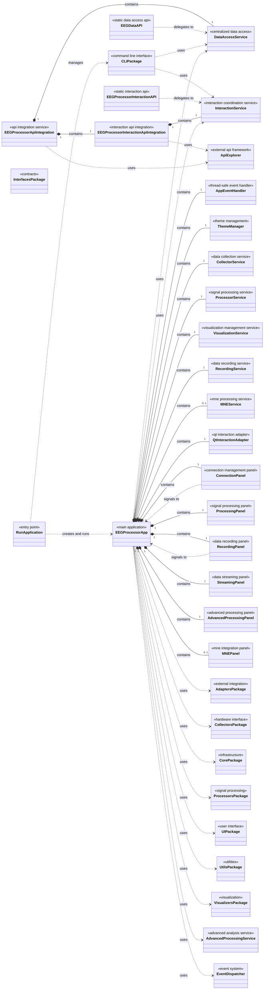

```mermaid
classDiagram
    direction LR
    
    %% Core Application
    class EEGProcessorApp {
        <<main application>>
    }
    
    class AppEventHandler {
        <<thread-safe event handler>>
    }
    
    %% APIs
    class EEGDataAPI {
        <<static data access api>>
    }
    
    class EEGProcessorInteractionAPI {
        <<static interaction api>>
    }
    
    class EEGProcessorApiIntegration {
        <<api integration service>>
    }
    
    class EEGProcessorInteractionApiIntegration {
        <<interaction api integration>>
    }
    
    %% Core Services
    class CollectorService {
        <<data collection service>>
    }
    
    class DataAccessService {
        <<centralized data access>>
    }
    
    class ProcessorService {
        <<signal processing service>>
    }
    
    class RecordingService {
        <<data recording service>>
    }
    
    class VisualizationService {
        <<visualization management service>>
    }
    
    class InteractionService {
        <<interaction coordination service>>
    }
    
    class MNEService {
        <<mne processing service>>
    }
    
    class AdvancedProcessingService {
        <<advanced analysis service>>
    }
    
    %% Package References
    class AdaptersPackage {
        <<external integration>>
    }
    
    class CollectorsPackage {
        <<hardware interface>>
    }
    
    class CorePackage {
        <<infrastructure>>
    }
    
    class InterfacesPackage {
        <<contracts>>
    }
    
    class ProcessorsPackage {
        <<signal processing>>
    }
    
    class UIPackage {
        <<user interface>>
    }
    
    class UtilsPackage {
        <<utilities>>
    }
    
    class VisualizersPackage {
        <<visualization>>
    }
    
    class CLIPackage {
        <<command line interface>>
    }
    
    %% UI Panel References
    class ConnectionPanel {
        <<connection management panel>>
    }
    
    class ProcessingPanel {
        <<signal processing panel>>
    }
    
    class RecordingPanel {
        <<data recording panel>>
    }
    
    class StreamingPanel {
        <<data streaming panel>>
    }
    
    class AdvancedProcessingPanel {
        <<advanced processing panel>>
    }
    
    class MNEPanel {
        <<mne integration panel>>
    }
    
    %% External Framework
    class ApiExplorer {
        <<external api framework>>
    }
    
    class EventDispatcher {
        <<event system>>
    }
    
    class ThemeManager {
        <<theme management>>
    }
    
    class QtInteractionAdapter {
        <<qt interaction adapter>>
    }
    
    %% Entry Point
    class RunApplication {
        <<entry point>>
    }
    
    %% Core Application Composition
    EEGProcessorApp "1" *-- "1" AppEventHandler : contains
    EEGProcessorApp "1" *-- "1" ThemeManager : contains
    EEGProcessorApp "1" *-- "1" CollectorService : contains
    EEGProcessorApp "1" *-- "1" ProcessorService : contains
    EEGProcessorApp "1" *-- "1" VisualizationService : contains
    EEGProcessorApp "1" *-- "1" RecordingService : contains
    EEGProcessorApp "1" *-- "0..1" MNEService : contains
    EEGProcessorApp "1" *-- "1" QtInteractionAdapter : contains
    
    %% UI Panel Composition
    EEGProcessorApp "1" *-- "1" ConnectionPanel : contains
    EEGProcessorApp "1" *-- "1" ProcessingPanel : contains
    EEGProcessorApp "1" *-- "1" RecordingPanel : contains
    EEGProcessorApp "1" *-- "1" StreamingPanel : contains
    EEGProcessorApp "1" *-- "1" AdvancedProcessingPanel : contains
    EEGProcessorApp "1" *-- "0..1" MNEPanel : contains
    
    %% API Integration Composition
    EEGProcessorApiIntegration "1" *-- "1" DataAccessService : contains
    EEGProcessorApiIntegration "1" *-- "1" EEGProcessorInteractionApiIntegration : contains
    
    %% Package References
    EEGProcessorApp ..> AdaptersPackage : uses
    EEGProcessorApp ..> CollectorsPackage : uses
    EEGProcessorApp ..> CorePackage : uses
    EEGProcessorApp ..> ProcessorsPackage : uses
    EEGProcessorApp ..> UIPackage : uses
    EEGProcessorApp ..> UtilsPackage : uses
    EEGProcessorApp ..> VisualizersPackage : uses
    
    %% API Delegation Pattern
    EEGDataAPI ..> DataAccessService : delegates to
    
    CLIPackage ..> InteractionService : uses
    EEGProcessorInteractionAPI ..> InteractionService : delegates to

    EEGProcessorInteractionApiIntegration "1" *-- "1" InteractionService : contains
    
    %% Service Layer Dependencies
    CLIPackage ..> DataAccessService : uses

    EEGProcessorApp ..> DataAccessService : uses
    EEGProcessorApp ..> InteractionService : uses
    EEGProcessorApp ..> AdvancedProcessingService : uses
    
    %% Integration Layer
    EEGProcessorInteractionApiIntegration ..> ApiExplorer : uses
    EEGProcessorApiIntegration ..> ApiExplorer : uses
    
    %% Event System
    EEGProcessorApp ..> EventDispatcher : uses
    
    %% Panel Signal Connections
    ConnectionPanel ..> EEGProcessorApp : signals to
    RecordingPanel ..> EEGProcessorApp : signals to
    
    
    %% Entry Point
    RunApplication ..> EEGProcessorApp : creates and runs
    RunApplication ..> CLIPackage : manages
```