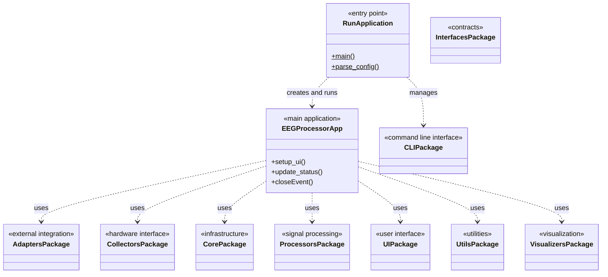

```mermaid
classDiagram
    direction TB
    
    %% Entry Point (mantener contexto)
    class RunApplication {
        <<entry point>>
        +main()$
        +parse_config()$
    }
    
    %% Core Application (referencia)
    class EEGProcessorApp {
        <<main application>>
        +setup_ui()
        +update_status()
        +closeEvent()
    }
    
    %% Package References
    class AdaptersPackage {
        <<external integration>>
    }
    
    class CollectorsPackage {
        <<hardware interface>>
    }
    
    class CorePackage {
        <<infrastructure>>
    }
    
    class InterfacesPackage {
        <<contracts>>
    }
    
    class ProcessorsPackage {
        <<signal processing>>
    }
    
    class UIPackage {
        <<user interface>>
    }
    
    class UtilsPackage {
        <<utilities>>
    }
    
    class VisualizersPackage {
        <<visualization>>
    }
    
    class CLIPackage {
        <<command line interface>>
    }
    
    %% Entry Point Relationships
    RunApplication ..> EEGProcessorApp : creates and runs
    RunApplication ..> CLIPackage : manages
    
    %% Package Dependencies
    EEGProcessorApp ..> AdaptersPackage : uses
    EEGProcessorApp ..> CollectorsPackage : uses
    EEGProcessorApp ..> CorePackage : uses
    EEGProcessorApp ..> ProcessorsPackage : uses
    EEGProcessorApp ..> UIPackage : uses
    EEGProcessorApp ..> UtilsPackage : uses
    EEGProcessorApp ..> VisualizersPackage : uses
```