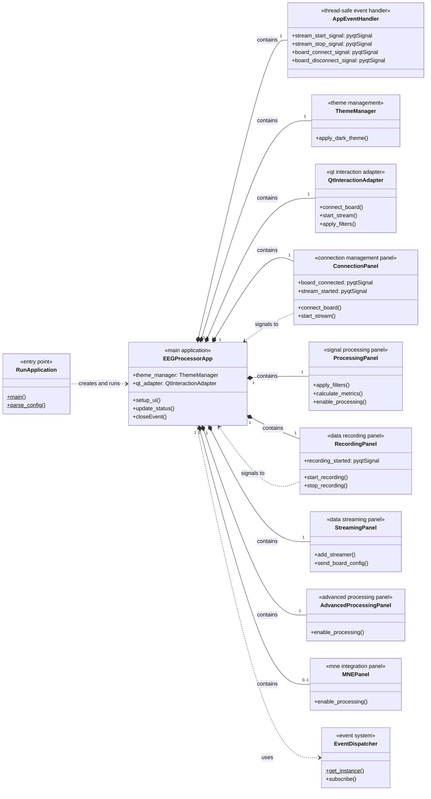

```mermaid
classDiagram
    direction LR
    
    %% Entry Point (mantener contexto)
    class RunApplication {
        <<entry point>>
        +main()$
        +parse_config()$
    }
    
    %% Core Application (referencia)
    class EEGProcessorApp {
        <<main application>>
        +theme_manager: ThemeManager
        +qt_adapter: QtInteractionAdapter
        +setup_ui()
        +update_status()
        +closeEvent()
    }
    
    class AppEventHandler {
        <<thread-safe event handler>>
        +stream_start_signal: pyqtSignal
        +stream_stop_signal: pyqtSignal
        +board_connect_signal: pyqtSignal
        +board_disconnect_signal: pyqtSignal
    }
    
    %% UI Panel References
    class ConnectionPanel {
        <<connection management panel>>
        +board_connected: pyqtSignal
        +stream_started: pyqtSignal
        +connect_board()
        +start_stream()
    }
    
    class ProcessingPanel {
        <<signal processing panel>>
        +apply_filters()
        +calculate_metrics()
        +enable_processing()
    }
    
    class RecordingPanel {
        <<data recording panel>>
        +recording_started: pyqtSignal
        +start_recording()
        +stop_recording()
    }
    
    class StreamingPanel {
        <<data streaming panel>>
        +add_streamer()
        +send_board_config()
    }
    
    class AdvancedProcessingPanel {
        <<advanced processing panel>>
        +enable_processing()
    }
    
    class MNEPanel {
        <<mne integration panel>>
        +enable_processing()
    }
    
    %% Adapters and Framework
    class QtInteractionAdapter {
        <<qt interaction adapter>>
        +connect_board()
        +start_stream()
        +apply_filters()
    }
    
    class EventDispatcher {
        <<event system>>
        +get_instance()$
        +subscribe()
    }
    
    class ThemeManager {
        <<theme management>>
        +apply_dark_theme()
    }
    
    %% Entry Point Relationships
    RunApplication ..> EEGProcessorApp : creates and runs
    
    %% Core Application Components
    EEGProcessorApp "1" *-- "1" AppEventHandler : contains
    EEGProcessorApp "1" *-- "1" ThemeManager : contains
    EEGProcessorApp "1" *-- "1" QtInteractionAdapter : contains
    
    %% UI Panel Composition
    EEGProcessorApp "1" *-- "1" ConnectionPanel : contains
    EEGProcessorApp "1" *-- "1" ProcessingPanel : contains
    EEGProcessorApp "1" *-- "1" RecordingPanel : contains
    EEGProcessorApp "1" *-- "1" StreamingPanel : contains
    EEGProcessorApp "1" *-- "1" AdvancedProcessingPanel : contains
    EEGProcessorApp "1" *-- "0..1" MNEPanel : contains
    
    %% Event System
    EEGProcessorApp ..> EventDispatcher : uses
    
    %% Panel Signal Connections
    ConnectionPanel ..> EEGProcessorApp : signals to
    RecordingPanel ..> EEGProcessorApp : signals to
```