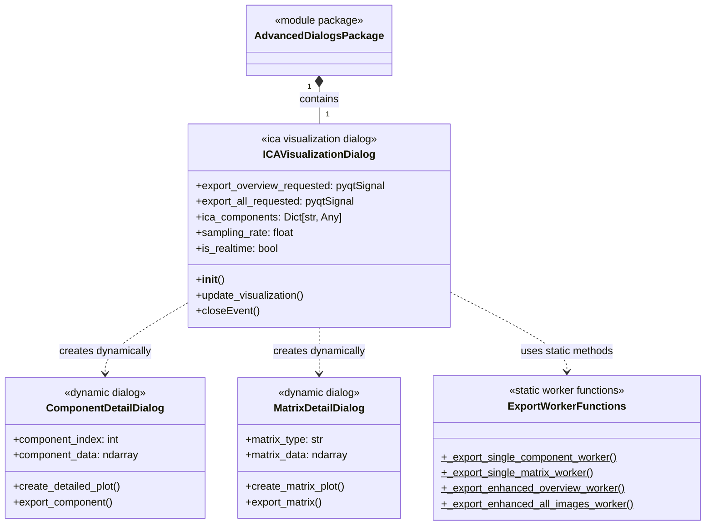

```mermaid
classDiagram
    direction TB
    
    %% Core Dialog Class
    class ICAVisualizationDialog {
        <<ica visualization dialog>>
        +export_overview_requested: pyqtSignal
        +export_all_requested: pyqtSignal
        +ica_components: Dict[str, Any]
        +sampling_rate: float
        +is_realtime: bool
        +__init__()
        +update_visualization()
        +closeEvent()
    }
    
    %% Dynamic Detail Dialogs
    class ComponentDetailDialog {
        <<dynamic dialog>>
        +component_index: int
        +component_data: ndarray
        +create_detailed_plot()
        +export_component()
    }
    
    class MatrixDetailDialog {
        <<dynamic dialog>>
        +matrix_type: str
        +matrix_data: ndarray
        +create_matrix_plot()
        +export_matrix()
    }
    
    %% Worker Process Functions
    class ExportWorkerFunctions {
        <<static worker functions>>
        +_export_single_component_worker()$
        +_export_single_matrix_worker()$
        +_export_enhanced_overview_worker()$
        +_export_enhanced_all_images_worker()$
    }
    
    %% Package Reference
    class AdvancedDialogsPackage {
        <<module package>>
    }
    
    %% Package Composition
    AdvancedDialogsPackage "1" *-- "1" ICAVisualizationDialog : contains
    
    %% Dynamic Dialog Creation
    ICAVisualizationDialog ..> ComponentDetailDialog : creates dynamically
    ICAVisualizationDialog ..> MatrixDetailDialog : creates dynamically
    
    %% Worker Process Dependencies
    ICAVisualizationDialog ..> ExportWorkerFunctions : uses static methods
```