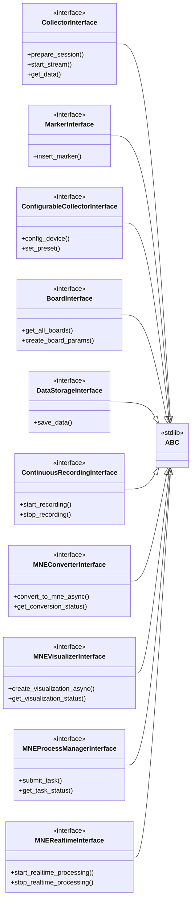

```mermaid
classDiagram
    direction LR
    
    %% Core Collector Interfaces
    class CollectorInterface {
        <<interface>>
        +prepare_session()
        +start_stream()
        +get_data()
    }
    
    class MarkerInterface {
        <<interface>>
        +insert_marker()
    }
    
    class ConfigurableCollectorInterface {
        <<interface>>
        +config_device()
        +set_preset()
    }
    
    %% Board Management
    class BoardInterface {
        <<interface>>
        +get_all_boards()
        +create_board_params()
    }
    
    %% Recording Interfaces
    class DataStorageInterface {
        <<interface>>
        +save_data()
    }
    
    class ContinuousRecordingInterface {
        <<interface>>
        +start_recording()
        +stop_recording()
    }
    
    %% MNE Processing
    class MNEConverterInterface {
        <<interface>>
        +convert_to_mne_async()
        +get_conversion_status()
    }
    
    class MNEVisualizerInterface {
        <<interface>>
        +create_visualization_async()
        +get_visualization_status()
    }
    
    class MNEProcessManagerInterface {
        <<interface>>
        +submit_task()
        +get_task_status()
    }
    
    class MNERealtimeInterface {
        <<interface>>
        +start_realtime_processing()
        +stop_realtime_processing()
    }
    
    %% Dependencies
    class ABC {
        <<stdlib>>
    }
    
    %% Relationships
    CollectorInterface --|> ABC
    MarkerInterface --|> ABC
    ConfigurableCollectorInterface --|> ABC
    BoardInterface --|> ABC
    DataStorageInterface --|> ABC
    ContinuousRecordingInterface --|> ABC
    MNEConverterInterface --|> ABC
    MNEVisualizerInterface --|> ABC
    MNEProcessManagerInterface --|> ABC
    MNERealtimeInterface --|> ABC
```