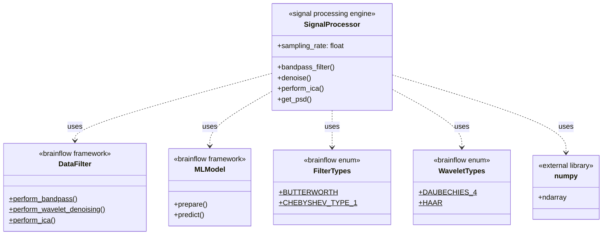

```mermaid
classDiagram
    direction TB
    
    %% Core Signal Processor
    class SignalProcessor {
        <<signal processing engine>>
        +sampling_rate: float
        +bandpass_filter()
        +denoise()
        +perform_ica()
        +get_psd()
    }
    
    %% BrainFlow Framework
    class DataFilter {
        <<brainflow framework>>
        +perform_bandpass()$
        +perform_wavelet_denoising()$
        +perform_ica()$
    }
    
    class MLModel {
        <<brainflow framework>>
        +prepare()
        +predict()
    }
    
    %% Essential Enums
    class FilterTypes {
        <<brainflow enum>>
        +BUTTERWORTH$
        +CHEBYSHEV_TYPE_1$
    }
    
    class WaveletTypes {
        <<brainflow enum>>
        +DAUBECHIES_4$
        +HAAR$
    }
    
    %% External Dependencies
    class numpy {
        <<external library>>
        +ndarray
    }
    
    %% Relationships
    SignalProcessor ..> DataFilter : uses
    SignalProcessor ..> MLModel : uses
    SignalProcessor ..> FilterTypes : uses
    SignalProcessor ..> WaveletTypes : uses
    SignalProcessor ..> numpy : uses
```