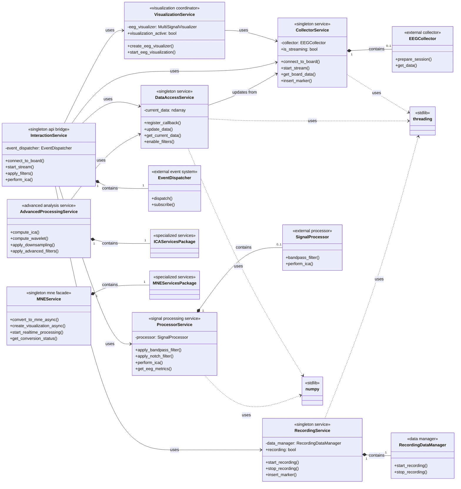

```mermaid
classDiagram
    direction LR
    
    %% Core Service Classes
    class CollectorService {
        <<singleton service>>
        -collector: EEGCollector
        +is_streaming: bool
        +connect_to_board()
        +start_stream()
        +get_board_data()
        +insert_marker()
    }
    
    class DataAccessService {
        <<singleton service>>
        -current_data: ndarray
        +register_callback()
        +update_data()
        +get_current_data()
        +enable_filters()
    }
    
    class ProcessorService {
        <<signal processing service>>
        -processor: SignalProcessor
        +apply_bandpass_filter()
        +apply_notch_filter()
        +perform_ica()
        +get_eeg_metrics()
    }
    
    class RecordingService {
        <<singleton service>>
        -data_manager: RecordingDataManager
        +recording: bool
        +start_recording()
        +stop_recording()
        +insert_marker()
    }
    
    class VisualizationService {
        <<visualization coordinator>>
        -eeg_visualizer: MultiSignalVisualizer
        +visualization_active: bool
        +create_eeg_visualizer()
        +start_eeg_visualization()
    }
    
    class InteractionService {
        <<singleton api bridge>>
        -event_dispatcher: EventDispatcher
        +connect_to_board()
        +start_stream()
        +apply_filters()
        +perform_ica()
    }
    
    class AdvancedProcessingService {
        <<advanced analysis service>>
        +compute_ica()
        +compute_wavelet()
        +apply_downsampling()
        +apply_advanced_filters()
    }
    
    class MNEService {
        <<singleton mne facade>>
        +convert_to_mne_async()
        +create_visualization_async()
        +start_realtime_processing()
        +get_conversion_status()
    }
    
    %% Supporting Classes
    class RecordingDataManager {
        <<data manager>>
        +start_recording()
        +stop_recording()
    }
    
    %% External Dependencies
    class EEGCollector {
        <<external collector>>
        +prepare_session()
        +get_data()
    }
    
    class SignalProcessor {
        <<external processor>>
        +bandpass_filter()
        +perform_ica()
    }
    
    class EventDispatcher {
        <<external event system>>
        +dispatch()
        +subscribe()
    }
    
    %% Specialized Service Packages (References)
    class ICAServicesPackage {
        <<specialized services>>
    }
    
    class MNEServicesPackage {
        <<specialized services>>
    }
    
    %% Standard Library
    class threading {
        <<stdlib>>
    }
    
    class numpy {
        <<stdlib>>
    }
    
    %% Core Relationships
    CollectorService "1" *-- "0..1" EEGCollector : contains
    ProcessorService "1" *-- "0..1" SignalProcessor : contains
    RecordingService "1" *-- "1" RecordingDataManager : contains
    InteractionService "1" *-- "1" EventDispatcher : contains
    
    VisualizationService --> CollectorService : uses
    InteractionService --> CollectorService : uses
    DataAccessService --> CollectorService : updates from
    
    InteractionService --> ProcessorService : uses
    InteractionService --> RecordingService : uses
    InteractionService --> VisualizationService : uses
    InteractionService --> DataAccessService : uses
    
    AdvancedProcessingService --> DataAccessService : uses
    AdvancedProcessingService "1" *-- "1" ICAServicesPackage : contains
    MNEService "1" *-- "1" MNEServicesPackage : contains
    
    %% Threading Dependencies
    CollectorService ..> threading : uses
    DataAccessService ..> threading : uses
    RecordingService ..> threading : uses
    
    %% Data Dependencies
    DataAccessService ..> numpy : uses
    ProcessorService ..> numpy : uses
```