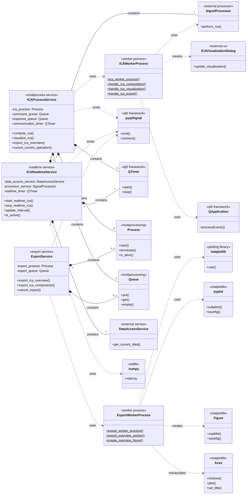

```mermaid
classDiagram
    direction LR
    
    %% Core ICA Service Classes
    class ICAProcessService {
        <<multiprocess service>>
        -ica_process: Process
        -command_queue: Queue
        -response_queue: Queue
        -communication_timer: QTimer
        +compute_ica()
        +visualize_ica()
        +export_ica_overview()
        +cancel_current_operation()
    }
    
    class ICARealtimeService {
        <<realtime service>>
        -data_access_service: DataAccessService
        -processor_service: SignalProcessor
        -realtime_timer: QTimer
        +start_realtime_ica()
        +stop_realtime_ica()
        +update_interval()
        +is_active()
    }
    
    class ExportService {
        <<export service>>
        -export_process: Process
        -export_queue: Queue
        +export_ica_overview()
        +export_ica_components()
        +cancel_export()
    }
    
    %% Worker Process Functions
    class ICAWorkerProcess {
        <<worker process>>
        +ica_worker_process()$
        +handle_ica_computation()$
        +handle_ica_visualization()$
        +handle_ica_export()$
    }
    
    class ExportWorkerProcess {
        <<worker process>>
        +export_worker_process()$
        +export_overview_worker()$
        +create_overview_figure()$
    }
    
    %% Qt5 Framework
    class pyqtSignal {
        <<qt5 framework>>
        +emit()
        +connect()
    }
    
    class QTimer {
        <<qt5 framework>>
        +start()
        +stop()
    }
    
    class QApplication {
        <<qt5 framework>>
        +processEvents()
    }
    
    %% Multiprocessing
    class Process {
        <<multiprocessing>>
        +start()
        +terminate()
        +is_alive()
    }
    
    class Queue {
        <<multiprocessing>>
        +put()
        +get()
        +empty()
    }
    
    %% Matplotlib Components
    class matplotlib {
        <<plotting library>>
        +use()
    }
    
    class pyplot {
        <<matplotlib>>
        +subplots()
        +savefig()
    }
    
    class Figure {
        <<matplotlib>>
        +suptitle()
        +savefig()
    }
    
    class Axes {
        <<matplotlib>>
        +imshow()
        +plot()
        +set_title()
    }
    
    %% External Dependencies
    class DataAccessService {
        <<external service>>
        +get_current_data()
    }
    
    class SignalProcessor {
        <<external processor>>
        +perform_ica()
    }
    
    class ICAVisualizationDialog {
        <<external ui>>
        +update_visualization()
    }
    
    %% Standard Library
    class numpy {
        <<stdlib>>
        +ndarray
    }
    
    %% Core Composition
    ICAProcessService "1" *-- "0..1" Process : contains
    ICAProcessService "1" *-- "0..1" Queue : contains
    ICAProcessService "1" *-- "0..1" QTimer : contains
    
    ICARealtimeService "1" *-- "1" DataAccessService : contains
    ICARealtimeService "1" *-- "1" SignalProcessor : contains
    ICARealtimeService "1" *-- "1" QTimer : contains
    
    ExportService "1" *-- "0..1" Process : contains
    ExportService "1" *-- "0..1" Queue : contains
    
    %% Worker Dependencies
    ICAProcessService ..> ICAWorkerProcess : uses
    ExportService ..> ExportWorkerProcess : uses
    
    ICAWorkerProcess ..> SignalProcessor : uses
    ICAWorkerProcess ..> ICAVisualizationDialog : creates
    ICAWorkerProcess ..> QApplication : uses
    
    ExportWorkerProcess ..> matplotlib : uses
    ExportWorkerProcess ..> pyplot : uses
    ExportWorkerProcess ..> Figure : creates
    ExportWorkerProcess ..> Axes : manipulates
    
    %% Qt Framework Dependencies
    ICAProcessService ..> pyqtSignal : emits
    ICARealtimeService ..> pyqtSignal : emits
    ExportService ..> pyqtSignal : emits
    
    %% Standard Library Dependencies
    ICARealtimeService ..> numpy : uses
```