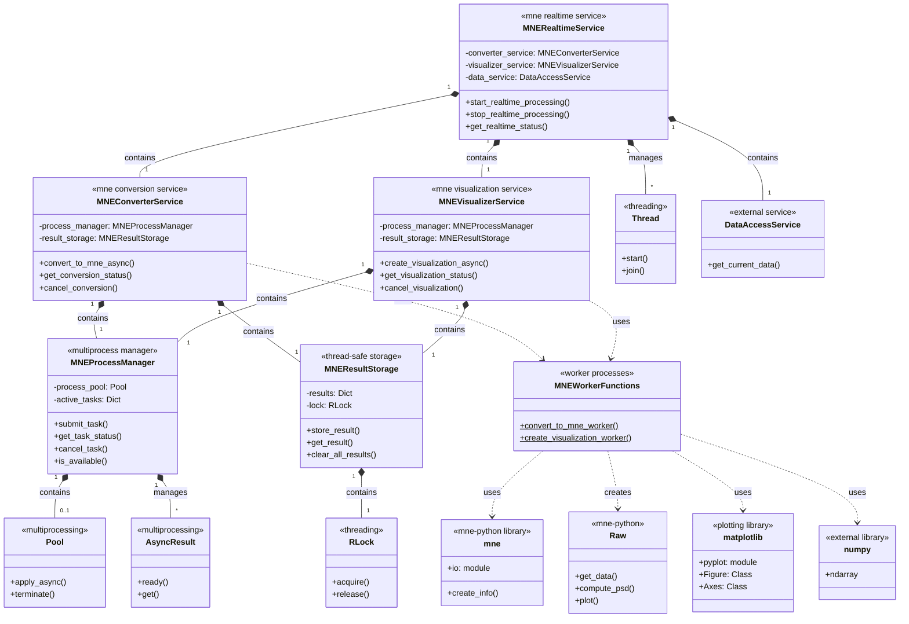

```mermaid
classDiagram
    direction TB
    
    %% Core MNE Service Classes
    class MNEConverterService {
        <<mne conversion service>>
        -process_manager: MNEProcessManager
        -result_storage: MNEResultStorage
        +convert_to_mne_async()
        +get_conversion_status()
        +cancel_conversion()
    }
    
    class MNEVisualizerService {
        <<mne visualization service>>
        -process_manager: MNEProcessManager
        -result_storage: MNEResultStorage
        +create_visualization_async()
        +get_visualization_status()
        +cancel_visualization()
    }
    
    class MNERealtimeService {
        <<mne realtime service>>
        -converter_service: MNEConverterService
        -visualizer_service: MNEVisualizerService
        -data_service: DataAccessService
        +start_realtime_processing()
        +stop_realtime_processing()
        +get_realtime_status()
    }
    
    class MNEProcessManager {
        <<multiprocess manager>>
        -process_pool: Pool
        -active_tasks: Dict
        +submit_task()
        +get_task_status()
        +cancel_task()
        +is_available()
    }
    
    class MNEResultStorage {
        <<thread-safe storage>>
        -results: Dict
        -lock: RLock
        +store_result()
        +get_result()
        +clear_all_results()
    }
    
    %% Worker Functions
    class MNEWorkerFunctions {
        <<worker processes>>
        +convert_to_mne_worker()$
        +create_visualization_worker()$
    }
    
    %% MNE-Python Framework
    class mne {
        <<mne-python library>>
        +create_info()
        +io: module
    }
    
    class Raw {
        <<mne-python>>
        +get_data()
        +compute_psd()
        +plot()
    }
    
    %% Matplotlib Framework
    class matplotlib {
        <<plotting library>>
        +pyplot: module
        +Figure: Class
        +Axes: Class
    }
    
    %% Multiprocessing Components
    class Pool {
        <<multiprocessing>>
        +apply_async()
        +terminate()
    }
    
    class AsyncResult {
        <<multiprocessing>>
        +ready()
        +get()
    }
    
    %% Threading Components
    class RLock {
        <<threading>>
        +acquire()
        +release()
    }
    
    class Thread {
        <<threading>>
        +start()
        +join()
    }
    
    %% External Dependencies
    class DataAccessService {
        <<external service>>
        +get_current_data()
    }
    
    class numpy {
        <<external library>>
        +ndarray
    }
    
    %% Service Composition (CORREGIDAS)
    MNEConverterService "1" *-- "1" MNEProcessManager : contains
    MNEConverterService "1" *-- "1" MNEResultStorage : contains
    MNEVisualizerService "1" *-- "1" MNEProcessManager : contains
    MNEVisualizerService "1" *-- "1" MNEResultStorage : contains
    
    MNERealtimeService "1" *-- "1" MNEConverterService : contains
    MNERealtimeService "1" *-- "1" MNEVisualizerService : contains
    MNERealtimeService "1" *-- "1" DataAccessService : contains
    
    %% Infrastructure (CORREGIDAS)
    MNEProcessManager "1" *-- "0..1" Pool : contains
    MNEProcessManager "1" *-- "*" AsyncResult : manages
    MNEResultStorage "1" *-- "1" RLock : contains
    MNERealtimeService "1" *-- "*" Thread : manages
    
    %% Framework Dependencies
    MNEWorkerFunctions ..> mne : uses
    MNEWorkerFunctions ..> Raw : creates
    MNEWorkerFunctions ..> matplotlib : uses
    MNEWorkerFunctions ..> numpy : uses
    
    MNEConverterService ..> MNEWorkerFunctions : uses
    MNEVisualizerService ..> MNEWorkerFunctions : uses
```