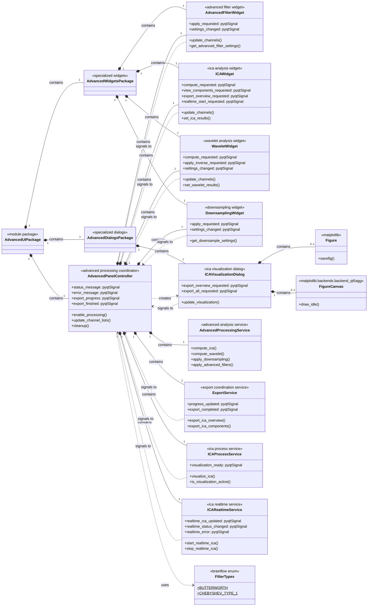

```mermaid
classDiagram
    direction LR
    
    %% Core Controller
    class AdvancedPanelController {
        <<advanced processing coordinator>>
        +status_message: pyqtSignal
        +error_message: pyqtSignal
        +export_progress: pyqtSignal
        +export_finished: pyqtSignal
        +enable_processing()
        +update_channel_lists()
        +cleanup()
    }
    
    %% Core Widget Classes
    class AdvancedFilterWidget {
        <<advanced filter widget>>
        +apply_requested: pyqtSignal
        +settings_changed: pyqtSignal
        +update_channels()
        +get_advanced_filter_settings()
    }
    
    class ICAWidget {
        <<ica analysis widget>>
        +compute_requested: pyqtSignal
        +view_components_requested: pyqtSignal
        +export_overview_requested: pyqtSignal
        +realtime_start_requested: pyqtSignal
        +update_channels()
        +set_ica_results()
    }
    
    class WaveletWidget {
        <<wavelet analysis widget>>
        +compute_requested: pyqtSignal
        +apply_inverse_requested: pyqtSignal
        +settings_changed: pyqtSignal
        +update_channels()
        +set_wavelet_results()
    }
    
    class DownsamplingWidget {
        <<downsampling widget>>
        +apply_requested: pyqtSignal
        +settings_changed: pyqtSignal
        +get_downsample_settings()
    }
    
    %% Specialized Dialog
    class ICAVisualizationDialog {
        <<ica visualization dialog>>
        +export_overview_requested: pyqtSignal
        +export_all_requested: pyqtSignal
        +update_visualization()
    }
    
    %% Service Layer
    class AdvancedProcessingService {
        <<advanced analysis service>>
        +compute_ica()
        +compute_wavelet()
        +apply_downsampling()
        +apply_advanced_filters()
    }
    
    class ExportService {
        <<export coordination service>>
        +progress_updated: pyqtSignal
        +export_completed: pyqtSignal
        +export_ica_overview()
        +export_ica_components()
    }
    
    class ICAProcessService {
        <<ica process service>>
        +visualization_ready: pyqtSignal
        +visualize_ica()
        +is_visualization_active()
    }
    
    class ICARealtimeService {
        <<ica realtime service>>
        +realtime_ica_updated: pyqtSignal
        +realtime_status_changed: pyqtSignal
        +realtime_error: pyqtSignal
        +start_realtime_ica()
        +stop_realtime_ica()
    }
    
    %% Package References
    class AdvancedUIPackage {
        <<module package>>
    }
    
    class AdvancedWidgetsPackage {
        <<specialized widgets>>
    }
    
    class AdvancedDialogsPackage {
        <<specialized dialogs>>
    }
    
    %% Matplotlib Components
    class Figure {
        <<matplotlib>>
        +savefig()
    }
    
    class FigureCanvas {
        <<matplotlib.backends.backend_qt5agg>>
        +draw_idle()
    }
    
    %% BrainFlow
    class FilterTypes {
        <<brainflow enum>>
        +BUTTERWORTH$
        +CHEBYSHEV_TYPE_1$
    }
    
    %% Package Composition
    AdvancedUIPackage "1" *-- "1" AdvancedPanelController : contains
    AdvancedUIPackage "1" *-- "1" AdvancedWidgetsPackage : contains
    AdvancedUIPackage "1" *-- "1" AdvancedDialogsPackage : contains
    
    AdvancedWidgetsPackage "1" *-- "1" AdvancedFilterWidget : contains
    AdvancedWidgetsPackage "1" *-- "1" ICAWidget : contains
    AdvancedWidgetsPackage "1" *-- "1" WaveletWidget : contains
    AdvancedWidgetsPackage "1" *-- "1" DownsamplingWidget : contains
    
    AdvancedDialogsPackage "1" *-- "1" ICAVisualizationDialog : contains
    
    %% Core Controller Composition
    AdvancedPanelController "1" *-- "1" AdvancedFilterWidget : contains
    AdvancedPanelController "1" *-- "1" ICAWidget : contains
    AdvancedPanelController "1" *-- "1" WaveletWidget : contains
    AdvancedPanelController "1" *-- "1" DownsamplingWidget : contains
    AdvancedPanelController "1" *-- "1" AdvancedProcessingService : contains
    AdvancedPanelController "1" *-- "1" ExportService : contains
    AdvancedPanelController "1" *-- "1" ICAProcessService : contains
    AdvancedPanelController "1" *-- "1" ICARealtimeService : contains
    
    %% Dialog Composition
    ICAVisualizationDialog "1" *-- "0..1" Figure : contains
    ICAVisualizationDialog "1" *-- "0..1" FigureCanvas : contains
    
    %% Signal Connections (Simplified)
    AdvancedFilterWidget ..> AdvancedPanelController : signals to
    ICAWidget ..> AdvancedPanelController : signals to
    WaveletWidget ..> AdvancedPanelController : signals to
    DownsamplingWidget ..> AdvancedPanelController : signals to
    ICAVisualizationDialog ..> AdvancedPanelController : signals to
    
    ExportService ..> AdvancedPanelController : signals to
    ICAProcessService ..> AdvancedPanelController : signals to
    ICARealtimeService ..> AdvancedPanelController : signals to
    
    %% Dynamic Creation
    AdvancedPanelController ..> ICAVisualizationDialog : creates
    
    %% Framework Dependencies
    AdvancedPanelController ..> FilterTypes : uses
```