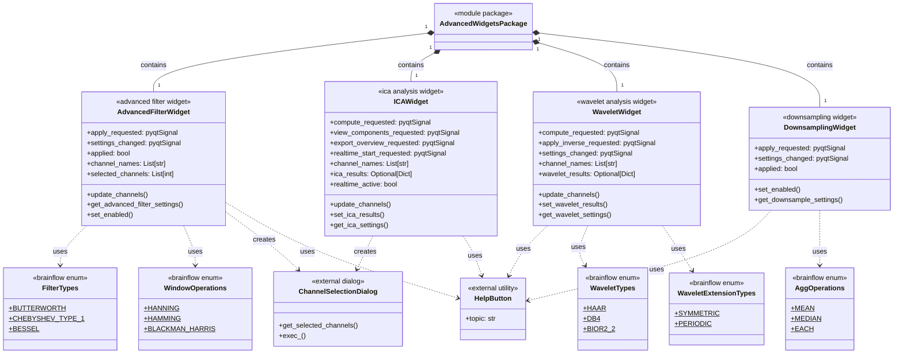

```mermaid
classDiagram
    direction TB
    
    %% Core Widget Classes
    class AdvancedFilterWidget {
        <<advanced filter widget>>
        +apply_requested: pyqtSignal
        +settings_changed: pyqtSignal
        +applied: bool
        +channel_names: List[str]
        +selected_channels: List[int]
        +update_channels()
        +get_advanced_filter_settings()
        +set_enabled()
    }
    
    class ICAWidget {
        <<ica analysis widget>>
        +compute_requested: pyqtSignal
        +view_components_requested: pyqtSignal
        +export_overview_requested: pyqtSignal
        +realtime_start_requested: pyqtSignal
        +channel_names: List[str]
        +ica_results: Optional[Dict]
        +realtime_active: bool
        +update_channels()
        +set_ica_results()
        +get_ica_settings()
    }
    
    class WaveletWidget {
        <<wavelet analysis widget>>
        +compute_requested: pyqtSignal
        +apply_inverse_requested: pyqtSignal
        +settings_changed: pyqtSignal
        +channel_names: List[str]
        +wavelet_results: Optional[Dict]
        +update_channels()
        +set_wavelet_results()
        +get_wavelet_settings()
    }
    
    class DownsamplingWidget {
        <<downsampling widget>>
        +apply_requested: pyqtSignal
        +settings_changed: pyqtSignal
        +applied: bool
        +set_enabled()
        +get_downsample_settings()
    }
    
    %% Package Reference
    class AdvancedWidgetsPackage {
        <<module package>>
    }
    
    %% External Dependencies
    class ChannelSelectionDialog {
        <<external dialog>>
        +get_selected_channels()
        +exec_()
    }
    
    class HelpButton {
        <<external utility>>
        +topic: str
    }
    
    %% BrainFlow Enums (Essential)
    class FilterTypes {
        <<brainflow enum>>
        +BUTTERWORTH$
        +CHEBYSHEV_TYPE_1$
        +BESSEL$
    }
    
    class WaveletTypes {
        <<brainflow enum>>
        +HAAR$
        +DB4$
        +BIOR2_2$
    }
    
    class WindowOperations {
        <<brainflow enum>>
        +HANNING$
        +HAMMING$
        +BLACKMAN_HARRIS$
    }
    
    class WaveletExtensionTypes {
        <<brainflow enum>>
        +SYMMETRIC$
        +PERIODIC$
    }
    
    class AggOperations {
        <<brainflow enum>>
        +MEAN$
        +MEDIAN$
        +EACH$
    }
    
    %% Package Composition
    AdvancedWidgetsPackage "1" *-- "1" AdvancedFilterWidget : contains
    AdvancedWidgetsPackage "1" *-- "1" ICAWidget : contains
    AdvancedWidgetsPackage "1" *-- "1" WaveletWidget : contains
    AdvancedWidgetsPackage "1" *-- "1" DownsamplingWidget : contains
    
    %% External Dependencies
    
    ICAWidget ..> ChannelSelectionDialog : creates
    
    ICAWidget ..> HelpButton : uses
    WaveletWidget ..> HelpButton : uses
    DownsamplingWidget ..> HelpButton : uses
    
    %% BrainFlow Dependencies
    AdvancedFilterWidget ..> FilterTypes : uses
    AdvancedFilterWidget ..> WindowOperations : uses

    AdvancedFilterWidget ..> ChannelSelectionDialog : creates
    AdvancedFilterWidget ..> HelpButton : uses

    WaveletWidget ..> WaveletTypes : uses
    WaveletWidget ..> WaveletExtensionTypes : uses
    DownsamplingWidget ..> AggOperations : uses
```