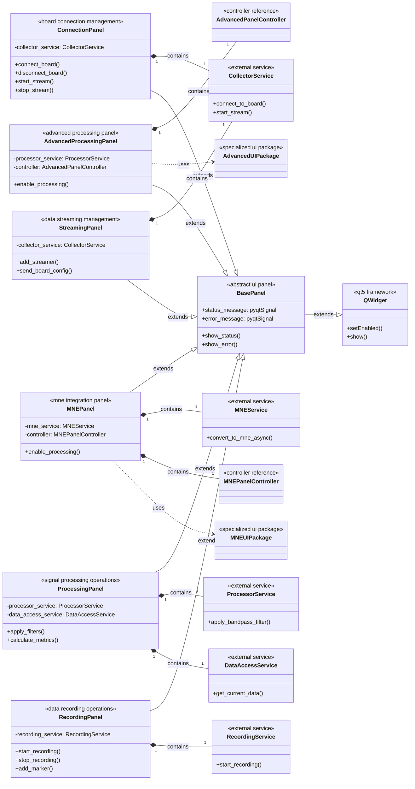

```mermaid
classDiagram
    direction LR
    
    %% Core Panel Base Class
    class BasePanel {
        <<abstract ui panel>>
        +status_message: pyqtSignal
        +error_message: pyqtSignal
        +show_status()
        +show_error()
    }
    
    %% Core Panel Classes
    class ConnectionPanel {
        <<board connection management>>
        -collector_service: CollectorService
        +connect_board()
        +disconnect_board()
        +start_stream()
        +stop_stream()
    }
    
    class ProcessingPanel {
        <<signal processing operations>>
        -processor_service: ProcessorService
        -data_access_service: DataAccessService
        +apply_filters()
        +calculate_metrics()
    }
    
    class RecordingPanel {
        <<data recording operations>>
        -recording_service: RecordingService
        +start_recording()
        +stop_recording()
        +add_marker()
    }
    
    class StreamingPanel {
        <<data streaming management>>
        -collector_service: CollectorService
        +add_streamer()
        +send_board_config()
    }
    
    class MNEPanel {
        <<mne integration panel>>
        -mne_service: MNEService
        -controller: MNEPanelController
        +enable_processing()
    }
    
    class AdvancedProcessingPanel {
        <<advanced processing panel>>
        -processor_service: ProcessorService
        -controller: AdvancedPanelController
        +enable_processing()
    }
    
    %% Specialized UI Package References
    class AdvancedUIPackage {
        <<specialized ui package>>
    }
    
    class MNEUIPackage {
        <<specialized ui package>>
    }
    
    class AdvancedPanelController {
        <<controller reference>>
    }
    
    class MNEPanelController {
        <<controller reference>>
    }
    
    %% Core Services
    class CollectorService {
        <<external service>>
        +connect_to_board()
        +start_stream()
    }
    
    class DataAccessService {
        <<external service>>
        +get_current_data()
    }
    
    class ProcessorService {
        <<external service>>
        +apply_bandpass_filter()
    }
    
    class RecordingService {
        <<external service>>
        +start_recording()
    }
    
    class MNEService {
        <<external service>>
        +convert_to_mne_async()
    }
    
    %% Qt5 Framework (Essential Only)
    class QWidget {
        <<qt5 framework>>
        +setEnabled()
        +show()
    }
    
    %% Inheritance
    ProcessingPanel --|> BasePanel : extends
    
    MNEPanel --|> BasePanel : extends
    
    BasePanel --|> QWidget : extends
    
    %% Core Composition
    ConnectionPanel "1" *-- "1" CollectorService : contains

    ConnectionPanel --|> BasePanel : extends

    StreamingPanel "1" *-- "1" CollectorService : contains

    StreamingPanel --|> BasePanel : extends

    MNEPanel "1" *-- "1" MNEService : contains
    AdvancedProcessingPanel "1" *-- "1" AdvancedPanelController : contains

    AdvancedProcessingPanel ..> AdvancedUIPackage : uses

    AdvancedProcessingPanel --|> BasePanel : extends

    MNEPanel "1" *-- "1" MNEPanelController : contains
    MNEPanel ..> MNEUIPackage : uses
    ProcessingPanel "1" *-- "1" ProcessorService : contains
    ProcessingPanel "1" *-- "1" DataAccessService : contains

    RecordingPanel --|> BasePanel : extends

    RecordingPanel "1" *-- "1" RecordingService : contains
```