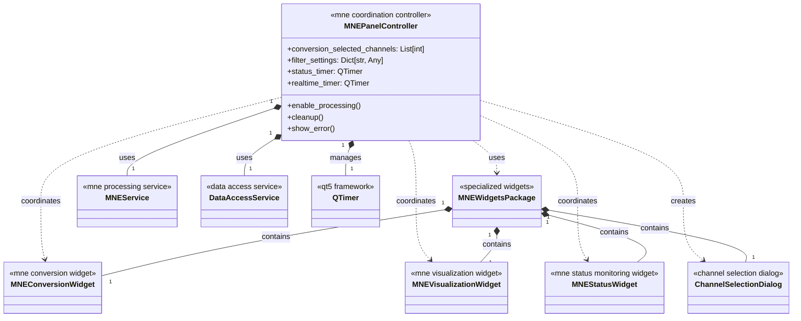

```mermaid
classDiagram
    direction TB

    %% Core Controller
    class MNEPanelController {
        <<mne coordination controller>>
        +enable_processing()
        +cleanup()
        +show_error()
        +conversion_selected_channels: List[int]
        +filter_settings: Dict[str, Any]
        +status_timer: QTimer
        +realtime_timer: QTimer
    }

    %% Widget Package Reference
    class MNEWidgetsPackage {
        <<specialized widgets>>
    }

    %% Main Widgets (references only)
    class MNEConversionWidget {
        <<mne conversion widget>>
    }
    class MNEVisualizationWidget {
        <<mne visualization widget>>
    }
    class MNEStatusWidget {
        <<mne status monitoring widget>>
    }
    class ChannelSelectionDialog {
        <<channel selection dialog>>
    }

    %% Service Layer
    class MNEService {
        <<mne processing service>>
    }
    class DataAccessService {
        <<data access service>>
    }

    %% Qt5 Framework (references only)
    class QTimer {
        <<qt5 framework>>
    }

    %% Package Composition
    MNEPanelController "1" *-- "1" MNEService : uses
    MNEPanelController "1" *-- "1" DataAccessService : uses
    MNEPanelController "1" *-- "1" QTimer : manages
    MNEPanelController ..> MNEConversionWidget : coordinates
    MNEPanelController ..> MNEVisualizationWidget : coordinates
    MNEPanelController ..> MNEStatusWidget : coordinates
    MNEPanelController ..> ChannelSelectionDialog : creates

    %% Widget Package Reference
    MNEPanelController ..> MNEWidgetsPackage : uses

    %% Widget Package Composition
    MNEWidgetsPackage "1" *-- "1" MNEConversionWidget : contains
    MNEWidgetsPackage "1" *-- "1" MNEVisualizationWidget : contains
    MNEWidgetsPackage "1" *-- "1" MNEStatusWidget : contains
    MNEWidgetsPackage "1" *-- "1" ChannelSelectionDialog : contains
```