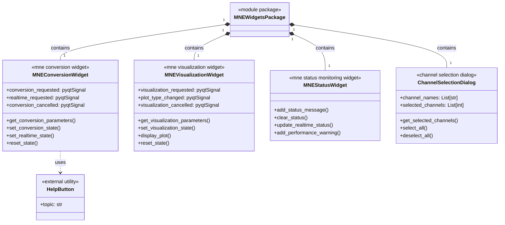

```mermaid
classDiagram
    direction TB
    
    %% Core Widget Classes
    class MNEConversionWidget {
        <<mne conversion widget>>
        +conversion_requested: pyqtSignal
        +realtime_requested: pyqtSignal
        +conversion_cancelled: pyqtSignal
        +get_conversion_parameters()
        +set_conversion_state()
        +set_realtime_state()
        +reset_state()
    }
    
    class MNEVisualizationWidget {
        <<mne visualization widget>>
        +visualization_requested: pyqtSignal
        +plot_type_changed: pyqtSignal
        +visualization_cancelled: pyqtSignal
        +get_visualization_parameters()
        +set_visualization_state()
        +display_plot()
        +reset_state()
    }
    
    class MNEStatusWidget {
        <<mne status monitoring widget>>
        +add_status_message()
        +clear_status()
        +update_realtime_status()
        +add_performance_warning()
    }
    
    class ChannelSelectionDialog {
        <<channel selection dialog>>
        +channel_names: List[str]
        +selected_channels: List[int]
        +get_selected_channels()
        +select_all()
        +deselect_all()
    }
    
    %% Package Reference
    class MNEWidgetsPackage {
        <<module package>>
    }
    
    %% External Utility
    class HelpButton {
        <<external utility>>
        +topic: str
    }
    
    %% Package Composition
    MNEWidgetsPackage "1" *-- "1" MNEConversionWidget : contains
    MNEWidgetsPackage "1" *-- "1" MNEVisualizationWidget : contains
    MNEWidgetsPackage "1" *-- "1" MNEStatusWidget : contains
    MNEWidgetsPackage "1" *-- "1" ChannelSelectionDialog : contains
    
    %% External Dependencies
    MNEConversionWidget ..> HelpButton : uses
```