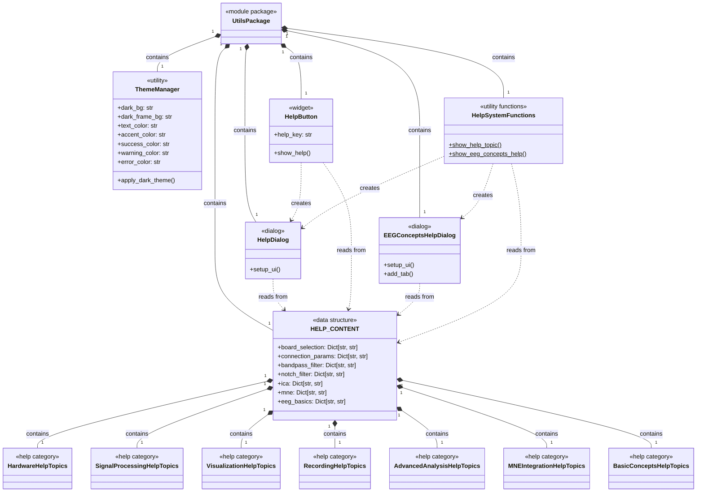

```mermaid
classDiagram
    direction TB
    
    %% Core Utility Classes
    class ThemeManager {
        <<utility>>
        +dark_bg: str
        +dark_frame_bg: str
        +text_color: str
        +accent_color: str
        +success_color: str
        +warning_color: str
        +error_color: str
        +apply_dark_theme()
    }
    
    class HelpDialog {
        <<dialog>>
        +setup_ui()
    }
    
    class HelpButton {
        <<widget>>
        +help_key: str
        +show_help()
    }
    
    class EEGConceptsHelpDialog {
        <<dialog>>
        +setup_ui()
        +add_tab()
    }
    
    %% Help Content Structure
    class HELP_CONTENT {
        <<data structure>>
        +board_selection: Dict[str, str]
        +connection_params: Dict[str, str]
        +bandpass_filter: Dict[str, str]
        +notch_filter: Dict[str, str]
        +ica: Dict[str, str]
        +mne: Dict[str, str]
        +eeg_basics: Dict[str, str]
    }
    
    %% Help System Functions
    class HelpSystemFunctions {
        <<utility functions>>
        +show_help_topic()$
        +show_eeg_concepts_help()$
    }
    
    %% Help Content Categories (References)
    class HardwareHelpTopics {
        <<help category>>
    }
    
    class SignalProcessingHelpTopics {
        <<help category>>
    }
    
    class VisualizationHelpTopics {
        <<help category>>
    }
    
    class RecordingHelpTopics {
        <<help category>>
    }
    
    class AdvancedAnalysisHelpTopics {
        <<help category>>
    }
    
    class MNEIntegrationHelpTopics {
        <<help category>>
    }
    
    class BasicConceptsHelpTopics {
        <<help category>>
    }
    
    %% Package Reference
    class UtilsPackage {
        <<module package>>
    }
    
    %% Package Composition
    UtilsPackage "1" *-- "1" ThemeManager : contains
    UtilsPackage "1" *-- "1" HelpDialog : contains
    UtilsPackage "1" *-- "1" HelpButton : contains
    UtilsPackage "1" *-- "1" EEGConceptsHelpDialog : contains
    UtilsPackage "1" *-- "1" HELP_CONTENT : contains
    UtilsPackage "1" *-- "1" HelpSystemFunctions : contains
    
    %% Help Content Categories
    HELP_CONTENT "1" *-- "1" HardwareHelpTopics : contains
    HELP_CONTENT "1" *-- "1" SignalProcessingHelpTopics : contains
    HELP_CONTENT "1" *-- "1" VisualizationHelpTopics : contains
    HELP_CONTENT "1" *-- "1" RecordingHelpTopics : contains
    HELP_CONTENT "1" *-- "1" AdvancedAnalysisHelpTopics : contains
    HELP_CONTENT "1" *-- "1" MNEIntegrationHelpTopics : contains
    HELP_CONTENT "1" *-- "1" BasicConceptsHelpTopics : contains
    
    %% Help System Usage
    HelpDialog ..> HELP_CONTENT : reads from
    HelpButton ..> HELP_CONTENT : reads from
    EEGConceptsHelpDialog ..> HELP_CONTENT : reads from
    HelpSystemFunctions ..> HELP_CONTENT : reads from
    
    %% Dynamic Creation
    HelpButton ..> HelpDialog : creates
    HelpSystemFunctions ..> HelpDialog : creates
    HelpSystemFunctions ..> EEGConceptsHelpDialog : creates
```