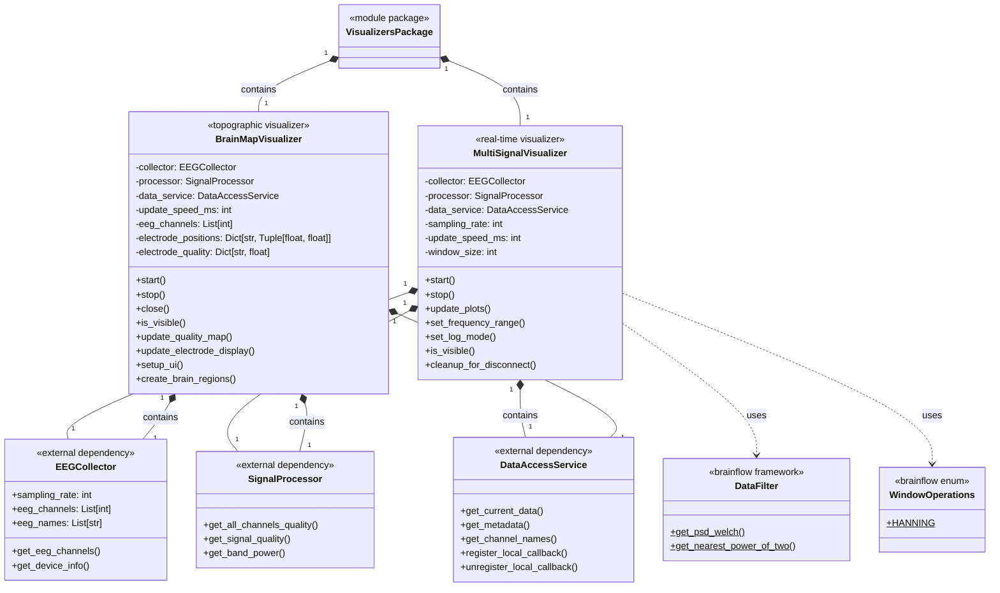

```mermaid
classDiagram
    direction TB
    
    %% Core Visualizer Classes
    class MultiSignalVisualizer {
        <<real-time visualizer>>
        -collector: EEGCollector
        -processor: SignalProcessor
        -data_service: DataAccessService
        -sampling_rate: int
        -update_speed_ms: int
        -window_size: int
        +start()
        +stop()
        +update_plots()
        +set_frequency_range()
        +set_log_mode()
        +is_visible()
        +cleanup_for_disconnect()
    }
    
    class BrainMapVisualizer {
        <<topographic visualizer>>
        -collector: EEGCollector
        -processor: SignalProcessor
        -data_service: DataAccessService
        -update_speed_ms: int
        -eeg_channels: List[int]
        -electrode_positions: Dict[str, Tuple[float, float]]
        -electrode_quality: Dict[str, float]
        +start()
        +stop()
        +close()
        +is_visible()
        +update_quality_map()
        +update_electrode_display()
        +setup_ui()
        +create_brain_regions()
    }
    
    %% External Services
    class EEGCollector {
        <<external dependency>>
        +sampling_rate: int
        +eeg_channels: List[int]
        +eeg_names: List[str]
        +get_eeg_channels()
        +get_device_info()
    }
    
    class SignalProcessor {
        <<external dependency>>
        +get_all_channels_quality()
        +get_signal_quality()
        +get_band_power()
    }
    
    class DataAccessService {
        <<external dependency>>
        +get_current_data()
        +get_metadata()
        +get_channel_names()
        +register_local_callback()
        +unregister_local_callback()
    }
    
    %% BrainFlow Framework
    class DataFilter {
        <<brainflow framework>>
        +get_psd_welch()$
        +get_nearest_power_of_two()$
    }
    
    class WindowOperations {
        <<brainflow enum>>
        +HANNING$
    }
    
    %% Package Reference
    class VisualizersPackage {
        <<module package>>
    }
    
    %% Package Composition
    VisualizersPackage "1" *-- "1" MultiSignalVisualizer : contains
    VisualizersPackage "1" *-- "1" BrainMapVisualizer : contains
    
    %% Core Service Dependencies
    MultiSignalVisualizer "1" *-- "1" EEGCollector : contains
    MultiSignalVisualizer "1" *-- "1" SignalProcessor : contains
    MultiSignalVisualizer "1" *-- "1" DataAccessService : contains
    
    BrainMapVisualizer "1" *-- "1" EEGCollector : contains
    BrainMapVisualizer "1" *-- "1" SignalProcessor : contains
    BrainMapVisualizer "1" *-- "1" DataAccessService : contains
    
    %% Framework Dependencies
    MultiSignalVisualizer ..> DataFilter : uses
    MultiSignalVisualizer ..> WindowOperations : uses
```