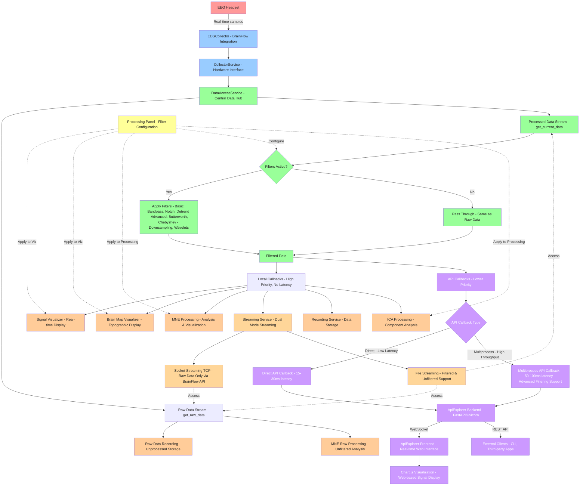

```mermaid
flowchart TD
    %% Hardware Layer
    A[EEG Headset] -->|Real-time samples| B[EEGCollector - BrainFlow Integration]
    
    %% Collection Layer
    B --> C[CollectorService - Hardware Interface]
    C --> D[DataAccessService - Central Data Hub]
    
    %% Data Branching
    D --> E[Raw Data Stream - get_raw_data]
    D --> F[Processed Data Stream - get_current_data]
    
    %% Processing Branch
    F --> G{Filters Active?}
    G -->|Yes| H[Apply Filters - Basic: Bandpass, Notch, Detrend - Advanced: Butterworth, Chebyshev - Downsampling, Wavelets]
    G -->|No| I[Pass Through - Same as Raw Data]
    H --> J[Filtered Data]
    I --> J
    
    %% Callback Distribution
    J --> K[Local Callbacks - High Priority, No Latency]
    J --> L[API Callbacks - Lower Priority]
    
    %% Local Consumers
    
    K --> M[Signal Visualizer - Real-time Display]
    K --> N[Brain Map Visualizer - Topographic Display]
    K --> P[MNE Processing - Analysis & Visualization]
    K --> R[Streaming Service - Dual Mode Streaming]
    K --> O[Recording Service - Data Storage]
    K --> Q[ICA Processing - Component Analysis]
    
    %% Streaming Service Branching
    R --> R2[Socket Streaming TCP - Raw Data Only via BrainFlow API]
    R --> R1[File Streaming - Filtered & Unfiltered Support]
    R1 -.->|Access| F
    R1 -.->|Access| E
    R2 -.->|Access| E
    
    %% Filter Configuration
    S[Processing Panel - Filter Configuration] -.->|Apply to Viz| M
    S -.->|Apply to Viz| N
    S -.->|Apply to Processing| P
    S -.->|Configure| G
    S -.->|Apply to Processing| Q
    
    %% API Branch
    L --> T{API Callback Type}
    T -->|Direct - Low Latency| U[Direct API Callback - 15-30ms latency]
    T -->|Multiprocess - High Throughput| V[Multiprocess API Callback - 50-100ms latency - Advanced Filtering Support]
    
    %% API Backend
    U --> W[ApiExplorer Backend - FastAPI/Uvicorn]
    V --> W
    
    %% API Frontend
    W -->|WebSocket| X[ApiExplorer Frontend - Real-time Web Interface]
    X --> Y[Chart.js Visualization - Web-based Signal Display]
    
    %% External API Clients
    W -->|REST API| Z[External Clients - CLI, Third-party Apps]
    
    %% Raw Data Consumers
    E --> AA[Raw Data Recording - Unprocessed Storage]
    E --> BB[MNE Raw Processing - Unfiltered Analysis]
    
    %% Styling
    classDef hardware fill:#ff9999,color:#222;
    classDef collection fill:#99ccff,color:#222;
    classDef processing fill:#99ff99,color:#222;
    classDef consumers fill:#ffcc99,color:#222;
    classDef api fill:#cc99ff,color:#fff;
    classDef config fill:#ffff99,color:#222;
    classDef streaming fill:#ffd699,color:#222;
    
    class A hardware
    class B,C collection
    class D,F,G,H,I,J processing
    class M,N,O,P,Q,AA,BB consumers
    class L,T,U,V,W,X,Y,Z api
    class S config
    class R,R1,R2 streaming
```