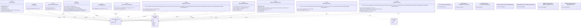

```mermaid
classDiagram
    %% ================================================================================
    %% INTERFACES MODULE - EEG PROCESSING SYSTEM CONTRACTS
    %% ================================================================================

    %% ================================================================================
    %% CORE COLLECTOR INTERFACES
    %% ================================================================================

    class CollectorInterface {
        <<interface>>
        +prepare_session() void
        +start_stream() void
        +stop_stream() void
        +release_session() void
        +get_data(num_samples: Optional[int]) Tuple[Any, List[int]]
        +get_device_info() Dict[str, Any]
    }

    class MarkerInterface {
        <<interface>>
        +insert_marker(marker_value: Any) void
    }

    class ConfigurableCollectorInterface {
        <<interface>>
        +config_device(config: str) str
        +set_preset(preset: Any) bool
    }

    %% ================================================================================
    %% BOARD MANAGEMENT INTERFACE
    %% ================================================================================

    class BoardInterface {
        <<interface>>
        +get_all_boards() List[Tuple[str, int]]
        +get_board_groups() Dict[str, List[Tuple[str, int]]]
        +get_board_requirements(board_id: Any) Dict[str, bool]
        +create_board_params(board_id: Any, params_dict: Dict[str, Any]) Any
        +get_board_description(board_id: Any, preset: Any) Dict[str, Any]
    }

    %% ================================================================================
    %% RECORDING INTERFACES
    %% ================================================================================

    class DataStorageInterface {
        <<interface>>
        +save_data(filename: str, data_type: str) void
    }

    class ContinuousRecordingInterface {
        <<interface>>
        +start_continuous_recording(filename: str, data_type: str) void
        +stop_continuous_recording() void
    }

    %% ================================================================================
    %% MNE PROCESSING INTERFACES
    %% ================================================================================

    class MNEConverterInterface {
        <<interface>>
        +convert_to_mne_async(data: np.ndarray, metadata: Dict[str, Any], duration_seconds: int, convert_to_v: bool, selected_channels: Optional[List[int]], callback: Optional[Callable]) str
        +get_conversion_status(task_id: str) Dict[str, Any]
        +cancel_conversion(task_id: str) bool
    }

    class MNEVisualizerInterface {
        <<interface>>
        +create_visualization_async(mne_data: Dict[str, Any], plot_type: str, freq_min: int, freq_max: int, bg_color: str, show_individual_channels: bool, selected_channels_for_display: Optional[List[int]], topomap_freq_range: Optional[Tuple[int, int]], callback: Optional[Callable]) str
        +get_visualization_status(task_id: str) Dict[str, Any]
        +cancel_visualization(task_id: str) bool
    }

    class MNEResultStorageInterface {
        <<interface>>
        +store_result(task_id: str, result: Dict[str, Any]) void
        +get_result(task_id: str) Optional[Dict[str, Any]]
        +remove_result(task_id: str) bool
        +clear_all_results() void
    }

    class MNEProcessManagerInterface {
        <<interface>>
        +start_service() void
        +stop_service() void
        +submit_task(worker_func: Callable[..., Any], *args: Any, task_id: Optional[str], **kwargs: Any) str
        +get_task_status(task_id: str) Dict[str, Any]
        +cancel_task(task_id: str) bool
        +is_available() bool
    }

    class MNERealtimeInterface {
        <<interface>>
        +start_realtime_processing(update_interval_seconds: float, plot_type: str, duration_seconds: int, convert_to_v: bool, selected_channels: Optional[List[int]], visualization_params: Optional[Dict[str, Any]], callback: Optional[Callable]) str
        +stop_realtime_processing(session_id: str) bool
        +update_realtime_params(session_id: str, params: Dict[str, Any]) bool
        +get_realtime_status(session_id: str) Dict[str, Any]
        +is_realtime_active(session_id: str) bool
    }

    %% ================================================================================
    %% STANDARD LIBRARY DEPENDENCIES
    %% ================================================================================

    class ABC {
        <<stdlib abstract base class>>
        +abstractmethod
    }

    class typing {
        <<stdlib module>>
        +Dict
        +List
        +Any
        +Optional
        +Tuple
        +Callable
    }

    class numpy {
        <<external library>>
        +ndarray
    }

    %% ================================================================================
    %% RELATIONSHIPS
    %% ================================================================================

    %% Interface Inheritance
    CollectorInterface --|> ABC : extends
    MarkerInterface --|> ABC : extends
    ConfigurableCollectorInterface --|> ABC : extends
    BoardInterface --|> ABC : extends
    DataStorageInterface --|> ABC : extends
    ContinuousRecordingInterface --|> ABC : extends
    MNEConverterInterface --|> ABC : extends
    MNEVisualizerInterface --|> ABC : extends
    MNEResultStorageInterface --|> ABC : extends
    MNEProcessManagerInterface --|> ABC : extends
    MNERealtimeInterface --|> ABC : extends

    %% Dependencies
    CollectorInterface ..> typing : uses
    MarkerInterface ..> typing : uses
    ConfigurableCollectorInterface ..> typing : uses
    BoardInterface ..> typing : uses
    DataStorageInterface ..> typing : uses
    ContinuousRecordingInterface ..> typing : uses
    MNEConverterInterface ..> typing : uses
    MNEConverterInterface ..> numpy : uses
    MNEVisualizerInterface ..> typing : uses
    MNEResultStorageInterface ..> typing : uses
    MNEProcessManagerInterface ..> typing : uses
    MNERealtimeInterface ..> typing : uses

    %% ================================================================================
    %% INTERFACE GROUPINGS (LOGICAL RELATIONSHIPS)
    %% ================================================================================

    %% Core Collector Interface Group
    CollectorInterface -.- MarkerInterface : "core collector operations"
    CollectorInterface -.- ConfigurableCollectorInterface : "core collector operations"

    %% Recording Interface Group
    DataStorageInterface -.- ContinuousRecordingInterface : "recording operations"

    %% MNE Processing Interface Group
    MNEConverterInterface -.- MNEVisualizerInterface : "mne processing pipeline"
    MNEVisualizerInterface -.- MNEResultStorageInterface : "mne processing pipeline"
    MNEResultStorageInterface -.- MNEProcessManagerInterface : "mne processing pipeline"
    MNEProcessManagerInterface -.- MNERealtimeInterface : "mne processing pipeline"
```
