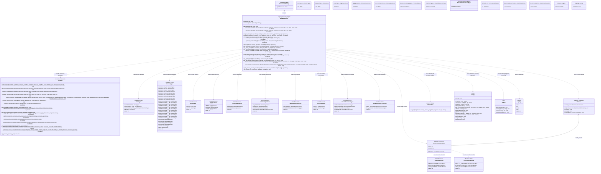

```mermaid
classDiagram
    %% ================================================================================
    %% PROCESSORS MODULE - SIGNAL PROCESSING SYSTEM
    %% ================================================================================
    
    %% ================================================================================
    %% CORE SIGNAL PROCESSOR
    %% ================================================================================
    
    class SignalProcessor {
        <<signal processing engine>>
        +sampling_rate: float
        +processed_data: Optional[np.ndarray]
        
        +__init__(sampling_rate: float) void
        +bandpass_filter(data: np.ndarray, start_freq: float, stop_freq: float, order: int, filter_type: FilterTypes, ripple: float) np.ndarray
        +bandstop_filter(data: np.ndarray, start_freq: float, stop_freq: float, order: int, filter_type: FilterTypes) np.ndarray
        +lowpass_filter(data: np.ndarray, cutoff_freq: float, order: int, filter_type: FilterTypes) np.ndarray
        +highpass_filter(data: np.ndarray, cutoff_freq: float, order: int, filter_type: FilterTypes) np.ndarray
        +denoise(data: np.ndarray, wavelet: WaveletTypes) np.ndarray
        +remove_environmental_noise(data: np.ndarray, noise_type: NoiseTypes) np.ndarray
        +perform_downsampling(data: np.ndarray, factor: int, operation: AggOperations) np.ndarray
        +detrend(data: np.ndarray, operation: DetrendOperations) np.ndarray
        +get_psd(data: np.ndarray, window: WindowOperations) Tuple[np.ndarray, np.ndarray]
        +get_band_power(data: np.ndarray, start_freq: float, stop_freq: float) np.ndarray
        +get_eeg_metrics(data: np.ndarray, eeg_channels: List[int]) Dict[str, float]
        +perform_ica(data: np.ndarray, num_components: int) Tuple[np.ndarray, np.ndarray, np.ndarray, np.ndarray]
        +detect_peaks(data: np.ndarray, lag: int, threshold: float, influence: float) np.ndarray
        +restore_wavelet_coeffs(data: np.ndarray, wavelet: int, decomp_level: int, level_to_restore: int) np.ndarray
        +get_signal_quality(data: np.ndarray, channel: int, gain: int) float
        +get_all_channels_quality(data: np.ndarray, channels: List[int], gain: int) Dict[int, float]
        +perform_advanced_bandpass_filter(data: np.ndarray, start_freq: float, stop_freq: float, order: int, filter_type: FilterTypes, ripple: float) np.ndarray
        +get_wavelet_coefficients(data: np.ndarray, wavelet: WaveletTypes, decomposition_level: int, extension_type: int, apply_denoising: bool) Tuple[np.ndarray, Dict[str, Any]]
        +apply_inverse_wavelet_transform(coefficients: np.ndarray, metadata: Dict[str, Any]) np.ndarray
        -_is_synthetic_or_problematic_data(data: np.ndarray) bool
    }
    
    class ProcessorsPackage {
        <<module package>>
        +SignalProcessor: Class
    }
    
    %% ================================================================================
    %% BRAINFLOW DATA FILTER COMPONENTS
    %% ================================================================================
    
    class DataFilter {
        <<brainflow framework>>
        +perform_bandpass(data: np.ndarray, sampling_rate: float, start_freq: float, stop_freq: float, order: int, filter_type: FilterTypes, ripple: int)$ void
        +perform_bandstop(data: np.ndarray, sampling_rate: float, start_freq: float, stop_freq: float, order: int, filter_type: FilterTypes, ripple: int)$ void
        +perform_lowpass(data: np.ndarray, sampling_rate: float, cutoff_freq: float, order: int, filter_type: FilterTypes, ripple: int)$ void
        +perform_highpass(data: np.ndarray, sampling_rate: float, cutoff_freq: float, order: int, filter_type: FilterTypes, ripple: int)$ void
        +perform_wavelet_denoising(data: np.ndarray, wavelet: WaveletTypes, decomp_level: int, denoising_type: WaveletDenoisingTypes, threshold_type: ThresholdTypes, extension_type: WaveletExtensionTypes, noise_estimation: NoiseEstimationLevelTypes)$ void
        +remove_environmental_noise(data: np.ndarray, sampling_rate: float, noise_type: NoiseTypes)$ void
        +perform_downsampling(data: np.ndarray, factor: int, operation: AggOperations)$ np.ndarray
        +detrend(data: np.ndarray, operation: DetrendOperations)$ void
        +get_psd_welch(data: np.ndarray, nfft: int, overlap: int, sampling_rate: float, window: WindowOperations)$ np.ndarray
        +get_band_power(psd: np.ndarray, start_freq: float, stop_freq: float)$ float
        +get_avg_band_powers(data: np.ndarray, channels: List[int], sampling_rate: float, apply_filters: bool)$ Tuple[np.ndarray, np.ndarray]
        +perform_ica(data: np.ndarray, num_components: int)$ Tuple[np.ndarray, np.ndarray, np.ndarray, np.ndarray]
        +detect_peaks_z_score(data: np.ndarray, lag: int, threshold: float, influence: float)$ np.ndarray
        +restore_data_from_wavelet_detailed_coeffs(data: np.ndarray, wavelet: int, decomp_level: int, level_to_restore: int)$ np.ndarray
        +get_railed_percentage(data: np.ndarray, gain: int)$ float
        +perform_wavelet_transform(data: np.ndarray, wavelet: WaveletTypes, decomp_level: int, extension_type: int)$ Tuple[np.ndarray, List[int]]
        +perform_inverse_wavelet_transform(coeffs_tuple: Tuple[np.ndarray, List[int]], original_length: int, wavelet: WaveletTypes, decomp_level: int, extension_type: int)$ np.ndarray
        +get_nearest_power_of_two(n: int)$ int
    }
    
    %% ================================================================================
    %% BRAINFLOW FILTER ENUMS
    %% ================================================================================
    
    class FilterTypes {
        <<brainflow enum>>
        +BUTTERWORTH$: FilterTypes
        +CHEBYSHEV_TYPE_1$: FilterTypes
        +CHEBYSHEV_TYPE_1_ZERO_PHASE$: FilterTypes
        +BESSEL$: FilterTypes
        +value: int
    }
    
    class WaveletTypes {
        <<brainflow enum>>
        +DAUBECHIES_4$: WaveletTypes
        +DAUBECHIES_6$: WaveletTypes
        +DAUBECHIES_8$: WaveletTypes
        +DAUBECHIES_10$: WaveletTypes
        +DAUBECHIES_12$: WaveletTypes
        +DAUBECHIES_14$: WaveletTypes
        +DAUBECHIES_16$: WaveletTypes
        +DAUBECHIES_18$: WaveletTypes
        +DAUBECHIES_20$: WaveletTypes
        +BIORTHOGONAL_2_2$: WaveletTypes
        +BIORTHOGONAL_2_4$: WaveletTypes
        +BIORTHOGONAL_2_6$: WaveletTypes
        +BIORTHOGONAL_2_8$: WaveletTypes
        +BIORTHOGONAL_3_1$: WaveletTypes
        +BIORTHOGONAL_3_3$: WaveletTypes
        +BIORTHOGONAL_3_5$: WaveletTypes
        +BIORTHOGONAL_3_7$: WaveletTypes
        +BIORTHOGONAL_3_9$: WaveletTypes
        +BIORTHOGONAL_4_4$: WaveletTypes
        +BIORTHOGONAL_5_5$: WaveletTypes
        +BIORTHOGONAL_6_8$: WaveletTypes
        +COIFLETS_2$: WaveletTypes
        +COIFLETS_3$: WaveletTypes
        +COIFLETS_4$: WaveletTypes
        +COIFLETS_5$: WaveletTypes
        +HAAR$: WaveletTypes
        +DB4$: WaveletTypes
        +value: int
    }
    
    class NoiseTypes {
        <<brainflow enum>>
        +FIFTY$: NoiseTypes
        +SIXTY$: NoiseTypes
        +value: int
    }
    
    class AggOperations {
        <<brainflow enum>>
        +MEAN$: AggOperations
        +MEDIAN$: AggOperations
        +EACH$: AggOperations
        +value: int
    }
    
    class DetrendOperations {
        <<brainflow enum>>
        +CONSTANT$: DetrendOperations
        +LINEAR$: DetrendOperations
        +value: int
    }
    
    class WindowOperations {
        <<brainflow enum>>
        +NO_WINDOW$: WindowOperations
        +HANNING$: WindowOperations
        +HAMMING$: WindowOperations
        +BLACKMAN_HARRIS$: WindowOperations
        +value: int
    }
    
    class WaveletDenoisingTypes {
        <<brainflow enum>>
        +VISUSHRINK$: WaveletDenoisingTypes
        +SURESHRINK$: WaveletDenoisingTypes
        +value: int
    }
    
    class ThresholdTypes {
        <<brainflow enum>>
        +SOFT$: ThresholdTypes
        +HARD$: ThresholdTypes
        +value: int
    }
    
    class WaveletExtensionTypes {
        <<brainflow enum>>
        +SYMMETRIC$: WaveletExtensionTypes
        +PERIODIZATION$: WaveletExtensionTypes
        +ZERO$: WaveletExtensionTypes
        +CONSTANT$: WaveletExtensionTypes
        +value: int
    }
    
    class NoiseEstimationLevelTypes {
        <<brainflow enum>>
        +FIRST_LEVEL$: NoiseEstimationLevelTypes
        +ALL_LEVELS$: NoiseEstimationLevelTypes
        +value: int
    }
    
    %% ================================================================================
    %% BRAINFLOW ML MODEL COMPONENTS
    %% ================================================================================
    
    class MLModel {
        <<brainflow framework>>
        +model_params: BrainFlowModelParams
        
        +__init__(model_params: BrainFlowModelParams) void
        +prepare() void
        +release() void
        +predict(feature_vector: np.ndarray) float
    }
    
    class BrainFlowModelParams {
        <<brainflow framework>>
        +metric: int
        +classifier: int
        
        +__init__(metric: int, classifier: int) void
    }
    
    class BrainFlowMetrics {
        <<brainflow enum>>
        +MINDFULNESS$: BrainFlowMetrics
        +RESTFULNESS$: BrainFlowMetrics
        +USER_DEFINED$: BrainFlowMetrics
        +value: int
    }
    
    class BrainFlowClassifiers {
        <<brainflow enum>>
        +DEFAULT_CLASSIFIER$: BrainFlowClassifiers
        +DYN_LIB_CLASSIFIER$: BrainFlowClassifiers
        +ONNX_CLASSIFIER$: BrainFlowClassifiers
        +value: int
    }
    
    %% ================================================================================
    %% SCIPY INTEGRATION (OPTIONAL)
    %% ================================================================================
    
    class scipy_signal {
        <<external library>>
        +savgol_filter(data: np.ndarray, window_length: int, polyorder: int) np.ndarray
    }
    
    %% ================================================================================
    %% STANDARD LIBRARY COMPONENTS
    %% ================================================================================
    
    class numpy {
        <<stdlib>>
        +ndarray: Class
        +array(data: Any) ndarray
        +zeros(shape: Tuple[int, ...]) ndarray
        +copy(data: ndarray) ndarray
        +isfinite(data: ndarray) ndarray
        +nan_to_num(data: ndarray, nan: float, posinf: float, neginf: float) ndarray
        +std(data: ndarray) float
        +mean(data: ndarray) float
        +ptp(data: ndarray) float
        +allclose(a: ndarray, b: ndarray, rtol: float, atol: float) bool
        +arange(start: float, stop: float, step: float) ndarray
        +round(data: Any) Any
        +min(data: Any) Any
        +max(data: Any) Any
    }
    
    class logging {
        <<stdlib>>
        +info(message: str) void
        +warning(message: str) void
        +error(message: str) void
        +debug(message: str) void
    }
    
    class typing {
        <<stdlib>>
        +Dict
        +List
        +Tuple
        +Any
        +Optional
    }
    
    %% ================================================================================
    %% RELATIONSHIPS
    %% ================================================================================
    
    %% Package Composition
    ProcessorsPackage "1" *-- "1" SignalProcessor : contains
    
    %% Core Processing Dependencies
    SignalProcessor ..> DataFilter : uses for all filtering operations
    SignalProcessor ..> MLModel : uses for EEG metrics
    SignalProcessor ..> BrainFlowModelParams : creates for ML models
    
    %% Filter Type Dependencies
    SignalProcessor ..> FilterTypes : uses for filter selection
    SignalProcessor ..> WaveletTypes : uses for wavelet operations
    SignalProcessor ..> NoiseTypes : uses for noise removal
    SignalProcessor ..> AggOperations : uses for downsampling
    SignalProcessor ..> DetrendOperations : uses for detrending
    SignalProcessor ..> WindowOperations : uses for spectral analysis
    SignalProcessor ..> WaveletDenoisingTypes : uses for denoising
    SignalProcessor ..> ThresholdTypes : uses for wavelet thresholding
    SignalProcessor ..> WaveletExtensionTypes : uses for wavelet transforms
    SignalProcessor ..> NoiseEstimationLevelTypes : uses for noise estimation
    
    %% ML Model Dependencies
    MLModel "1" *-- "1" BrainFlowModelParams : model_params
    BrainFlowModelParams ..> BrainFlowMetrics : uses for metric selection
    BrainFlowModelParams ..> BrainFlowClassifiers : uses for classifier selection
    
    %% Optional External Dependencies
    SignalProcessor ..> scipy_signal : uses optionally for enhanced stability
    
    %% Standard Library Dependencies
    SignalProcessor ..> numpy : uses extensively for array operations
    SignalProcessor ..> logging : uses for debugging and monitoring
    SignalProcessor ..> typing : uses for type hints
    
    %% ================================================================================
    %% LOGICAL GROUPINGS
    %% ================================================================================
    
    %% Filter Operations Group
    FilterTypes -.- WaveletTypes : "filter types"
    WaveletTypes -.- NoiseTypes : "filter types"
    NoiseTypes -.- AggOperations : "filter types"
    AggOperations -.- DetrendOperations : "filter types"
    DetrendOperations -.- WindowOperations : "filter types"
    
    %% Wavelet Operations Group
    WaveletDenoisingTypes -.- ThresholdTypes : "wavelet processing"
    ThresholdTypes -.- WaveletExtensionTypes : "wavelet processing"
    WaveletExtensionTypes -.- NoiseEstimationLevelTypes : "wavelet processing"
    
    %% ML Model Group
    MLModel -.- BrainFlowModelParams : "ml framework"
    BrainFlowModelParams -.- BrainFlowMetrics : "ml framework"
    BrainFlowMetrics -.- BrainFlowClassifiers : "ml framework"
    
    %% Standard Library Group
    numpy -.- logging : "standard libraries"
    logging -.- typing : "standard libraries"
```