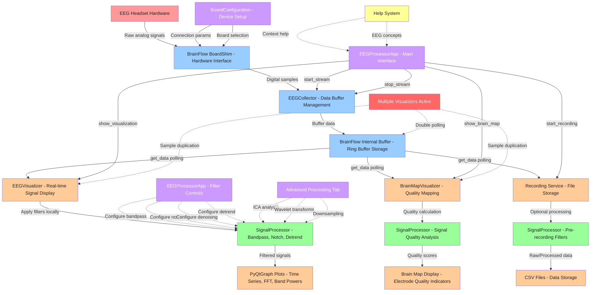

```mermaid
flowchart TD
    %% Hardware Layer
    A[EEG Headset Hardware] -->|Raw analog signals| B[BrainFlow BoardShim - Hardware Interface]
    
    %% Collection Layer
    B -->|Digital samples| C[EEGCollector - Data Buffer Management]
    C -->|Buffer data| D[BrainFlow Internal Buffer - Ring Buffer Storage]
    
    %% Direct Polling Architecture
    D -->|get_data polling| E[EEGVisualizer - Real-time Signal Display]
    D -->|get_data polling| F[BrainMapVisualizer - Quality Mapping]
    D -->|get_data polling| G[Recording Service - File Storage]
    
    %% Individual Processing in Visualizers
    E -->|Apply filters locally| H[SignalProcessor - Bandpass, Notch, Detrend]
    F -->|Quality calculation| I[SignalProcessor - Signal Quality Analysis]
    G -->|Optional processing| J[SignalProcessor - Pre-recording Filters]
    
    %% Visualizer Output
    H -->|Filtered signals| K[PyQtGraph Plots - Time Series, FFT, Band Powers]
    I -->|Quality scores| L[Brain Map Display - Electrode Quality Indicators]
    J -->|Raw/Processed data| M[CSV Files - Data Storage]
    
    %% Filter Configuration
    N[EEGProcessorApp - Filter Controls] -.->|Configure bandpass| H
    N -.->|Configure notch| H
    N -.->|Configure denoising| H
    N -.->|Configure detrend| H
    
    %% App Control
    O[EEGProcessorApp - Main Interface] -->|start_stream| C
    O -->|stop_stream| C
    O -->|show_visualization| E
    O -->|show_brain_map| F
    O -->|start_recording| G
    
    %% Board Configuration
    P[BoardConfiguration - Device Setup] -->|Connection params| B
    P -->|Board selection| B
    
    %% Data Duplication Issue
    Q[Multiple Visualizers Active] -.->|Double polling| D
    Q -.->|Sample duplication| E
    Q -.->|Sample duplication| F
    
    %% Advanced Processing Optional
    R[Advanced Processing Tab] -.->|ICA analysis| H
    R -.->|Wavelet transforms| H
    R -.->|Downsampling| H
    
    %% Help System
    S[Help System] -.->|Context help| O
    S -.->|EEG concepts| O
    
    %% Styling
    classDef hardware fill:#ff9999,color:#222
    classDef collection fill:#99ccff,color:#222
    classDef processing fill:#99ff99,color:#222
    classDef visualization fill:#ffcc99,color:#222
    classDef control fill:#cc99ff,color:#fff
    classDef issue fill:#ff6666,color:#fff
    classDef config fill:#ffff99,color:#222
    
    class A hardware
    class B,C,D collection
    class H,I,J processing
    class E,F,G,K,L,M visualization
    class N,O,P,R control
    class Q issue
    class S config
```