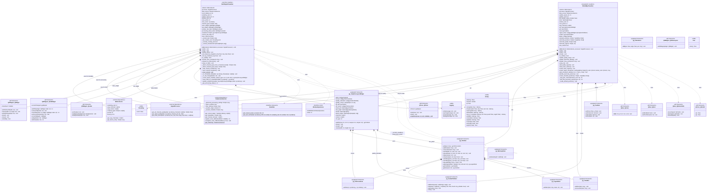

```mermaid
classDiagram
    %% ================================================================================
    %% VISUALIZERS MODULE - EEG AND BIOSIGNAL VISUALIZATION SYSTEM
    %% ================================================================================

    %% ================================================================================
    %% CORE VISUALIZER CLASSES
    %% ================================================================================

    class MultiSignalVisualizer {
        <<real-time visualizer>>
        -collector: EEGCollector
        -processor: SignalProcessor
        -data_service: DataAccessService
        -local_callback_id: str
        -sampling_rate: int
        -update_speed_ms: int
        -window_size: int
        -num_points: int
        -time_vector: np.ndarray
        -channel_types: Dict[str, Dict]
        -main_widget: QtWidgets.QWidget
        -tab_widget: QtWidgets.QTabWidget
        -sample_rate_label: QtWidgets.QLabel
        -processing_status_label: QtWidgets.QLabel
        -visualizers: Dict[str, pg.GraphicsLayoutWidget]
        -current_tab_index: int
        -timer: QtCore.QTimer
        -_cached_tabs: Dict[str, Any]
        -_tab_creation_lock: threading.Lock
        -_currently_creating_tab: bool
        +_cached_visualizers$: Optional[Dict[str, Any]]

        +__init__(collector: EEGCollector, processor: SignalProcessor) void
        +start() void
        +stop() void
        +update_plots() void
        +set_frequency_range(min_freq: float, max_freq: float) void
        +set_log_mode(use_log: bool) void
        +is_visible() bool
        +handle_close_event(event: Any) void
        +cleanup_for_disconnect() void
        +setup_ui_fast() void
        -_detect_channel_types_from_connected_board() Dict[str, Dict]
        -_detect_channel_types_fast() Dict[str, Dict]
        -_load_cached_visualizers() void
        -_save_cached_visualizers() void
        -_clear_cache()$ void
        -_on_immediate_data(data: np.ndarray, timestamps: List[int]) void
        -_on_tab_changed(index: int) void
        -_create_signal_visualizer_fast(ch_type: str, ch_info: Dict) pg.GraphicsLayoutWidget
        -_clean_data_for_visualization(data: np.ndarray) np.ndarray
        -_update_visualizer(visualizer: pg.GraphicsLayoutWidget, data: np.ndarray) void
        -_get_processing_status() str
    }

    class BrainMapVisualizer {
        <<topographic visualizer>>
        -collector: EEGCollector
        -processor: SignalProcessor
        -data_service: DataAccessService
        -update_speed_ms: int
        -update_count: int
        -last_quality_values: Dict[str, float]
        -timer: Optional[QTimer]
        -window_size: int
        -num_points: int
        -eeg_channels: List[int]
        -win: pg.GraphicsLayoutWidget
        -plot: pg.PlotItem
        -view: pg.ViewBox
        -region_items: List[pg.QtWidgets.QGraphicsPathItem]
        -scatter: pg.ScatterPlotItem
        -labels: List[pg.TextItem]
        -standard_positions: Dict[str, Tuple[float, float]]
        -electrode_positions: Dict[str, Tuple[float, float]]
        -electrode_quality: Dict[str, float]
        -electrode_regions: Dict[str, str]
        -was_closed: bool

        +__init__(collector: EEGCollector, processor: SignalProcessor) void
        +start() void
        +stop() void
        +close() void
        +is_visible() bool
        +update_quality_map() void
        +update_electrode_display() void
        +handle_close_event(event: Any) void
        +setup_ui() void
        +add_quality_legend() void
        +draw_brain_outlines() void
        +create_brain_regions() void
        +create_region_item(points: List[Tuple[float, float]], fill_color: QColor, border_color: QColor) Any
        +add_orientation_label(text: str, x: float, y: float) void
        +identify_electrode_positions() void
        +create_standard_positions() Dict[str, Tuple[float, float]]
        -_map_gtec_channel(channel_num: int) str
        -_find_best_electrode_match(name: str) str
        -_create_default_positions() void
    }

    %% ================================================================================
    %% DEPENDENCY CLASSES
    %% ================================================================================

    class EEGCollector {
        <<external dependency>>
        +sampling_rate: int
        +eeg_channels: List[int]
        +eeg_names: List[str]
        +channel_types: Dict[str, List[int]]
        +preset: int
        +board_id: int

        +get_eeg_channels() List[int]
        +get_device_info() Dict[str, Any]
    }

    class SignalProcessor {
        <<external dependency>>
        +get_all_channels_quality(data: np.ndarray, channels: List[int]) Dict[int, float]
        +get_signal_quality(data: np.ndarray, channel_idx: int) float
        +get_band_power(data: np.ndarray, low_freq: float, high_freq: float) List[float]
    }

    class DataAccessService {
        <<external dependency>>
        +get_current_data() Tuple[np.ndarray, List[int]]
        +get_metadata() Dict[str, Any]
        +get_channel_names() List[str]
        +register_local_callback(callback: Callable) str
        +unregister_local_callback(callback_id: str) void
        +get_instance()$ DataAccessService
        -_advanced_processing_settings: Dict[str, Any]
        -_filters_enabled: bool
        -_filter_settings: Dict[str, Any]
        -_wavelet_target_channel: int
        -_wavelet_metadata: Dict[str, Any]
    }

    %% ================================================================================
    %% PYQTGRAPH FRAMEWORK COMPONENTS
    %% ================================================================================

    class pg_GraphicsLayoutWidget {
        <<pyqtgraph framework>>
        +plots: List[pg.PlotItem]
        +curves: List[pg.PlotCurveItem]
        +quality_indicators: List[pg.ScatterPlotItem]
        +quality_colors: List[Tuple[int, int, int]]
        +fft_plot: pg.PlotItem
        +fft_curves: List[pg.PlotCurveItem]
        +band_plot: Optional[pg.PlotItem]
        +bar_graph: Optional[pg.BarGraphItem]
        +bands: Optional[List[str]]
        +band_ranges: Optional[List[Tuple[int, int]]]
        +channels: List[int]
        +names: List[str]
        +ch_type: str

        +addPlot(row: int, col: int, rowspan: int, colspan: int) pg.PlotItem
        +show() void
        +close() void
        +resize(width: int, height: int) void
    }

    class pg_PlotItem {
        <<pyqtgraph framework>>
        +plot(pen: Any) pg.PlotCurveItem
        +addItem(item: Any) void
        +removeItem(item: Any) void
        +setTitle(title: str, color: str) void
        +setLabel(axis: str, text: str, units: str, color: str) void
        +hideAxis(axis: str) void
        +showAxis(axis: str, show: bool) void
        +setXRange(min_val: float, max_val: float) void
        +setYRange(min_val: float, max_val: float) void
        +setLogMode(x: bool, y: bool) void
        +addLegend(offset: Tuple[int, int], colCount: int) pg.LegendItem
        +getViewBox() pg.ViewBox
        +getAxis(axis: str) pg.AxisItem
    }

    class pg_ScatterPlotItem {
        <<pyqtgraph framework>>
        +addPoints(points: List[Dict[str, Any]]) void
        +setData(x: List[float], y: List[float], size: float, brush: Any, pxMode: bool) void
        +setPen(pen: Any) void
        +clear() void
    }

    class pg_PlotCurveItem {
        <<pyqtgraph framework>>
        +setData(x: np.ndarray, y: np.ndarray) void
    }

    class pg_BarGraphItem {
        <<pyqtgraph framework>>
        +setOpts(height: List[float]) void
    }

    class pg_TextItem {
        <<pyqtgraph framework>>
        +setPos(x: float, y: float) void
        +setColor(color: QColor) void
        +setFont(font: QFont) void
        +setText(text: str) void
    }

    class pg_ViewBox {
        <<pyqtgraph framework>>
        +addItem(item: Any) void
        +removeItem(item: Any) void
    }

    class pg_InfiniteLine {
        <<pyqtgraph framework>>
        +__init__(pos: float, angle: float, pen: Any) void
    }

    class pg_LegendItem {
        <<pyqtgraph framework>>
        +addItem(item: Any, name: str) void
    }

    %% ================================================================================
    %% QT5 FRAMEWORK COMPONENTS
    %% ================================================================================

    class QtWidgets_QWidget {
        <<qt5 framework>>
        +setWindowTitle(title: str) void
        +resize(width: int, height: int) void
        +setStyleSheet(style: str) void
        +show() void
        +close() void
        +isVisible() bool
        +closeEvent: Callable
    }

    class QtWidgets_QTabWidget {
        <<qt5 framework>>
        +addTab(widget: QWidget, label: str) int
        +removeTab(index: int) void
        +insertTab(index: int, widget: QWidget, label: str) int
        +setCurrentIndex(index: int) void
        +currentWidget() QWidget
        +widget(index: int) QWidget
        +tabText(index: int) str
        +currentChanged: pyqtSignal
    }

    class QtWidgets_QLabel {
        <<qt5 framework>>
        +setText(text: str) void
        +setAlignment(alignment: Qt.Alignment) void
        +setStyleSheet(style: str) void
    }

    class QtWidgets_QVBoxLayout {
        <<qt5 framework>>
        +addWidget(widget: QWidget) void
    }

    class QtCore_QTimer {
        <<qt5 framework>>
        +start(msec: int) void
        +stop() void
        +singleShot(msec: int, slot: Callable)$ void
        +timeout: pyqtSignal
    }

    class QtCore_QPointF {
        <<qt5 framework>>
        +x() float
        +y() float
    }

    class QtGui_QColor {
        <<qt5 framework>>
        +__init__(r: int, g: int, b: int, a: int) void
    }

    class QtGui_QFont {
        <<qt5 framework>>
        +setBold(bold: bool) void
        +setPointSize(size: int) void
    }

    class QtGui_QPainterPath {
        <<qt5 framework>>
        +moveTo(point: QPointF) void
        +lineTo(point: QPointF) void
        +closeSubpath() void
    }

    %% ================================================================================
    %% BRAINFLOW COMPONENTS
    %% ================================================================================

    class DataFilter {
        <<brainflow framework>>
        +get_nearest_power_of_two(n: int)$ int
        +get_psd_welch(data: np.ndarray, nfft: int, overlap: int, sampling_rate: int, window: int)$ np.ndarray
    }

    class WindowOperations {
        <<brainflow enum>>
        +HANNING$: WindowOperations
        +value: int
    }

    %% ================================================================================
    %% STANDARD LIBRARY COMPONENTS
    %% ================================================================================

    class threading {
        <<stdlib>>
        +Lock: Class
    }

    class logging {
        <<stdlib>>
        +info(message: str) void
        +warning(message: str) void
        +error(message: str) void
        +debug(message: str) void
    }

    class numpy {
        <<stdlib>>
        +ndarray: Class
        +array(data: Any) ndarray
        +linspace(start: float, stop: float, num: int) ndarray
        +asarray(data: Any) ndarray
        +isfinite(data: ndarray) ndarray
        +nan_to_num(data: ndarray, nan: float, posinf: float, neginf: float) ndarray
        +std(data: ndarray) float
        +mean(data: ndarray) float
        +ptp(data: ndarray) float
        +random: module
        +cos(angle: float) float
        +sin(angle: float) float
        +pi: float
        +log10(x: float) float
    }

    class time {
        <<stdlib>>
        +time() float
    }

    %% ================================================================================
    %% RELATIONSHIPS
    %% ================================================================================

    %% Core Dependencies
    MultiSignalVisualizer "1" *-- "1" EEGCollector : uses for metadata
    MultiSignalVisualizer "1" *-- "1" SignalProcessor : uses for processing
    MultiSignalVisualizer "1" *-- "1" DataAccessService : uses for data
    BrainMapVisualizer "1" *-- "1" EEGCollector : uses for metadata
    BrainMapVisualizer "1" *-- "1" SignalProcessor : uses for quality
    BrainMapVisualizer "1" *-- "1" DataAccessService : uses for data

    %% UI Component Composition
    MultiSignalVisualizer "1" *-- "1" QtWidgets_QWidget : main_widget
    MultiSignalVisualizer "1" *-- "1" QtWidgets_QTabWidget : tab_widget
    MultiSignalVisualizer "1" *-- "2" QtWidgets_QLabel : status labels
    MultiSignalVisualizer "1" *-- "1" QtCore_QTimer : timer
    MultiSignalVisualizer "1" *-- "*" pg_GraphicsLayoutWidget : visualizers

    BrainMapVisualizer "1" *-- "1" pg_GraphicsLayoutWidget : win
    BrainMapVisualizer "1" *-- "1" pg_PlotItem : plot
    BrainMapVisualizer "1" *-- "1" pg_ViewBox : view
    BrainMapVisualizer "1" *-- "1" pg_ScatterPlotItem : scatter
    BrainMapVisualizer "1" *-- "*" pg_TextItem : labels
    BrainMapVisualizer "1" *-- "1" QtCore_QTimer : timer

    %% PyQtGraph Component Relationships
    pg_GraphicsLayoutWidget "1" *-- "*" pg_PlotItem : plots
    pg_GraphicsLayoutWidget "1" *-- "*" pg_PlotCurveItem : curves
    pg_GraphicsLayoutWidget "1" *-- "*" pg_ScatterPlotItem : quality_indicators
    pg_GraphicsLayoutWidget "1" *-- "0..1" pg_BarGraphItem : bar_graph

    pg_PlotItem "1" *-- "*" pg_PlotCurveItem : curves
    pg_PlotItem "1" *-- "*" pg_ScatterPlotItem : items
    pg_PlotItem "1" *-- "0..1" pg_LegendItem : legend
    pg_PlotItem "1" *-- "1" pg_ViewBox : viewbox

    %% Framework Dependencies
    MultiSignalVisualizer ..> threading : uses
    MultiSignalVisualizer ..> logging : uses
    MultiSignalVisualizer ..> numpy : uses
    MultiSignalVisualizer ..> DataFilter : uses
    MultiSignalVisualizer ..> WindowOperations : uses

    BrainMapVisualizer ..> logging : uses
    BrainMapVisualizer ..> numpy : uses
    BrainMapVisualizer ..> QtGui_QColor : uses
    BrainMapVisualizer ..> QtGui_QFont : uses
    BrainMapVisualizer ..> QtGui_QPainterPath : uses
    BrainMapVisualizer ..> QtCore_QPointF : uses

    %% Static Relationships
    MultiSignalVisualizer ..> MultiSignalVisualizer : "_cached_visualizers (class-level cache)"
```
