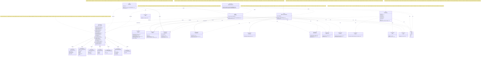

```mermaid
classDiagram
    %% ================================================================================
    %% UTILS MODULE - APPLICATION UTILITIES AND SUPPORT SYSTEMS
    %% ================================================================================

    %% ================================================================================
    %% THEME MANAGEMENT SYSTEM
    %% ================================================================================

    class ThemeManager {
        <<utility>>
        +dark_bg: str
        +dark_frame_bg: str
        +text_color: str
        +accent_color: str
        +success_color: str
        +warning_color: str
        +error_color: str

        +__init__() void
        +apply_dark_theme(widget: QWidget) void
    }

    %% ================================================================================
    %% HELP SYSTEM COMPONENTS
    %% ================================================================================

    class HelpDialog {
        <<dialog>>
        +content_browser: QTextBrowser

        +__init__(title: str, content: str, parent: Optional[QWidget]) void
        +setup_ui(content: str) void
    }

    class HelpButton {
        <<widget>>
        +help_key: str

        +__init__(help_key: str, parent: Optional[QWidget]) void
        +show_help() void
    }

    class EEGConceptsHelpDialog {
        <<dialog>>
        +tabs: QTabWidget

        +__init__(parent: Optional[QWidget]) void
        +setup_ui() void
        +add_tab(tab_name: str, help_keys: List[str]) void
    }

    %% ================================================================================
    %% HELP CONTENT STRUCTURE
    %% ================================================================================

    class HELP_CONTENT {
        <<data structure>>
        +board_selection: Dict[str, str]
        +connection_params: Dict[str, str]
        +preset_selection: Dict[str, str]
        +streaming: Dict[str, str]
        +bandpass_filter: Dict[str, str]
        +notch_filter: Dict[str, str]
        +denoising: Dict[str, str]
        +detrend: Dict[str, str]
        +eeg_visualization: Dict[str, str]
        +brain_map: Dict[str, str]
        +multi_modality: Dict[str, str]
        +recording: Dict[str, str]
        +ica: Dict[str, str]
        +ica_realtime: Dict[str, str]
        +advanced_filters: Dict[str, str]
        +wavelet: Dict[str, str]
        +streamers: Dict[str, str]
        +board_config: Dict[str, str]
        +mne: Dict[str, str]
        +mne_conversion: Dict[str, str]
        +mne_visualization: Dict[str, str]
        +mne_workflow: Dict[str, str]
        +mne_advanced: Dict[str, str]
        +eeg_basics: Dict[str, str]
    }

    %% ================================================================================
    %% HELP SYSTEM FUNCTIONS
    %% ================================================================================

    class HelpSystemFunctions {
        <<utility functions>>
        +show_help_topic(key: str, parent: Optional[QWidget])$ void
        +show_eeg_concepts_help(parent: Optional[QWidget])$ void
    }

    %% ================================================================================
    %% QT5 FRAMEWORK COMPONENTS
    %% ================================================================================

    class QWidget {
        <<qt5 framework>>
        +setPalette(palette: QPalette) void
        +setStyleSheet(style: str) void
        +setWindowTitle(title: str) void
        +setMinimumSize(width: int, height: int) void
        +setFixedSize(size: QSize) void
        +parent() QWidget
    }

    class QDialog {
        <<qt5 framework>>
        +exec_() int
        +accept() void
        +setWindowTitle(title: str) void
        +setMinimumSize(width: int, height: int) void
    }

    class QPushButton {
        <<qt5 framework>>
        +setText(text: str) void
        +setToolTip(tooltip: str) void
        +setStyleSheet(style: str) void
        +clicked: pyqtSignal
    }

    class QTextBrowser {
        <<qt5 framework>>
        +setHtml(html: str) void
        +setOpenExternalLinks(enable: bool) void
        +setFont(font: QFont) void
    }

    class QTabWidget {
        <<qt5 framework>>
        +addTab(widget: QWidget, label: str) int
    }

    class QVBoxLayout {
        <<qt5 framework>>
        +addWidget(widget: QWidget) void
        +addLayout(layout: QLayout) void
        +addStretch() void
    }

    class QHBoxLayout {
        <<qt5 framework>>
        +addWidget(widget: QWidget) void
        +addStretch() void
    }

    class QScrollArea {
        <<qt5 framework>>
        +setWidgetResizable(resizable: bool) void
        +setWidget(widget: QWidget) void
    }

    class QPalette {
        <<qt5 framework>>
        +setColor(role: QPalette.ColorRole, color: QColor) void
    }

    class QColor {
        <<qt5 framework>>
        +__init__(color: str) void
        +__init__(r: int, g: int, b: int) void
    }

    class QFont {
        <<qt5 framework>>
        +__init__(family: str, size: int) void
    }

    class QSize {
        <<qt5 framework>>
        +__init__(width: int, height: int) void
    }

    %% ================================================================================
    %% HELP CONTENT CATEGORIES (LOGICAL GROUPINGS)
    %% ================================================================================

    class HardwareHelpTopics {
        <<help category>>
        +board_selection
        +connection_params
        +preset_selection
        +board_config
    }

    class SignalProcessingHelpTopics {
        <<help category>>
        +bandpass_filter
        +notch_filter
        +denoising
        +detrend
        +advanced_filters
        +wavelet
    }

    class VisualizationHelpTopics {
        <<help category>>
        +eeg_visualization
        +brain_map
        +multi_modality
    }

    class RecordingHelpTopics {
        <<help category>>
        +recording
        +streaming
        +streamers
    }

    class AdvancedAnalysisHelpTopics {
        <<help category>>
        +ica
        +ica_realtime
    }

    class MNEIntegrationHelpTopics {
        <<help category>>
        +mne
        +mne_conversion
        +mne_visualization
        +mne_workflow
        +mne_advanced
    }

    class BasicConceptsHelpTopics {
        <<help category>>
        +eeg_basics
    }

    %% ================================================================================
    %% STANDARD LIBRARY COMPONENTS
    %% ================================================================================

    class typing {
        <<stdlib>>
        +Optional
        +List
        +Dict
    }

    %% ================================================================================
    %% RELATIONSHIPS
    %% ================================================================================

    %% Inheritance Relationships
    HelpDialog --|> QDialog : extends
    HelpButton --|> QPushButton : extends
    EEGConceptsHelpDialog --|> QDialog : extends

    %% Composition Relationships
    ThemeManager ..> QWidget : applies theme to
    ThemeManager ..> QPalette : uses
    ThemeManager ..> QColor : uses

    HelpDialog "1" *-- "1" QTextBrowser : content_browser
    HelpDialog ..> QVBoxLayout : uses
    HelpDialog ..> QHBoxLayout : uses
    HelpDialog ..> QPushButton : uses
    HelpDialog ..> QFont : uses

    HelpButton ..> QSize : uses
    HelpButton ..> HelpDialog : creates

    EEGConceptsHelpDialog "1" *-- "1" QTabWidget : tabs
    EEGConceptsHelpDialog ..> QVBoxLayout : uses
    EEGConceptsHelpDialog ..> QHBoxLayout : uses
    EEGConceptsHelpDialog ..> QScrollArea : uses
    EEGConceptsHelpDialog ..> QTextBrowser : uses
    EEGConceptsHelpDialog ..> QPushButton : uses
    EEGConceptsHelpDialog ..> QFont : uses

    %% Dependencies and Usage
    HelpDialog ..> HELP_CONTENT : reads from
    HelpButton ..> HELP_CONTENT : reads from
    EEGConceptsHelpDialog ..> HELP_CONTENT : reads from
    HelpSystemFunctions ..> HELP_CONTENT : reads from
    HelpSystemFunctions ..> HelpDialog : creates
    HelpSystemFunctions ..> EEGConceptsHelpDialog : creates

    %% Help Content Category Relationships
    HELP_CONTENT "1" *-- "1" HardwareHelpTopics : contains
    HELP_CONTENT "1" *-- "1" SignalProcessingHelpTopics : contains
    HELP_CONTENT "1" *-- "1" VisualizationHelpTopics : contains
    HELP_CONTENT "1" *-- "1" RecordingHelpTopics : contains
    HELP_CONTENT "1" *-- "1" AdvancedAnalysisHelpTopics : contains
    HELP_CONTENT "1" *-- "1" MNEIntegrationHelpTopics : contains
    HELP_CONTENT "1" *-- "1" BasicConceptsHelpTopics : contains

    %% Standard Library Dependencies
    ThemeManager ..> typing : uses
    HelpDialog ..> typing : uses
    HelpButton ..> typing : uses
    EEGConceptsHelpDialog ..> typing : uses
    HelpSystemFunctions ..> typing : uses

    %% ================================================================================
    %% NOTES
    %% ================================================================================

    note for ThemeManager "Professional Theme Management:\n• Dark theme implementation optimized for extended use\n• Semantic color system with predefined palette (accent, success, warning, error)\n• Complete Qt widget styling covering all component types and states\n• Consistent visual hierarchy with proper contrast ratios and accessibility\n• Reduced eye strain design with scientific color temperature considerations\n• Hover and disabled state styling for interactive feedback\n• Border radius and spacing standards for unified appearance"

    note for HELP_CONTENT "Help Content Dictionary:\n• 25+ detailed help topics covering all application aspects\n• Structured HTML content with proper formatting and organization\n• Educational content bridging theory and practical application\n• Progressive complexity from basic concepts to advanced research\n• Scientific accuracy with established neuroscience protocol recommendations\n• Troubleshooting guides with common issues and solutions\n• Context-sensitive content designed for immediate user assistance"

    note for HelpDialog "Context-Sensitive Help Dialog:\n• HTML content rendering with external link support\n• Responsive layout with minimum size constraints\n• Professional typography with readable font selection\n• Modal dialog with proper parent-child relationship\n• Cross-referenced content with logical information architecture\n• Immediate access to relevant information during operation"

    note for HelpButton "Integrated Help Button Component:\n• Consistent 20x20 pixel size for uniform UI integration\n• Professional styling with hover states and accessibility\n• Context-sensitive help key association for relevant content\n• Tooltip support for user guidance and discoverability\n• Styled as recognizable help icon with blue accent color\n• Easy integration throughout application UI panels and dialogs"

    note for EEGConceptsHelpDialog "Help System Dialog:\n• Tabbed interface organizing content by functional areas\n• Scrollable content areas supporting extensive documentation\n• Multiple help topics per tab with logical grouping\n• Educational progression from basic concepts to advanced features\n• Searchable and navigable content structure\n• Professional presentation suitable for both novice and expert users"

    note "Help Content Categories:\n• Hardware: Board selection, connection parameters, configuration\n• Signal Processing: Filtering theory, denoising, advanced algorithms\n• Visualization: Plot types, brain mapping, multi-modality displays\n• Recording: Data storage, streaming, marker insertion\n• Advanced Analysis: ICA theory and practice, real-time monitoring\n• MNE Integration: Workflow guidance, conversion modes, visualization\n• EEG Basics: Fundamental concepts, brain rhythms, artifacts"

    note "Utility Architecture Features:\n• Modular design enabling easy maintenance and content updates\n• Separation of content from presentation for translation support\n• Reusable components for consistent integration across application\n• Clean separation between utility functions and application logic\n• Type hints and documentation supporting collaborative development\n• Extensible structure for future enhancement and customization"

    note "User Experience Design:\n• Context-sensitive help positioned near relevant controls\n• Progressive disclosure with immediate and help options\n• Visual consistency with application theme and styling standards\n• Accessibility support with keyboard navigation and screen reader compatibility\n• Professional presentation building user confidence and competence\n• Educational value supporting skill development and understanding"
```
