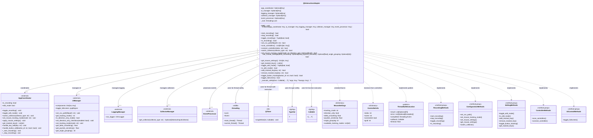

```mermaid
classDiagram
    %% Main Adapter Class
    class QtInteractionAdapter {
        -app_coordinator: Optional[Any]
        -ui_manager: Optional[Any]
        -logging_manager: Optional[Any]
        -collector_manager: Optional[Any]
        -event_processor: Optional[Any]
        -_lock: threading.Lock

        +__init__() void
        +initialize(app_coordinator: Any, ui_manager: Any, logging_manager: Any, collector_manager: Any, event_processor: Any) bool
        +start_recording() bool
        +stop_recording() bool
        +toggle_recording() Tuple[bool, bool]
        +is_recording() bool
        +set_csv_path(filepath: str) bool
        +scan_controllers() List[Dict[str, Any]]
        +connect_controller(index: int) bool
        +switch_collector(collector_type: str) bool
        +set_mouse_tracking_mode(mode: str, direction_only: Optional[bool]) bool
        +set_mouse_settings(delta_smoothing: Optional[float], joystick_sensitivity: Optional[float], angle_grouping: Optional[int]) bool
        +get_mouse_settings() Dict[str, Any]
        +get_tracked_keys() List[str]
        +toggle_edit_mode() Tuple[bool, bool]
        +is_edit_mode() bool
        +add_tracked_key(key: str) bool
        +remove_tracked_key(key: str) bool
        +toggle_button_tracking(button_id: str, track: bool) bool
        +toggle_fullscreen() bool
        -_execute_safely(func: Callable[..., T], *args: Any, **kwargs: Any) T
    }

    %% External Component Dependencies
    class AppCoordinator {
        <<external>>
        +is_recording: bool
        +edit_mode: bool
        +toggle_recording() void
        +toggle_edit_mode() void
        +switch_collector(collector_type: str) void
        +set_mouse_tracking_mode(mode: str) void
        +apply_mouse_settings() void
        +get_tracked_keys() List[str]
        +handle_key_edit(key: str) void
        +handle_button_edit(button_id: str, track: bool) void
        +_start_recording() void
        +_stop_recording() void
    }

    class UIManager {
        <<external>>
        +components: Dict[str, Any]
        +set_csv_path(filepath: str) void
        +get_tracking_mode() str
        +is_direction_only_mode() bool
        +set_direction_only_checkbox(enabled: bool) void
        +set_tracking_mode(mode: str) void
        +get_delta_smoothing() float
        +get_joystick_sensitivity() float
        +get_angle_grouping() int
        +toggle_fullscreen: pyqtSignal
    }

    class LoggingManager {
        <<external>>
        +csv_logger: CSVLogger
    }

    class CollectorManager {
        <<external>>
        +get_collector(collector_type: str) Optional[AbstractInputCollector]
    }

    class EventProcessor {
        <<external>>
    }

    %% Qt Framework Classes
    class QTimer {
        <<Qt>>
        +singleShot(int, Callable) void
    }

    class threading {
        <<stdlib>>
        +Lock
        +Event
        +main_thread() Thread
        +current_thread() Thread
    }

    %% Type System
    class TypeVar {
        <<typing>>
        T
    }

    class Callable {
        <<typing>>
        +[..., T]
    }

    %% Configuration Structures
    class MouseSettings {
        <<dictionary>>
        +tracking_mode: str
        +direction_only: bool
        +delta_smoothing: float
        +joystick_sensitivity: float
        +angle_grouping: int
        +available_tracking_modes: List[str]
    }

    class ControllerInfo {
        <<dictionary>>
        +index: int
        +name: str
        +connected: bool
        +guid: str
    }

    %% Thread Safety Components
    class ThreadSafeExecution {
        <<pattern>>
        +result: List[Optional[T]]
        +error: List[Optional[Exception]]
        +completed: threading.Event
        +callback: Callable
        +timeout: float
    }

    %% Relationships
    QtInteractionAdapter "1" --> "0..1" AppCoordinator : coordinates
    QtInteractionAdapter "1" --> "0..1" UIManager : manages UI
    QtInteractionAdapter "1" --> "0..1" LoggingManager : manages logging
    QtInteractionAdapter "1" --> "0..1" CollectorManager : manages collectors
    QtInteractionAdapter "1" --> "0..1" EventProcessor : processes events

    QtInteractionAdapter --> threading : uses for thread safety
    QtInteractionAdapter --> QTimer : uses for thread-safe execution
    QtInteractionAdapter --> TypeVar : uses for type safety
    QtInteractionAdapter --> Callable : uses for function execution

    QtInteractionAdapter ..> MouseSettings : creates/returns
    QtInteractionAdapter ..> ControllerInfo : receives from controllers
    QtInteractionAdapter ..> ThreadSafeExecution : implements pattern

    %% Method Categories
    class RecordingMethods {
        <<method group>>
        +start_recording()
        +stop_recording()
        +toggle_recording()
        +is_recording()
    }

    class ConfigurationMethods {
        <<method group>>
        +set_csv_path()
        +set_mouse_tracking_mode()
        +set_mouse_settings()
        +get_mouse_settings()
        +switch_collector()
    }

    class EditingMethods {
        <<method group>>
        +toggle_edit_mode()
        +is_edit_mode()
        +add_tracked_key()
        +remove_tracked_key()
        +toggle_button_tracking()
        +get_tracked_keys()
    }

    class ControllerMethods {
        <<method group>>
        +scan_controllers()
        +connect_controller()
    }

    class UIControlMethods {
        <<method group>>
        +toggle_fullscreen()
    }

    QtInteractionAdapter ..> RecordingMethods : implements
    QtInteractionAdapter ..> ConfigurationMethods : implements
    QtInteractionAdapter ..> EditingMethods : implements
    QtInteractionAdapter ..> ControllerMethods : implements
    QtInteractionAdapter ..> UIControlMethods : implements
```
