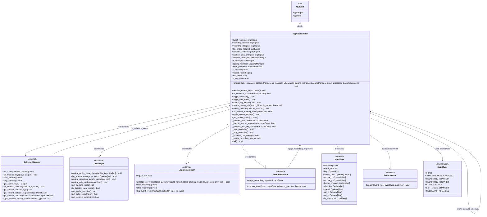

```mermaid
classDiagram
    %% Base Qt Class
    class QObject {
        <<Qt>>
        +pyqtSignal
        +pyqtSlot
    }

    %% Main Application Coordinator
    class AppCoordinator {
        +event_received: pyqtSignal
        +recording_started: pyqtSignal
        +recording_stopped: pyqtSignal
        +edit_mode_toggled: pyqtSignal
        +collector_switched: pyqtSignal
        +tracked_keys_changed: pyqtSignal

        -collector_manager: CollectorManager
        -ui_manager: UIManager
        -logging_manager: LoggingManager
        -event_processor: EventProcessor
        -is_recording: bool
        -tracked_keys: List[str]
        -edit_mode: bool
        -f9_key_down: bool

        +__init__(collector_manager: CollectorManager, ui_manager: UIManager, logging_manager: LoggingManager, event_processor: EventProcessor) void
        +initialize(tracked_keys: List[str]) void
        +on_collector_event(event: InputData) void
        +toggle_recording() void
        +toggle_edit_mode() void
        +handle_key_edit(key: str) void
        +handle_button_edit(button_id: str, is_tracked: bool) void
        +switch_collector(collector_type: str) void
        +set_mouse_tracking_mode(mode: str) void
        +apply_mouse_settings() void
        +get_tracked_keys() List[str]
        -_process_event(event: InputData) void
        -_handle_special_events(event: InputData) bool
        -_process_and_log_event(event: InputData) void
        -_start_recording() void
        -_stop_recording() void
        -_initialize_csv_logging() void
        -_toggle_recording_proxy() void
        +__del__() void
    }

    %% External Dependencies (from other modules)
    class CollectorManager {
        <<external>>
        +on_event(callback: Callable) void
        +set_tracked_keys(keys: List[str]) void
        +start_capture() void
        +stop_capture() void
        +get_active_keys() List[str]
        +set_current_collector(collector_type: str) bool
        +get_current_collector_type() str
        +get_current_collector_capabilities() Dict[str, Any]
        +get_current_collector() Optional[AbstractInputCollector]
        +_get_collector_display_name(collector_type: str) str
    }

    class UIManager {
        <<external>>
        +update_active_keys_display(active_keys: List[str]) void
        +log_status(message: str, color: Optional[str]) void
        +update_recording_state(is_recording: bool) void
        +update_edit_mode(enabled: bool) void
        +get_tracking_mode() str
        +is_direction_only_mode() bool
        +get_angle_grouping() int
        +get_delta_smoothing() float
        +get_joystick_sensitivity() float
    }

    class LoggingManager {
        <<external>>
        +log_to_csv: bool
        +initialize_csv_file(headers: List[str], tracked_keys: List[str], tracking_mode: str, direction_only: bool) bool
        +start_recording() void
        +stop_recording() void
        +log_event(event: InputData, collector_type: str) void
    }

    class EventProcessor {
        <<external>>
        +toggle_recording_requested: pyqtSignal
        +process_event(event: InputData, collector_type: str) Dict[str, Any]
    }

    class InputData {
        <<external>>
        +timestamp: float
        +event_type: str
        +key: Optional[str]
        +active_keys: Optional[List[str]]
        +mouse_x: Optional[float]
        +mouse_y: Optional[float]
        +button_pressed: Optional[str]
        +direction: Optional[str]
        +speed: Optional[float]
        +rel_x: Optional[float]
        +rel_y: Optional[float]
        +is_moving: Optional[bool]
    }

    %% Core Event System (external)
    class EventSystem {
        <<external>>
        +dispatch(event_type: EventType, data: Any) void
    }

    class EventType {
        <<enumeration>>
        +INPUT
        +TRACKED_KEYS_CHANGED
        +RECORDING_STARTED
        +RECORDING_STOPPED
        +STATE_CHANGE
        +EDIT_MODE_CHANGED
        +COLLECTOR_CHANGED
    }

    %% Relationships
    QObject <|-- AppCoordinator : inherits

    AppCoordinator "1" --> "1" CollectorManager : coordinates
    AppCoordinator "1" --> "1" UIManager : coordinates
    AppCoordinator "1" --> "1" LoggingManager : coordinates
    AppCoordinator "1" --> "1" EventProcessor : coordinates

    AppCoordinator --> InputData : processes
    AppCoordinator --> EventSystem : dispatches events
    AppCoordinator --> EventType : uses event types

    %% Signal Connections
    CollectorManager --> AppCoordinator : on_collector_event
    EventProcessor --> AppCoordinator : toggle_recording_requested
    AppCoordinator --> AppCoordinator : event_received (internal)
```
