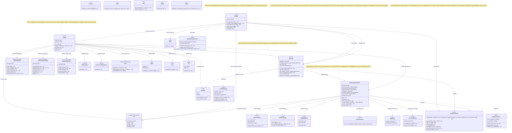

```mermaid
classDiagram
    %% Main CLI Application Components
    class CLIApp {
        <<module>>
        +app: typer.Typer
        +console: Console

        +run_cli() void
        +signal_handler(sig: int, frame: Any) void
        +shutdown_cli() void
        +version() void
        +info() void
    }

    class CLIShell {
        <<module>>
        +console: Console

        +run_interactive_shell() void
        +run_typer_command(args: List[str]) void
        +show_welcome_message() void
        +show_help_message() void
        +show_status() void
        +run_shell() void
    }

    class CLIConfig {
        <<module>>
        +headless_mode: bool
        +headless_app: Optional[HeadlessInputCollector]
        +gui_mode: bool
        +cli_running: threading.Event

        +set_gui_mode(enabled: bool) void
        +get_gui_mode() bool
        +init_headless_mode() HeadlessInputCollector
        +set_cli_running(running: bool) void
        +is_cli_running() bool
        +wait_for_cli_exit(timeout: Optional[float]) bool
    }

    %% Headless Application Class
    class HeadlessInputCollector {
        +console: Console
        +collector_manager: CollectorManager
        +event_processor: EventProcessor
        +logging_manager: LoggingManager
        +ui_manager: UIManager
        +visualizer_manager: VisualizerManager
        +app_coordinator: AppCoordinator
        +tracked_keys: List[str]

        +__init__() void
        +shutdown() void
        -_setup_components() void
        -_create_visualizer_manager() VisualizerManager
        -_connect_components() void
        -_initialize_apis() void
    }

    %% Command Modules (from submodule)
    class DataCommands {
        <<external submodule>>
        +app: typer.Typer
        +active_keys() void
        +is_key_active(key: str) void
        +mouse_position() void
        +mouse_button(button: str) void
        +current_event() void
        +events(event_type: str, count: int) void
    }

    class InteractionCommands {
        <<external submodule>>
        +app: typer.Typer
        +recording(action: str) void
        +logging(log_type: str, action: str) void
        +collectors(action: str) void
        +mouse(action: str) void
        +keys(action: str) void
        +status() void
    }

    class MonitorCommands {
        <<external submodule>>
        +app: typer.Typer
        +monitor_events() void
        +monitor_active_keys() void
        +monitor_mouse() void
        +monitor_controller() void
        +monitor_status() void
    }

    %% Core Application Components (external)
    class AppCoordinator {
        <<external>>
        +initialize(tracked_keys: List[str]) void
        +is_recording: bool
        +edit_mode: bool
        +tracked_keys: List[str]
    }

    class CollectorManager {
        <<external>>
        +stop_capture() void
        +get_available_collectors() List[Dict[str, str]]
        +get_current_collector_type() str
    }

    class LoggingManager {
        <<external>>
        +close_all() void
        +log_to_json: bool
        +log_to_csv: bool
    }

    class EventProcessor {
        <<external>>
        +process_event(event: InputData, collector_type: str) Dict[str, Any]
    }

    class UIManager {
        <<external>>
        +headless_mode: bool
        +components: Dict[str, Any]
    }

    class VisualizerManager {
        <<external>>
        +headless_mode: bool
        +get_keyboard_visualizer() Any
        +get_mouse_visualizer() Any
    }

    %% API Integration Classes
    class InputCollectorAPI {
        <<external>>
        +initialize(app_coordinator: Any, ui_manager: Any, logging_manager: Any, collector_manager: Any, event_processor: Any) bool
        +get_application_state() Dict[str, Any]
        +start_recording() bool
        +stop_recording() bool
        +is_recording() bool
        +get_logging_state() Dict[str, Any]
        +get_current_collector() Dict[str, Any]
        +get_tracked_keys() List[str]
    }

    class APIIntegration {
        <<external>>
        +shutdown() void
    }

    class InteractionAPIIntegration {
        <<external>>
        +shutdown() void
    }

    %% CLI Framework Components
    class typer {
        <<external CLI framework>>
        +Typer(name: str, help: str) Typer
        +add_typer(app: Typer, name: str, help: str) void
        +command(name: str) Callable
    }

    class rich {
        <<external rich framework>>
        +Console() Console
        +Panel() Panel
        +Table() Table
        +Prompt() Prompt
        +Syntax() Syntax
    }

    class Console {
        <<rich>>
        +print(text: str, style: Optional[str]) void
    }

    class Panel {
        <<rich>>
        +fit(content: str, title: str, border_style: str, box: Any) Panel
    }

    class Table {
        <<rich>>
        +add_column(name: str, style: str) void
        +add_row(*values: str) void
    }

    class Prompt {
        <<rich>>
        +ask(prompt: str) str
    }

    class Syntax {
        <<rich>>
        +__init__(code: str, language: str, theme: str, line_numbers: bool) void
    }

    %% System Modules
    class threading {
        <<stdlib>>
        +Event
        +Thread
        +current_thread() Thread
        +main_thread() Thread
    }

    class signal {
        <<stdlib>>
        +signal(sig: int, handler: Callable) void
        +SIGINT: int
        +SIGTERM: int
    }

    class atexit {
        <<stdlib>>
        +register(func: Callable) void
    }

    class sys {
        <<stdlib>>
        +argv: List[str]
        +stdin: Any
        +exit(code: int) void
    }

    class shlex {
        <<stdlib>>
        +split(s: str) List[str]
    }

    %% CLI Mode Management
    class CLIModeManager {
        <<pattern>>
        +headless_mode: bool
        +gui_mode: bool
        +cli_running: threading.Event

        +manage_concurrent_modes() void
        +coordinate_shutdown() void
        +handle_signal_cleanup() void
    }

    class ShellCommandProcessor {
        <<pattern>>
        +built_in_commands: Dict[str, Callable]
        +typer_app: typer.Typer

        +process_command(cmd: str) void
        +handle_built_in(cmd: str) bool
        +execute_typer_command(args: List[str]) void
    }

    class HeadlessInitializer {
        <<pattern>>
        +core_components: List[Any]
        +api_endpoints: List[Any]

        +initialize_minimal_stack() void
        +setup_without_gui() void
        +maintain_api_compatibility() void
    }

    %% Relationships
    CLIApp --> typer : uses CLI framework
    CLIApp --> rich : uses for output
    CLIApp --> DataCommands : includes via add_typer
    CLIApp --> InteractionCommands : includes via add_typer
    CLIApp --> MonitorCommands : includes via add_typer
    CLIApp --> CLIConfig : uses configuration
    CLIApp --> threading : manages threads
    CLIApp --> signal : handles signals
    CLIApp --> atexit : registers cleanup
    CLIApp --> sys : manages argv

    CLIShell --> CLIApp : runs typer commands
    CLIShell --> rich : uses for interactive display
    CLIShell --> CLIConfig : checks modes
    CLIShell --> InputCollectorAPI : queries status
    CLIShell --> shlex : parses commands

    CLIConfig --> HeadlessInputCollector : creates/manages
    CLIConfig --> threading : manages CLI state
    CLIConfig --> InputCollectorAPI : initializes

    HeadlessInputCollector --> AppCoordinator : creates/manages
    HeadlessInputCollector --> CollectorManager : creates/manages
    HeadlessInputCollector --> LoggingManager : creates/manages
    HeadlessInputCollector --> EventProcessor : creates/manages
    HeadlessInputCollector --> UIManager : creates minimal version
    HeadlessInputCollector --> VisualizerManager : creates minimal version
    HeadlessInputCollector --> InputCollectorAPI : initializes
    HeadlessInputCollector --> rich : uses for status output

    %% Pattern Implementations
    CLIConfig ..> CLIModeManager : implements
    CLIShell ..> ShellCommandProcessor : implements
    HeadlessInputCollector ..> HeadlessInitializer : implements

    %% API Integration
    CLIApp --> APIIntegration : manages lifecycle
    CLIApp --> InteractionAPIIntegration : manages lifecycle

    %% Shutdown Coordination
    CLIApp --> HeadlessInputCollector : coordinates shutdown
    CLIShell --> CLIConfig : coordinates exit

    %% Notes
    note for CLIApp "Main CLI application entry point\nManages Typer app with command modules\nHandles signals and cleanup\nSupports both standalone and GUI-concurrent modes"

    note for CLIShell "Interactive shell implementation\nProvides REPL-like experience\nSupports built-in commands and help\nIntegrates with Typer command execution"

    note for CLIConfig "Shared configuration and state management\nCoordinates headless and GUI modes\nManages CLI lifecycle\nProvides initialization utilities"

    note for HeadlessInputCollector "Minimal application stack for CLI-only mode\nInitializes core components without GUI\nMaintains API compatibility\nProvides clean shutdown procedures"

    %% Architecture Documentation
    note "CLI Architecture:\n• Modular command organization via Typer\n• Interactive shell with built-in commands\n• Dual-mode support (standalone/GUI-concurrent)\n• Headless application stack initialization\n• Thread-safe state management\n• Comprehensive cleanup and signal handling"

    %% Mode Coordination
    note "Mode Coordination:\n• headless_mode: CLI-only operation\n• gui_mode: CLI alongside GUI\n• cli_running: Thread coordination\n• Automatic API initialization\n• Clean shutdown coordination\n• Signal handling in main thread only"
```
