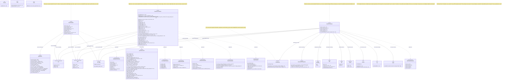

```mermaid
classDiagram
    %% Command Module Base Classes
    class DataCommands {
        <<module>>
        +active_keys() void
        +is_key_active(key: str) void
        +mouse_position() void
        +mouse_button(button: str) void
        +mouse_direction() void
        +metadata() void
        +current_event() void
        +events(event_type: str, count: int) void
        +controller_connected() void
    }

    class InteractionCommands {
        <<module>>
        +recording(action: str) void
        +logging(log_type: str, action: str, filepath: str) void
        +collectors(action: str, collector_type: str, controller_index: int) void
        +mouse(action: str, mode: str, direction_only: bool, delta_smoothing: float, joystick_sensitivity: float, angle_grouping: int) void
        +keys(action: str, key: str, button: str, track: bool) void
        +fullscreen() void
        +status() void
        +recording_start() void
        +recording_stop() void
        +recording_toggle() void
        +recording_status() void
        +logging_json(action: str) void
        +logging_csv(action: str, filepath: str) void
        +logging_status() void
        +collectors_list() void
        +collectors_current() void
        +collectors_switch(collector: str) void
        +collectors_scan() void
        +connect_controller(index: int) void
        +set_mouse_tracking_mode(mode: str, direction_only: bool) void
        +get_available_tracking_modes(direction_only: bool) void
        +set_mouse_settings(delta_smoothing: int, joystick_sensitivity: int, angle_grouping: int) void
        +get_mouse_settings() void
        +get_tracked_keys() void
        +toggle_edit_mode() void
        +is_edit_mode() void
        +add_tracked_key(key: str) void
        +remove_tracked_key(key: str) void
        +toggle_button_tracking(button_id: str, track: bool) void
        +toggle_fullscreen() void
        +get_application_state() void
    }

    class MonitorCommands {
        <<module>>
        +monitor_events() void
        +monitor_active_keys() void
        +monitor_mouse() void
        +monitor_controller() void
        +monitor_status() void
        -_run_monitor(allowed: List[str], show_keys: bool) void
    }

    %% CLI Framework Components
    class typer {
        <<external CLI framework>>
        +Typer() Typer
        +Argument(...) Any
        +Option(...) Any
        +Exit(code: int) void
    }

    class rich {
        <<external rich framework>>
        +Console() Console
        +Table() Table
        +Panel() Panel
    }

    class Console {
        <<rich>>
        +print(text: str) void
    }

    class Table {
        <<rich>>
        +add_column(name: str, style: str) void
        +add_row(*values: str) void
    }

    class Panel {
        <<rich>>
        +__init__(content: str, box: Any, expand: bool) void
    }

    %% API Integration Classes
    class InputCollectorAPI {
        <<external>>
        +start_recording() bool
        +stop_recording() bool
        +toggle_recording() bool
        +is_recording() bool
        +enable_json_logging(enabled: bool) bool
        +enable_csv_logging(enabled: bool, filepath: str) bool
        +set_csv_path(filepath: str) bool
        +get_logging_state() Dict[str, Any]
        +get_available_collectors() List[Dict[str, str]]
        +switch_collector(collector_type: str) bool
        +get_current_collector() Dict[str, Any]
        +scan_controllers() List[Dict[str, Any]]
        +connect_controller(index: int) bool
        +set_mouse_tracking_mode(mode: str, direction_only: bool) bool
        +get_available_tracking_modes(direction_only: bool) List[str]
        +set_mouse_settings(delta_smoothing: float, joystick_sensitivity: float, angle_grouping: int) bool
        +get_mouse_settings() Dict[str, Any]
        +get_tracked_keys() List[str]
        +toggle_edit_mode() bool
        +is_edit_mode() bool
        +add_tracked_key(key: str) bool
        +remove_tracked_key(key: str) bool
        +toggle_button_tracking(button_id: str, track: bool) bool
        +toggle_fullscreen() bool
        +get_application_state() Dict[str, Any]
        +get_last_operation_status() Dict[str, Any]
    }

    class InputDataAPI {
        <<external>>
        +get_active_keys() List[str]
        +is_key_active(key: str) bool
        +get_mouse_position() Tuple[float, float]
        +get_mouse_button_state(button: str) bool
        +get_mouse_direction() Optional[str]
        +is_mouse_moving() bool
        +get_metadata() Dict[str, Any]
        +get_current_event() Optional[InputData]
        +get_key_events(count: int) List[InputData]
        +get_mouse_movement_events(count: int) List[InputData]
        +get_mouse_button_events(count: int) List[InputData]
        +get_controller_events(count: int) List[InputData]
        +is_controller_connected() bool
        +get_controller_name() str
    }

    %% Configuration and Event System
    class cli_config {
        <<external>>
        +headless_mode: bool
        +init_headless_mode() void
    }

    class EventSystem {
        <<external>>
        +EventType: Enum
        +subscribe(event_type: EventType, handler: Callable) void
        +unsubscribe(event_type: EventType, handler: Callable) void
    }

    class InteractionAPIIntegration {
        <<external>>
        +get_interaction_api_integration() InteractionAPIIntegration
        +_broadcast_event(event_dict: Dict) void
        +_handle_core_event(event_type: EventType, data: Any) void
    }

    %% Command Categories
    class RecordingCommands {
        <<command group>>
        +recording_start()
        +recording_stop()
        +recording_toggle()
        +recording_status()
        +recording(action: str)
    }

    class LoggingCommands {
        <<command group>>
        +logging_json(action: str)
        +logging_csv(action: str, filepath: str)
        +logging_status()
        +logging(log_type: str, action: str, filepath: str)
    }

    class CollectorCommands {
        <<command group>>
        +collectors_list()
        +collectors_current()
        +collectors_switch(collector: str)
        +collectors_scan()
        +connect_controller(index: int)
        +collectors(action: str, collector_type: str, controller_index: int)
    }

    class MouseCommands {
        <<command group>>
        +set_mouse_tracking_mode(mode: str, direction_only: bool)
        +get_available_tracking_modes(direction_only: bool)
        +set_mouse_settings(delta_smoothing: int, joystick_sensitivity: int, angle_grouping: int)
        +get_mouse_settings()
        +mouse(action: str, ...)
    }

    class KeyCommands {
        <<command group>>
        +get_tracked_keys()
        +add_tracked_key(key: str)
        +remove_tracked_key(key: str)
        +toggle_button_tracking(button_id: str, track: bool)
        +toggle_edit_mode()
        +is_edit_mode()
        +keys(action: str, key: str, button: str, track: bool)
    }

    class DataQueryCommands {
        <<command group>>
        +active_keys()
        +is_key_active(key: str)
        +mouse_position()
        +mouse_button(button: str)
        +mouse_direction()
        +metadata()
        +current_event()
        +events(event_type: str, count: int)
        +controller_connected()
    }

    class MonitoringCommands {
        <<command group>>
        +monitor_events()
        +monitor_active_keys()
        +monitor_mouse()
        +monitor_controller()
        +monitor_status()
    }

    %% Threading and System Components
    class threading {
        <<stdlib>>
        +Event
        +Thread
    }

    class time {
        <<stdlib>>
        +time() float
        +sleep(seconds: float) void
        +strftime(format: str, time_struct: Any) str
        +localtime(timestamp: float) Any
    }

    class sys {
        <<stdlib>>
        +platform: str
        +stdin: Any
    }

    %% Platform-specific Input
    class msvcrt {
        <<Windows>>
        +kbhit() bool
        +getch() bytes
    }

    class termios {
        <<Unix>>
        +tcgetattr(fd: int) Any
        +tcsetattr(fd: int, when: int, attrs: Any) void
        +TCSADRAIN: int
    }

    class tty {
        <<Unix>>
        +setcbreak(fd: int) void
    }

    class select {
        <<Unix>>
        +select(rlist: List, wlist: List, xlist: List, timeout: float) Tuple
    }

    %% Relationships
    DataCommands --> InputDataAPI : uses for data access
    InteractionCommands --> InputCollectorAPI : uses for control
    MonitorCommands --> EventSystem : subscribes to events
    MonitorCommands --> InteractionAPIIntegration : monitors broadcasts

    DataCommands --> rich : uses for formatting
    InteractionCommands --> rich : uses for formatting
    MonitorCommands --> rich : uses for formatting

    DataCommands --> typer : uses CLI framework
    InteractionCommands --> typer : uses CLI framework
    MonitorCommands --> typer : uses CLI framework

    DataCommands --> cli_config : checks headless mode
    InteractionCommands --> cli_config : checks headless mode
    MonitorCommands --> cli_config : checks headless mode

    MonitorCommands --> threading : background monitoring
    MonitorCommands --> time : timestamps and delays
    MonitorCommands --> sys : platform detection

    MonitorCommands --> msvcrt : Windows key input
    MonitorCommands --> termios : Unix terminal control
    MonitorCommands --> tty : Unix terminal settings
    MonitorCommands --> select : Unix input selection

    %% Command Groupings
    InteractionCommands ..> RecordingCommands : implements
    InteractionCommands ..> LoggingCommands : implements
    InteractionCommands ..> CollectorCommands : implements
    InteractionCommands ..> MouseCommands : implements
    InteractionCommands ..> KeyCommands : implements

    DataCommands ..> DataQueryCommands : implements
    MonitorCommands ..> MonitoringCommands : implements

    %% Notes
    note for DataCommands "Data access command module\nProvides CLI interface for querying real-time data\nSupports key states, mouse info, events, and metadata\nFormats output using Rich tables and console"

    note for InteractionCommands "Application control command module\nProvides comprehensive CLI for all app operations\nSupports recording, logging, collectors, mouse config\nIncludes both complex and simple command variants"

    note for MonitorCommands "Real-time monitoring command module\nProvides live event stream visualization\nSupports filtered monitoring by event type\nCross-platform keyboard input handling for exit"

    note for EventSystem "Core event system integration\nSubscribes to application events\nProvides real-time event streaming\nFilters events by type and content"

    %% Architecture Documentation
    note "CLI Commands Architecture:\n• Module-based command organization\n• Rich framework for enhanced output\n• Typer for modern CLI interface\n• Cross-platform input handling\n• Real-time event monitoring\n• Comprehensive error handling\n• Headless mode support"

    %% Monitoring Flow
    note "Monitoring Flow:\n1. Subscribe to core events\n2. Intercept API broadcast events\n3. Filter by allowed event types\n4. Format and display in real-time\n5. Handle platform-specific exit keys\n6. Clean up subscriptions on exit"
```
